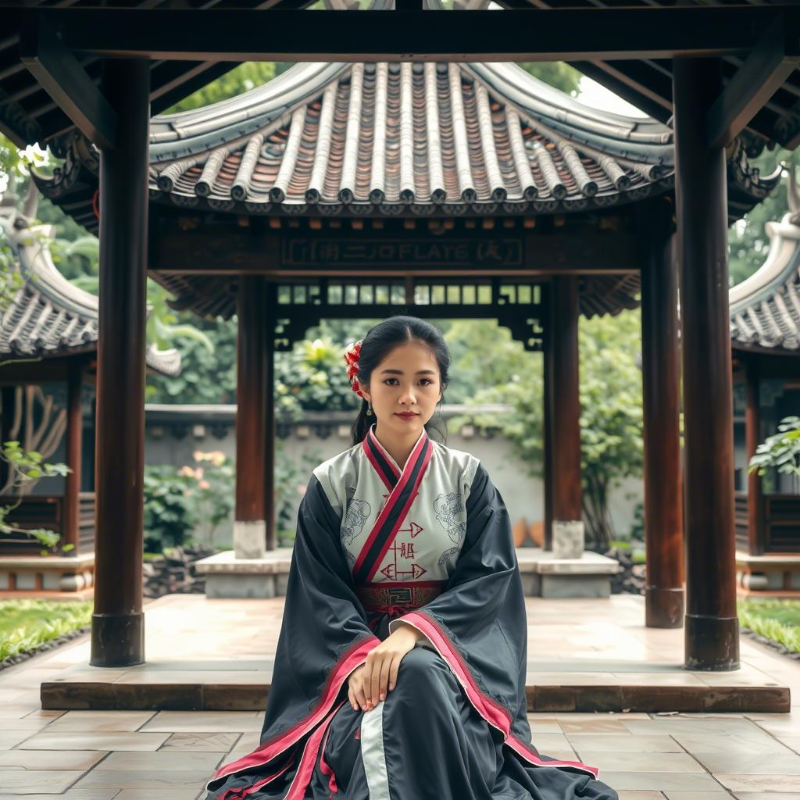

## AI应用调整以及万相2.1文生图的引入

我在上一期提到了因光照等方面不及Cosmos Predict2而弃用豆包的图片生成功能。由于需要另外引入一个在线图片生成应用作为备用，测试了通义app，流畅度较低且图片生成用的是效果较差的万相2.1 Turbo，就决定弃用。开发了Cogview的智谱的app之前用过流畅度也不行且风评一般，也不决定使用。Qwen Chat需要代理，但提供的图片生成功能是非Tubro版本的，效果好不少，文末展示了一些测试案例。另外测试了手机自带的AI助手，主要接入Deepseek模型，但在搜索时会额外引入应用商店的关联不大的内容，也决定不使用。

目前采用精简应用数量的策略，统一使用把网页安装到桌面或添加桌面快捷方式实现快速访问，其中Qwen Chat和Deepseek安装到了桌面，豆包添加了快捷方式。考虑到数据收集相对较多，会限制豆包在非必要时的使用。功能分配上，豆包仍用于电脑浏览器扩展、深入研究、多步搜索以及Github仓库/Arxiv文章解读功能；Qwen Chat用于图片生成以及快速预览的网页开发；Deepseek用于对模型能力要求较高的使用场景。

这里使用的网页作为应用安装的方法是pwa应用，这一形式能做到网页和客户端无需分别开发，并且允许客户端对缓存等功能进行额外优化。不过国内由于不少应用主推客户端，pwa应用相对较少。

在弃用Local Dream后，万相2.1的文生图作品由于16：9宽高比下只有720p分辨率，将作为后续的手环壁纸，不正式发布。
<!-- AUTO-GENERATED MEDIA -->

