## Cosmos人像系列：巫师服

本系列与之前的博客项目中的类似，在markdown图片中改用3列布局。

生成图片的提示词如下：

#### user:

创建30个分镜，每个分镜以“A woman in wizard costumes”开头，场景为森林或欧式建筑，用英语回答。

#### assistant:

Here are 30 storyboard shots starting with "A woman in wizard costumes," alternating between forest and European architecture settings:

1.  **Forest:** A woman in wizard costumes stands silhouetted against the dawn light filtering through ancient, moss-covered oaks, her robes stirring slightly.
2.  **Architecture:** A woman in wizard costumes examines intricate, glowing runes carved into the stone archway of a crumbling Gothic castle entrance.
3.  **Forest:** A woman in wizard costumes cautiously steps over giant, luminescent mushrooms in a twilight-dappled clearing.
4.  **Architecture:** A woman in wizard costumes peers down a long, dusty corridor lined with suits of armor inside a grand manor house, moonlight from tall windows striping the floor.
5.  **Forest:** A woman in wizard costumes kneels by a bubbling forest spring, cupping shimmering water in her hands, light reflecting on her face.
6.  **Architecture:** A woman in wizard costumes stands atop a high, windswept castle battlement, looking out over misty, rolling hills, her cloak billowing dramatically.
7.  **Forest:** A woman in wizard costumes uses her staff to gently push aside thick, hanging vines obscuring a hidden path deep within the woods.
8.  **Architecture:** A woman in wizard costumes studies towering, leather-bound books in a cavernous, candlelit library with vaulted ceilings.
9.  **Forest:** A woman in wizard costumes pauses, startled, as a flock of iridescent birds erupts from the canopy right above her head.
10. **Architecture:** A woman in wizard costumes traces her fingers along the cold, ornate metal of a large, sealed door in a cathedral's crypt.
11. **Forest:** A woman in wizard costumes leans against the massive, gnarled trunk of an ancient tree, catching her breath, dappled sunlight on her hood.
12. **Architecture:** A woman in wizard costumes walks across a cobblestone courtyard at dusk, her path lit by floating, magical orbs she conjures.
13. **Forest:** A woman in wizard costumes navigates a treacherous path across moss-slicked stones in a fast-flowing forest river.
14. **Architecture:** A woman in wizard costumes discovers a hidden chamber behind a tapestry in a grand hall, revealing star charts on the walls.
15. **Forest:** A woman in wizard costumes holds her staff aloft, its crystal tip pulsing with soft light to illuminate a dense, foggy thicket at night.
16. **Architecture:** A woman in wizard costumes observes a complex astrolabe mounted in the center of an observatory tower's domed roof.
17. **Forest:** A woman in wizard costumes sits cross-legged on a bed of soft ferns, meditating, small forest creatures curiously approaching.
18. **Architecture:** A woman in wizard costumes examines a stained-glass window depicting mythical beasts in a quiet chapel side-aisle.
19. **Forest:** A woman in wizard costumes uses a small, focused wind spell to clear fallen autumn leaves from a weathered stone marker.
20. **Architecture:** A woman in wizard costumes stands at the foot of a sweeping stone staircase in a grand, empty ballroom, dust motes dancing in sunbeams.
21. **Forest:** A woman in wizard costumes looks up in awe as bioluminescent pollen drifts down like stars from the high canopy in the deep forest.
22. **Architecture:** A woman in wizard costumes cautiously tests the water of a large, ornate fountain in a neglected palace garden filled with overgrown roses.
23. **Forest:** A woman in wizard costumes takes shelter under the roots of a giant overturned tree during a sudden downpour, steam rising from her damp robes.
24. **Architecture:** A woman in wizard costumes discovers a small, forgotten alchemy lab tucked into a turret room, dusty bottles glowing faintly.
25. **Forest:** A woman in wizard costumes carefully gathers rare, glowing blue herbs growing in a circle of standing stones.
26. **Architecture:** A woman in wizard costumes walks along the top of a high, arched stone bridge connecting two parts of a citadel, overlooking a river valley.
27. **Forest:** A woman in wizard costumes pauses at the edge of a cliff, looking down into a mist-shrouded valley filled with strange, giant flowers.
28. **Architecture:** A woman in wizard costumes examines a large, detailed tapestry map of the realm hanging in a dimly lit council chamber.
29. **Forest:** A woman in wizard costumes stands firm, staff raised defensively, as a low growl echoes from the dark undergrowth ahead.
30. **Architecture:** A woman in wizard costumes stands on a balcony overlooking a moonlit city of spires and tiled roofs, a look of determination on her face as she prepares a spell.

<!-- AUTO-GENERATED MEDIA -->

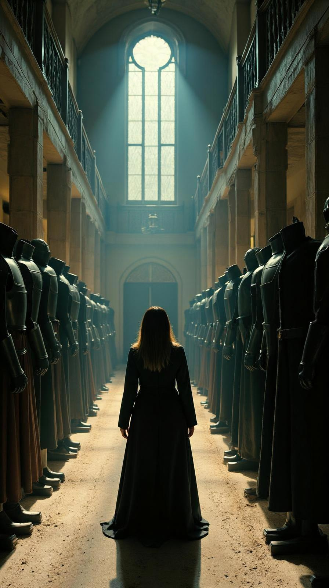

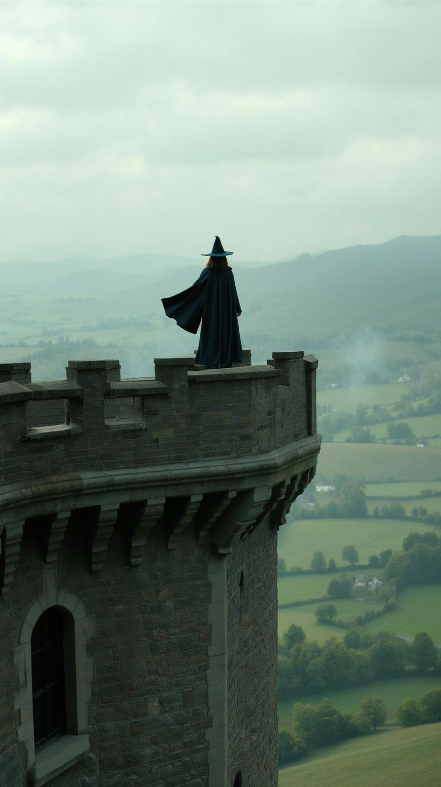

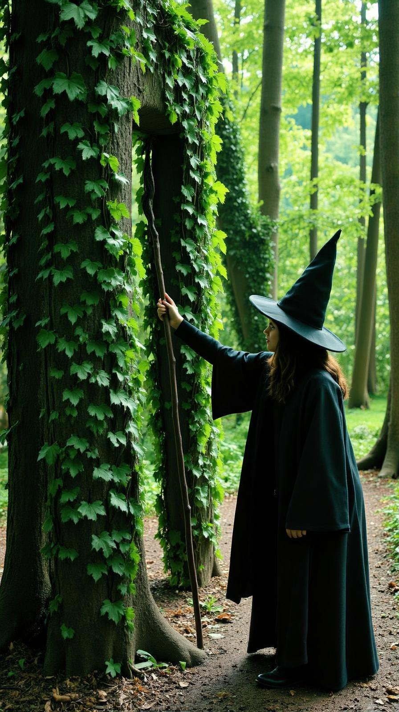

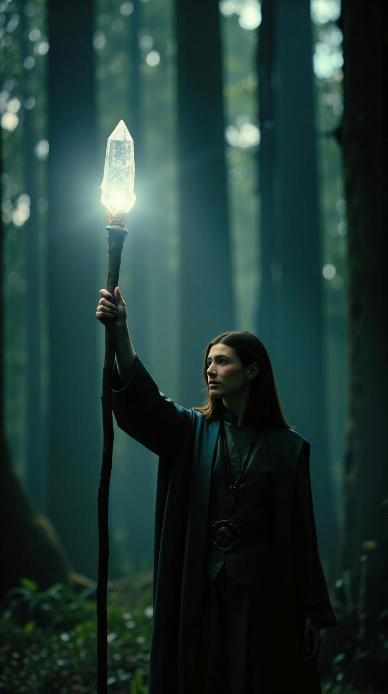

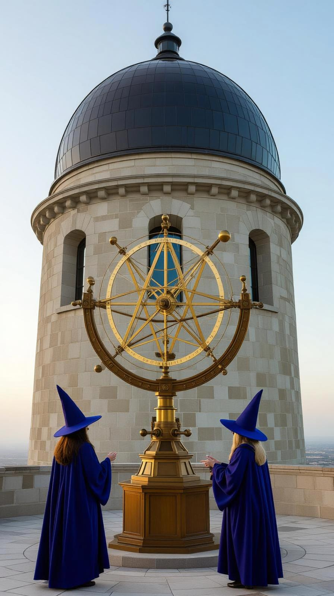

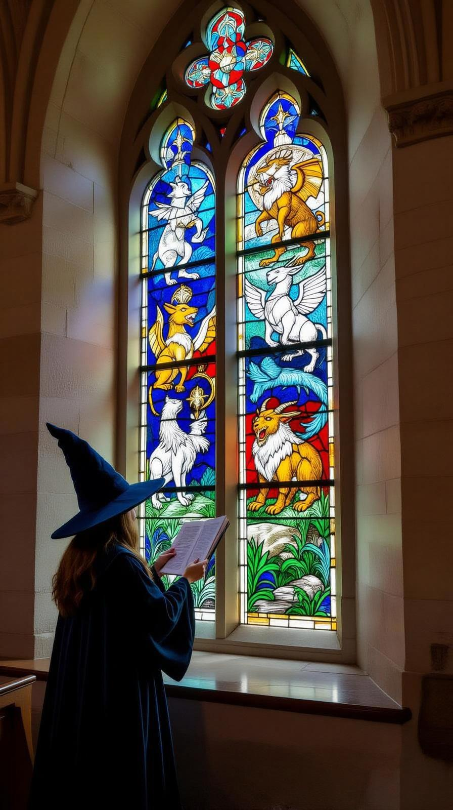

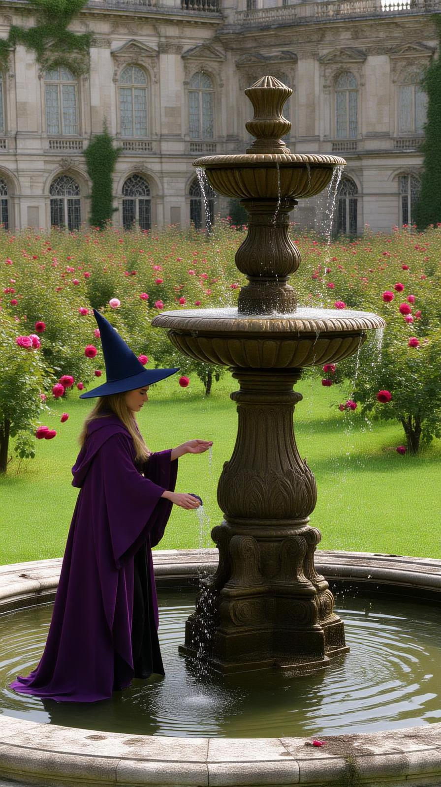

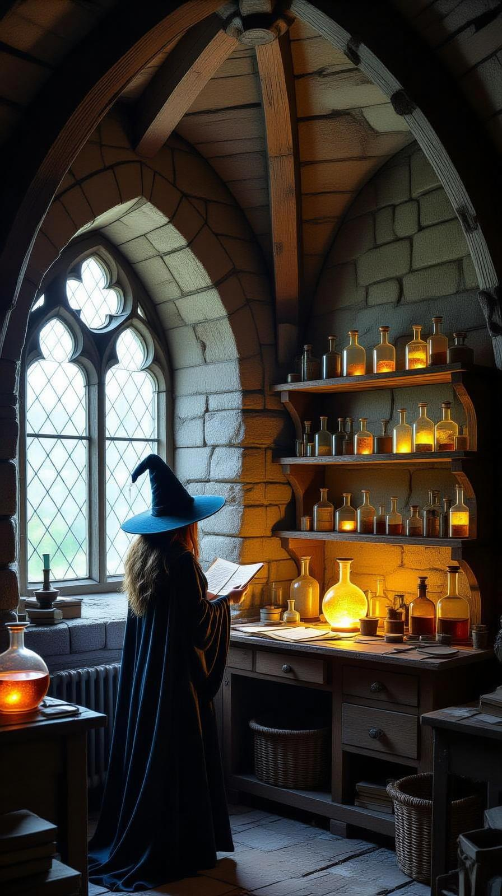

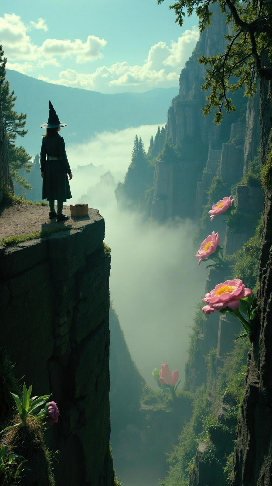

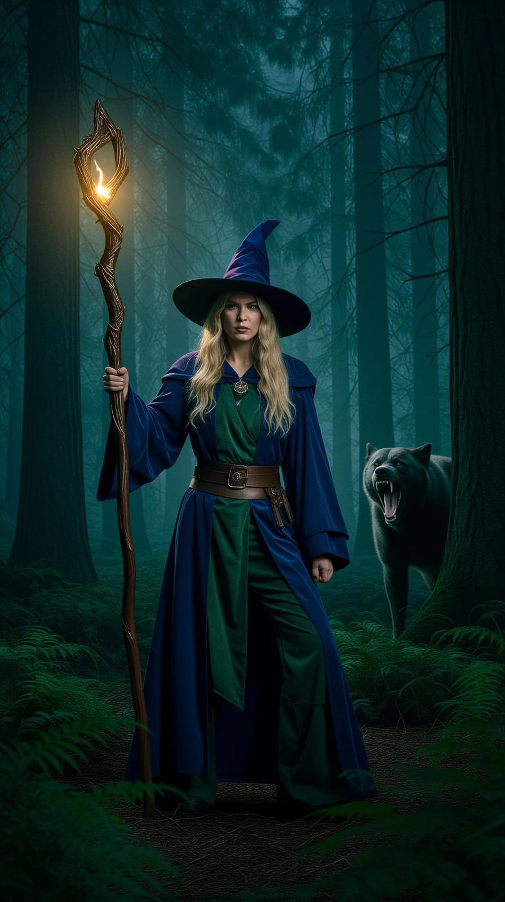

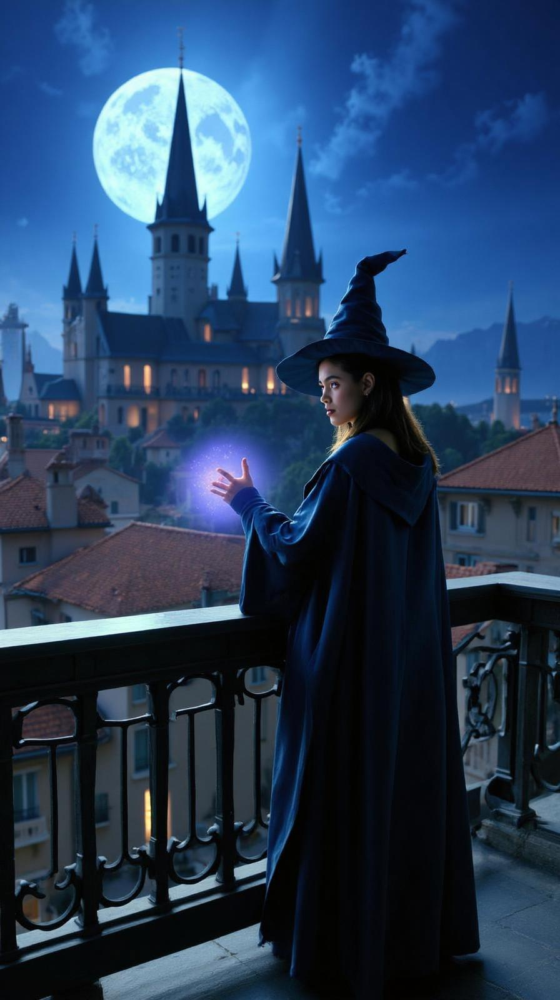

