## Cosmos人像系列：汉服

本系列与之前的博客项目中的类似，图片改用flex布局。

生成图片的提示词如下：

#### user:

创建30个分镜，每个分镜以“a man in Han Chinese Clothing”开头，场景为中式建筑或园林，用英语回答。

#### assistant:

Here are 30 distinct storyboard shots featuring a man in Han Chinese clothing within Chinese architecture or gardens:

1.  **A man in Han Chinese clothing** stands beneath a towering *pailou* (decorative archway) at the garden's entrance, dwarfed by its intricate stone carvings.
2.  **A man in Han Chinese clothing** walks slowly across a zigzagging vermilion bridge, gazing down at koi fish swirling in the pond below.
3.  **A man in Han Chinese clothing** sits in meditation on a stone bench within a secluded bamboo grove, shafts of light filtering through the tall stalks.
4.  **A man in Han Chinese clothing** practices calligraphy at a low table inside a simple thatched pavilion overlooking a lotus-covered pond.
5.  **A man in Han Chinese clothing** leans against the intricately latticed window of a moon gate, looking into a smaller, hidden courtyard.
6.  **A man in Han Chinese clothing** ascends a steep, winding stone staircase set against a mountainside, leading to a small temple perched on a cliff.
7.  **A man in Han Chinese clothing** stands silhouetted against the setting sun on a high pavilion balcony, overlooking the vast rooftops of a palace complex.
8.  **A man in Han Chinese clothing** carefully tends to a miniature bonsai pine tree on a scholar's rock stand within a quiet study room.
9.  **A man in Han Chinese clothing** plays a *guqin* (zither) beside a gently cascading artificial waterfall nestled among scholar's rocks.
10. **A man in Han Chinese clothing** pauses on a covered corridor (*lang*), its red pillars framing a view of a perfectly manicured rock garden.
11. **A man in Han Chinese clothing** reads a scroll beneath the sweeping, upturned eaves of a grand hall, massive wooden columns surrounding him.
12. **A man in Han Chinese clothing** walks along a narrow path beside a high, whitewashed garden wall, following the rhythmic pattern of its undulating top.
13. **A man in Han Chinese clothing** observes carp in a circular moon pond, his reflection shimmering on the water's still surface near the center.
14. **A man in Han Chinese clothing** sits alone in an ornate wooden pleasure boat drifting slowly through a narrow canal within the garden.
15. **A man in Han Chinese clothing** arranges chrysanthemums in a celadon vase on a low table within a serene, sparsely furnished tearoom.
16. **A man in Han Chinese clothing** looks up in awe at the intricate painted ceiling (*caisson*) inside a dimly lit temple hall.
17. **A man in Han Chinese clothing** stands at the edge of an open pavilion during a rainstorm, watching droplets fall from the eaves onto lotus leaves.
18. **A man in Han Chinese clothing** feeds cranes wading gracefully in a shallow, reed-fringed pond near a rustic wooden bridge.
19. **A man in Han Chinese clothing** contemplates a large, weathered Taihu rock with unusual holes and shapes, standing alone on a gravel bed.
20. **A man in Han Chinese clothing** walks through a dense grove of ancient pine trees, their gnarled roots gripping moss-covered rocks near a path.
21. **A man in Han Chinese clothing** sips tea while sitting on a veranda, overlooking a courtyard filled with blooming peonies and magnolias.
22. **A man in Han Chinese clothing** studies ancient stelae (stone tablets) mounted along the covered walkway of a Confucian temple.
23. **A man in Han Chinese clothing** pauses under the delicate blossoms of a weeping cherry tree arching over a winding garden path.
24. **A man in Han Chinese clothing** practices Tai Chi at dawn on a stone platform surrounded by mist rising from a tranquil lake.
25. **A man in Han Chinese clothing** examines intricate wood carvings adorning the doors of a locked ancestral hall within a complex.
26. **A man in Han Chinese clothing** watches a lone fisherman cast his net from a small, weathered dock extending into the garden's main lake.
27. **A man in Han Chinese clothing** walks through an autumn garden, vibrant red maple leaves swirling down around him onto a stone path.
28. **A man in Han Chinese clothing** sits by a glowing paper lantern illuminating a small, intimate pavilion nestled beside a stream at dusk.
29. **A man in Han Chinese clothing** ascends a steep, narrow staircase inside a multi-storied pagoda, looking out through a latticed window.
30. **A man in Han Chinese clothing** stands silently in a moonlit courtyard, gazing up at the silhouette of elaborate roof guardians against the night sky.
<!-- AUTO-GENERATED MEDIA -->

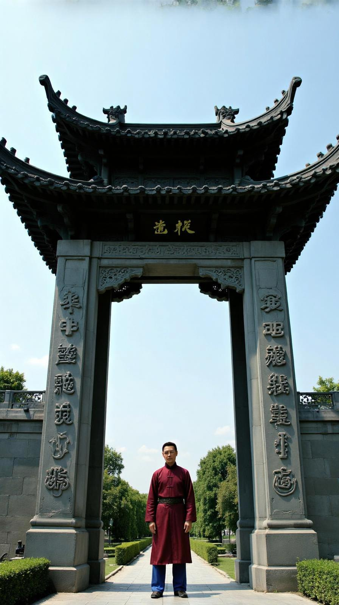

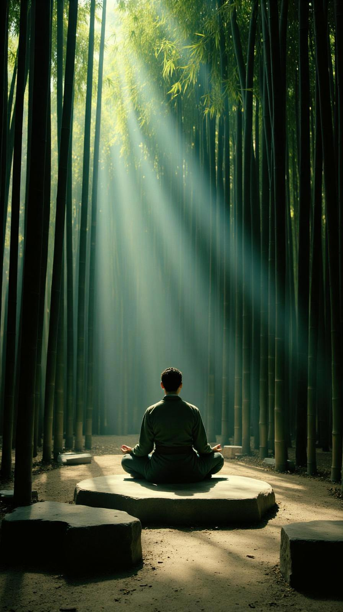

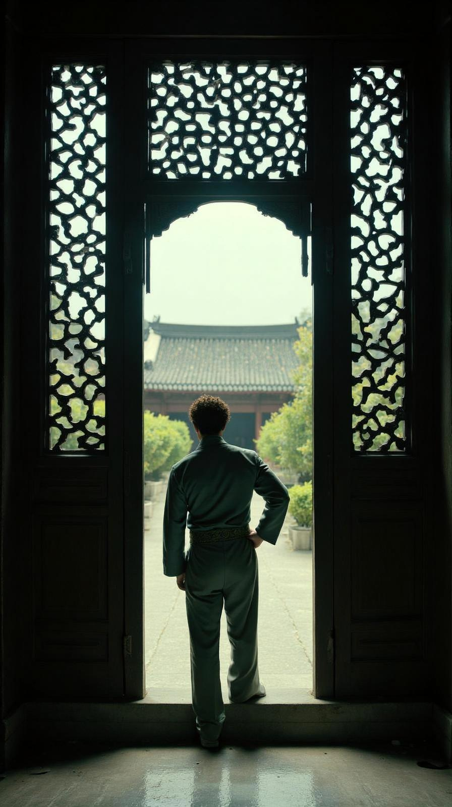

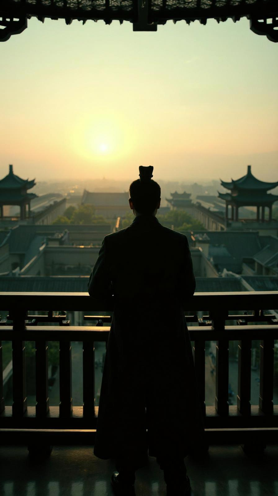

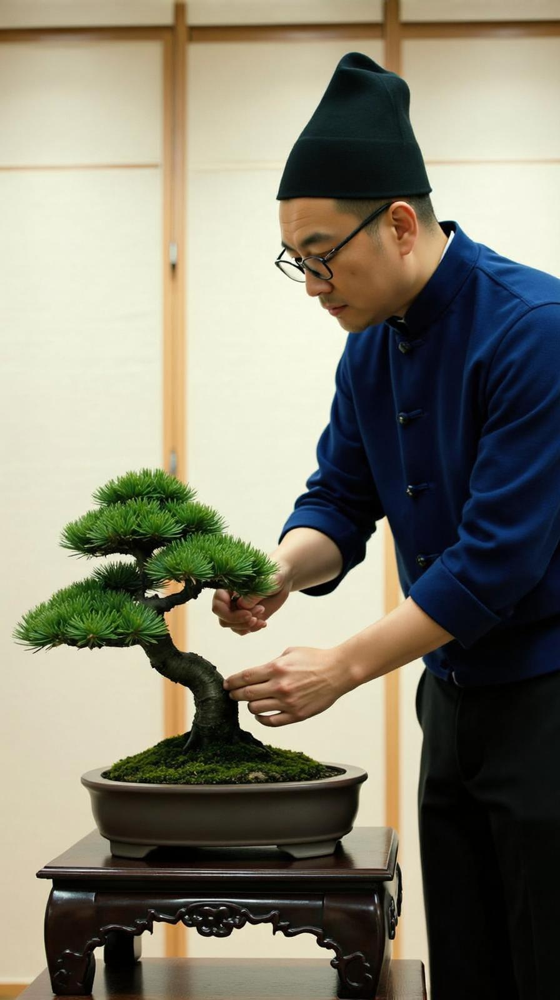

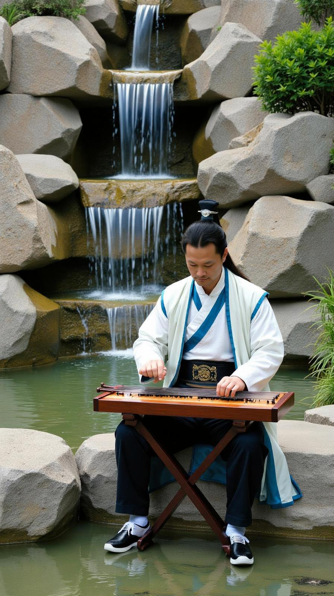

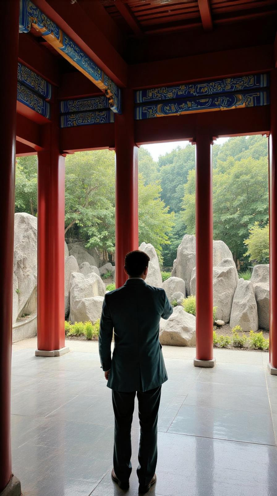

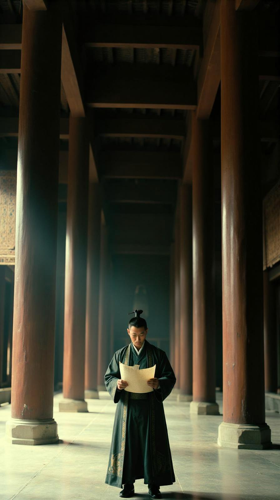

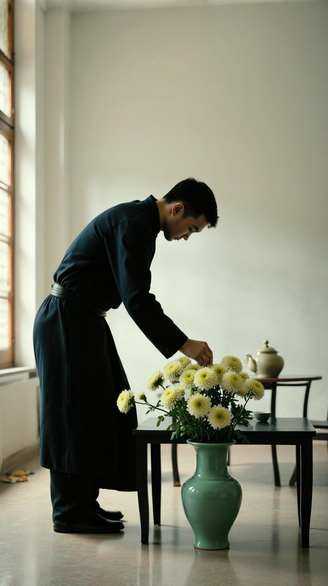

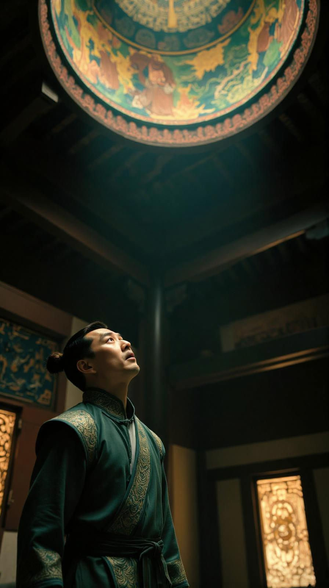

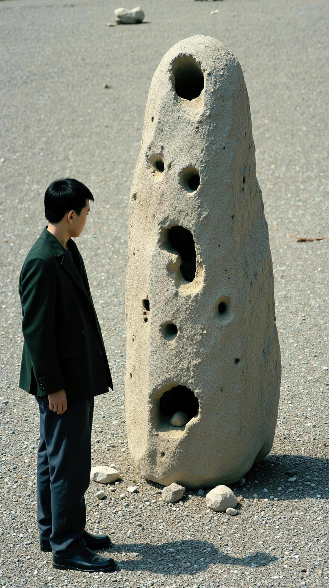

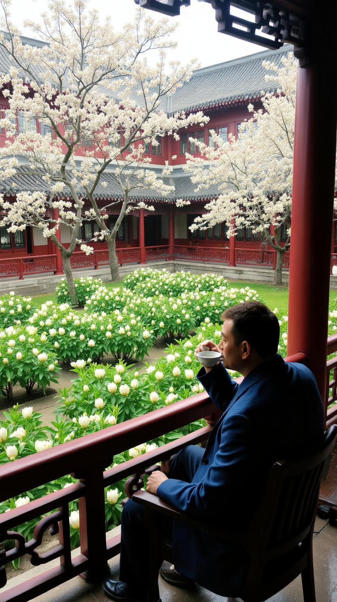

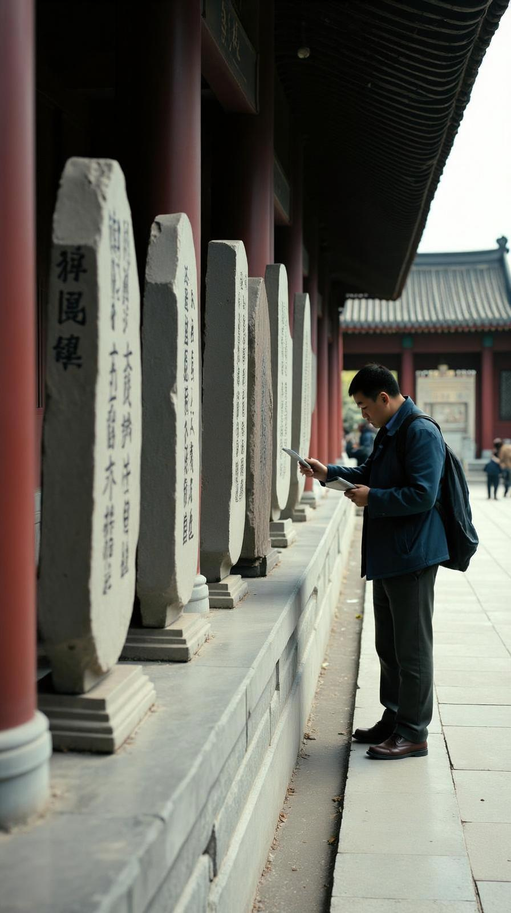

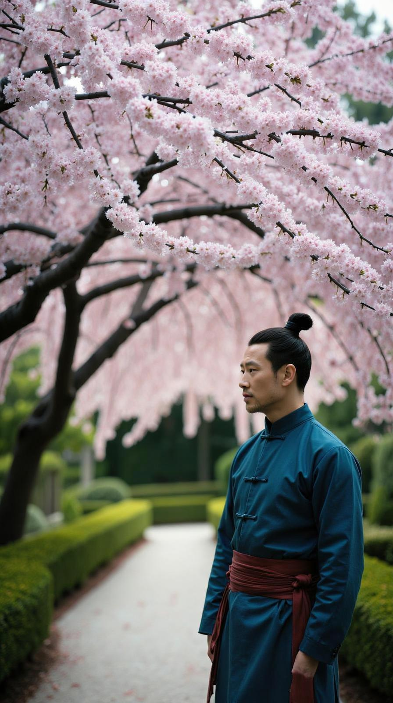

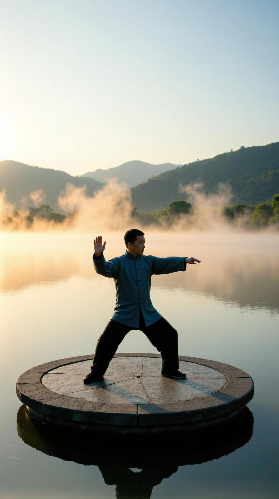

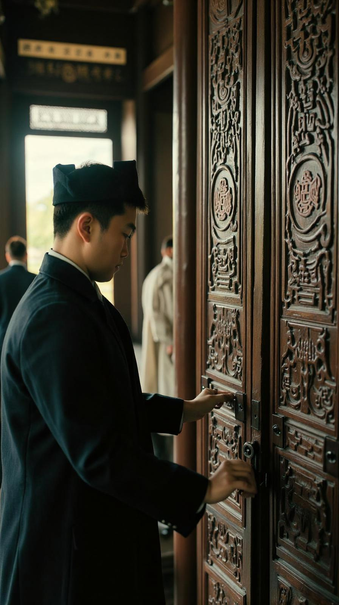

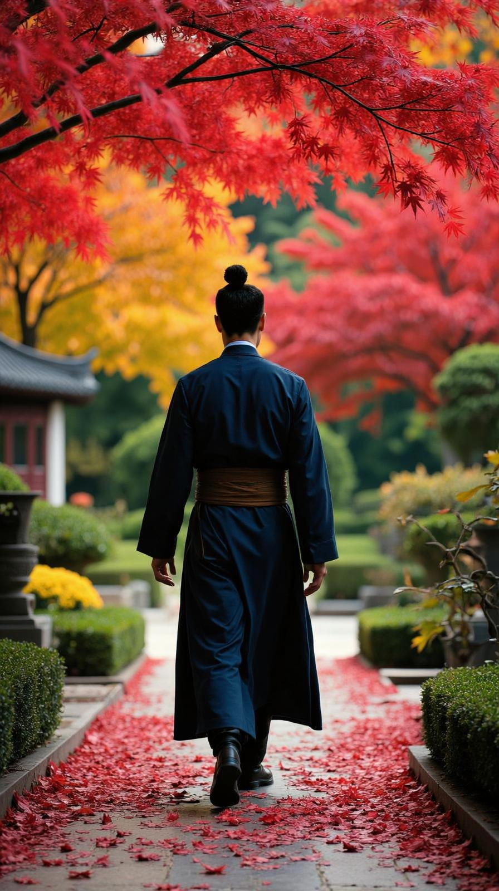

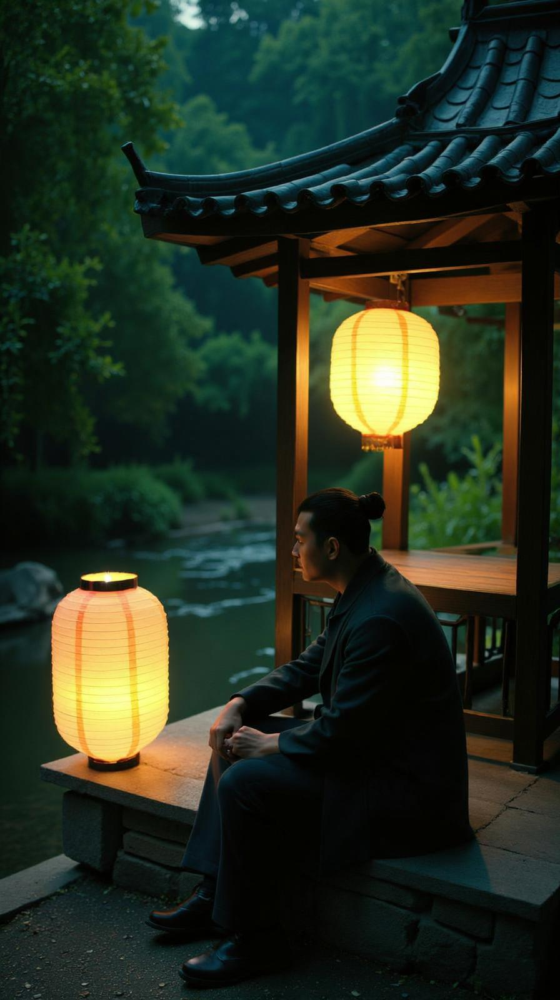

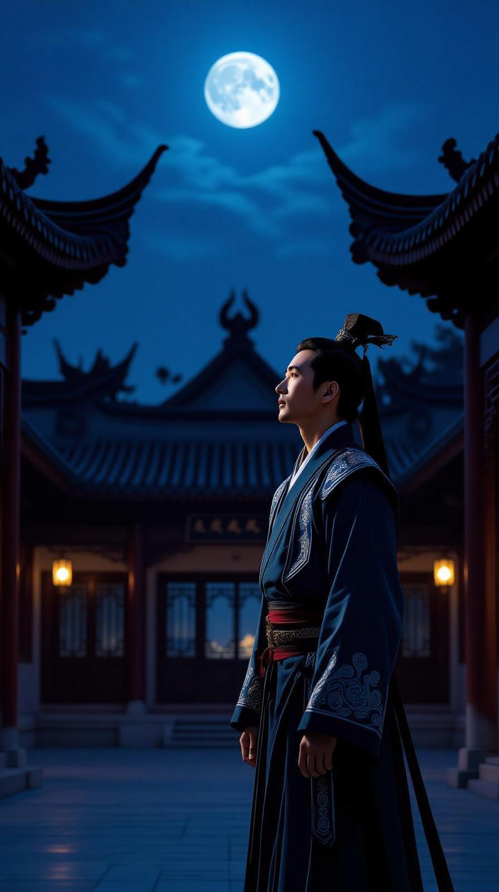

