## Cosmos室内系列：LOFT风格

本系列参考相关文章进行创建，由于包含的风格较多，缩减到20分镜。

分镜提示词如下：

#### user:

创建20个独立的LOFT风格室内设计的图片描述，用英语回答。

#### assistant:

Here are 20 unique Loft-style interior design descriptions, each emphasizing distinct industrial and modern elements:

1.  **Urban Artist's Haven:** Open-plan space with soaring ceilings, exposed red brick walls, and original steel columns. Large factory windows flood the concrete floor with light. A minimalist platform bed sits opposite a cluttered artist's studio corner with easels and raw canvas. Vintage metal lockers provide storage.
2.  **Industrial Chic Kitchen Focus:** Dominated by a massive stainless-steel kitchen island with pendant lights. Exposed ductwork runs along the ceiling above reclaimed wood cabinetry. Concrete floors contrast with a large, faded Persian rug under a modern dining table. Black metal-framed windows overlook the city.
3.  **Repurposed Factory Lounge:** Vast space featuring original concrete floors, weathered brick walls, and visible steel I-beams. A sunken conversation pit with plush velvet sofas creates intimacy. Oversized industrial pendant lights hang low. A salvaged factory cart serves as a coffee table.
4.  **Minimalist Loft with Green Accents:** Clean lines define this space. White-painted brick walls and polished concrete floors create a bright canvas. Sleek, low-profile furniture in neutral tones is accentuated by large, architectural potted plants (like Fiddle Leaf Figs). Black steel casement windows frame panoramic views.
5.  **Musician's Recording Loft:** High ceilings with exposed pipes and ducts painted matte black. One wall features custom acoustic panels in geometric patterns. A glass-walled control room overlooks the main live space with instruments. Vintage stage lights repurposed as decor. Concrete floors with scattered rugs.
6.  **Warm Timber & Brick Loft:** Expansive space blending raw elements – exposed brick, concrete columns, and visible ductwork – with warmth. Rich, reclaimed wood plank flooring and substantial timber beams on the ceiling. A large modern sectional faces a gas fireplace with a raw steel surround.
7.  **Modern Industrial Office Loft:** Converted warehouse space serving as a creative agency. Open floor plan with polished concrete floors. Workstations made from recycled scaffolding pipes and reclaimed wood desktops. Glass partitions separate meeting rooms. Massive skylights provide ample natural light.
8.  **Loft with Mezzanine Library:** Features a blackened steel spiral staircase leading to a mezzanine level lined with floor-to-ceiling bookshelves made of dark wood and black metal. Below, a cozy living area with a leather Chesterfield sofa sits near exposed brick. Large arched factory windows dominate one wall.
9.  **Cozy Industrial Bedroom Nook:** Within a larger loft, a sleeping area defined by a platform bed with a simple steel frame and linen bedding. Rough-textured concrete walls flank the bed. Industrial-style swing arm wall lamps provide focused lighting. A large, abstract canvas hangs above.
10. **Heritage Building Conversion:** Loft retaining ornate original features like decorative plaster cornices juxtaposed with raw concrete walls and exposed electrical conduits. Large arched windows with original frames. Modern furniture sits on wide-plank oak floors. A statement chandelier hangs from the high ceiling.
11. **Scandinavian-Influenced Loft:** Bright space with white-painted brick walls, white-washed wood floors, and exposed white-painted ductwork. Minimalist furniture in light wood and soft grey fabrics. Abundant natural light from tall windows. Accents of black metal (light fixtures, chair legs) and textured wool throws.
12. **Steampunk-Inspired Lounge Area:** Features copper pipe accents integrated into shelving and lighting fixtures. Exposed brick wall with a large, intricate vintage brass mirror. Leather armchairs and a velvet sofa surround a coffee table made from a giant industrial gear. Edison bulb lighting dominates.
13. **Loft with Glass-Block Partition:** Open layout where the bedroom is subtly separated by a floor-to-ceiling glass block wall, allowing light penetration while providing privacy. Exposed concrete ceiling and polished floors. Sleek kitchen with stainless steel appliances and a waterfall concrete countertop.
14. **Art Gallery Loft:** Vast white walls act as a gallery for large-scale contemporary art. Minimalist design with polished concrete floors and exposed ceiling infrastructure painted white. Track lighting highlights the artwork. Low-slung modular sofas provide seating without distraction.
15. **Black & White Monochrome Loft:** Dramatic space featuring black-painted brick walls, matte black exposed ductwork, and deep charcoal polished concrete floors. Crisp white kitchen cabinets and a white marble island countertop create stark contrast. Minimalist black furniture and geometric black & white rugs.
16. **Loft Greenhouse Corner:** Large loft featuring a dedicated corner flooded with light from a wall of steel-framed windows, transformed into an indoor greenhouse with tiered plant stands filled with lush greenery. Exposed brick and concrete provide an industrial backdrop to the vibrant plants.
17. **Micro-Loft Efficiency:** Compact yet stylish loft utilizing vertical space. A custom steel mezzanine bed accessed by a ladder overlooks a living area with a convertible sofa. Exposed brick wall, polished concrete floor, and clever under-stair storage. Large industrial-style pendant light.
18. **Converted Bookshop Loft:** Retains original bookshelves lining one tall brick wall, now filled with personal collections. Steel columns punctuate the space. A large, comfortable reading nook with a leather chair and floor lamp sits near massive front display windows. Open kitchen with metal shelving.
19. **Penthouse Loft with Terrace Access:** Luxurious loft featuring floor-to-ceiling windows leading to a private terrace with city views. Sleek modern kitchen with integrated appliances and a marble island. Exposed concrete ceiling and columns. Plush area rugs soften the polished concrete floors. Minimalist fireplace.
20. **Textile Designer's Studio Loft:** Features large worktables with sewing machines and rolls of fabric against a backdrop of exposed brick and concrete. Walls display mood boards and textile samples. Functional metal shelving units hold supplies. Large north-facing windows ensure perfect working light. Comfortable mid-century armchair in a corner for breaks.

Each description captures the essence of Loft style – embracing raw materials, open space, industrial heritage, and modern living – while offering a unique setting and focus.

<!-- AUTO-GENERATED MEDIA -->

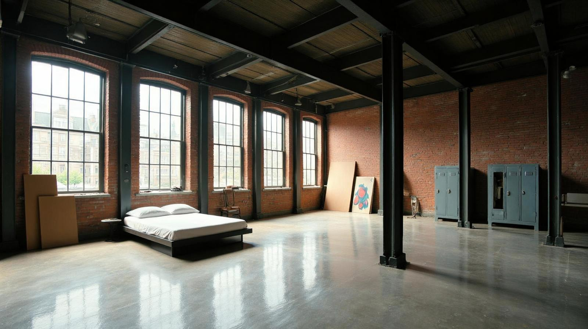

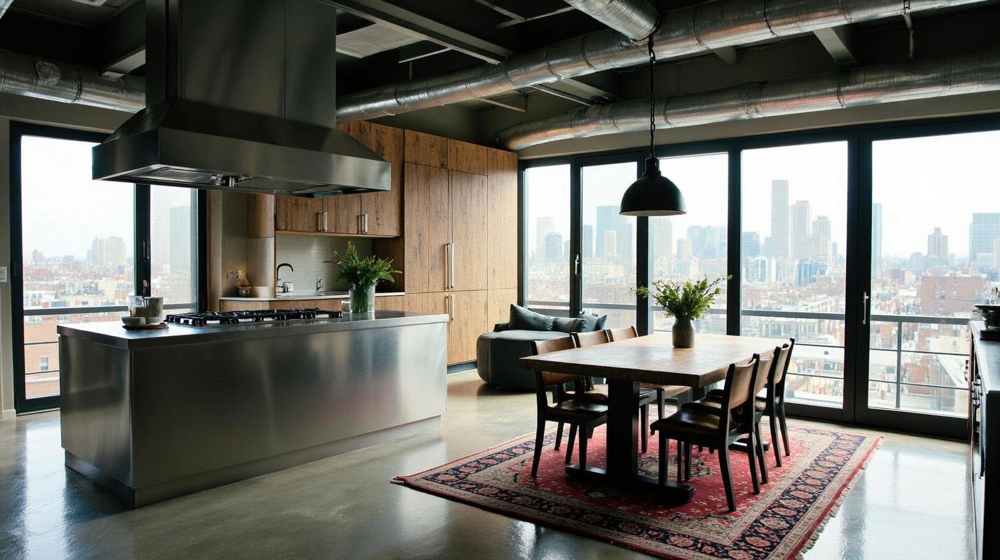

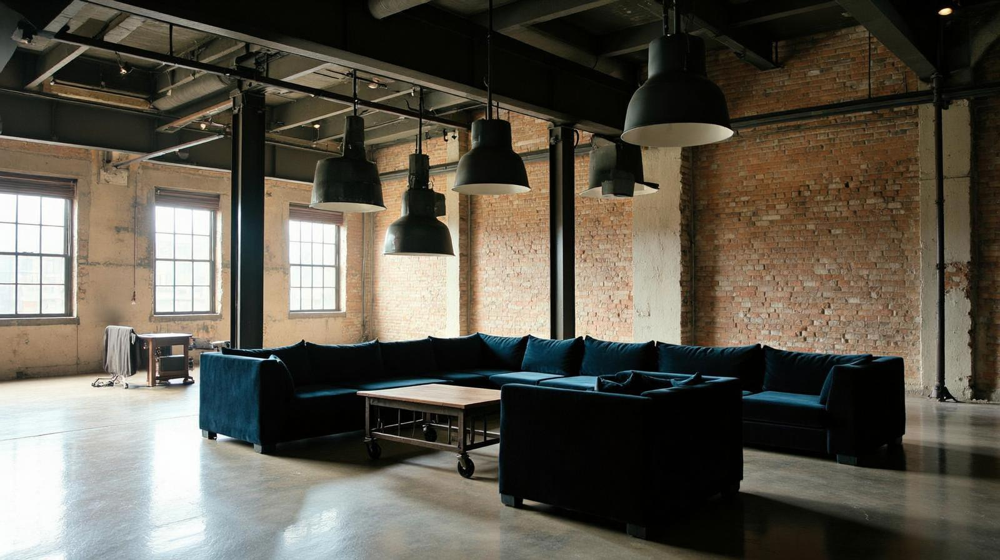

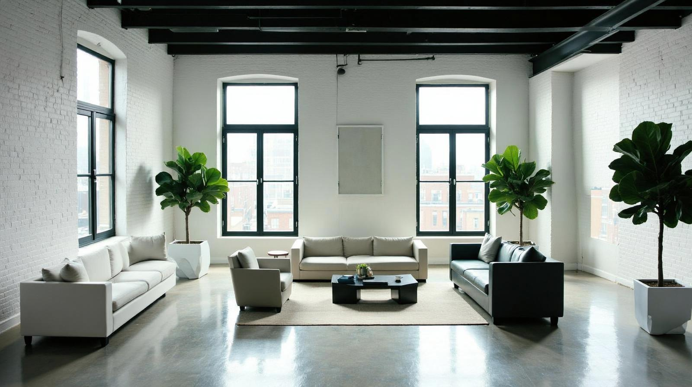

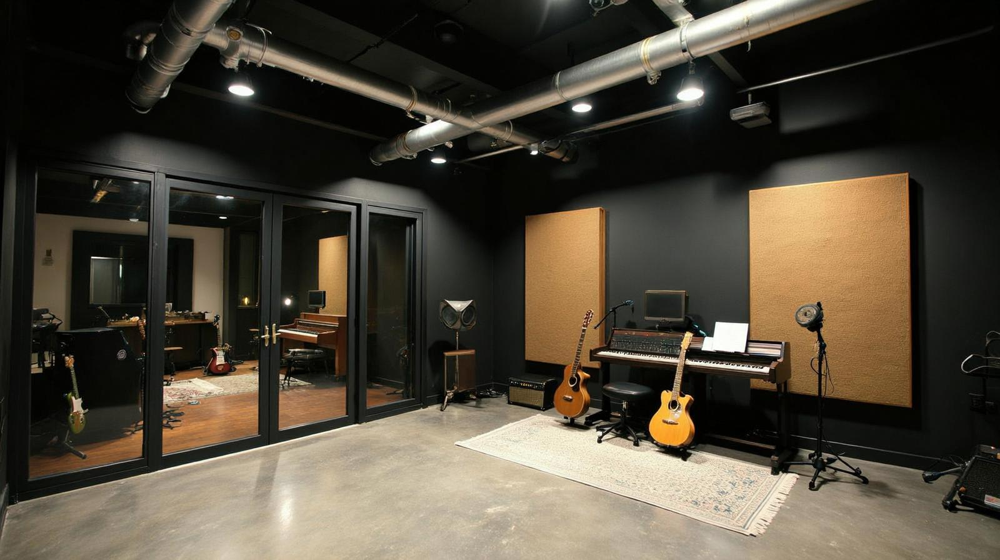

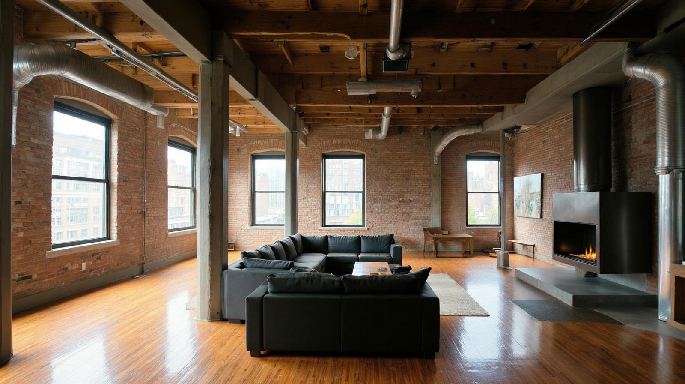

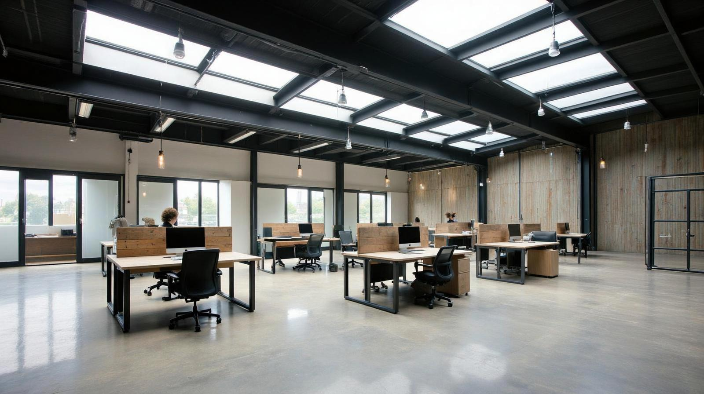

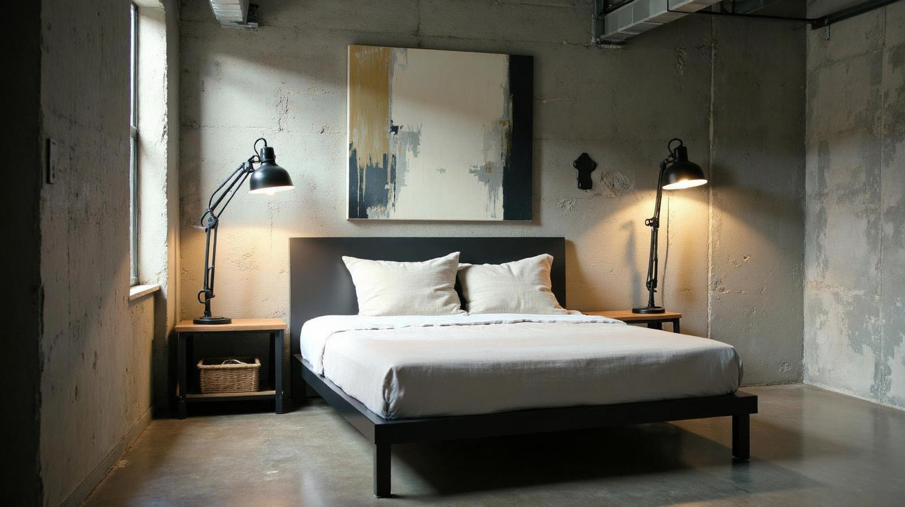

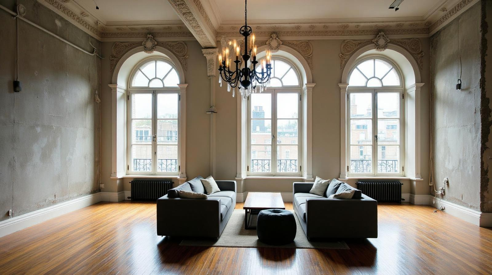

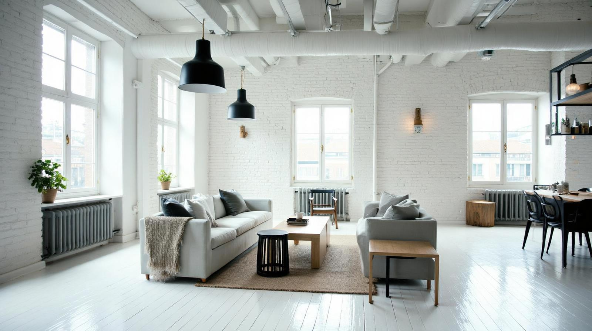

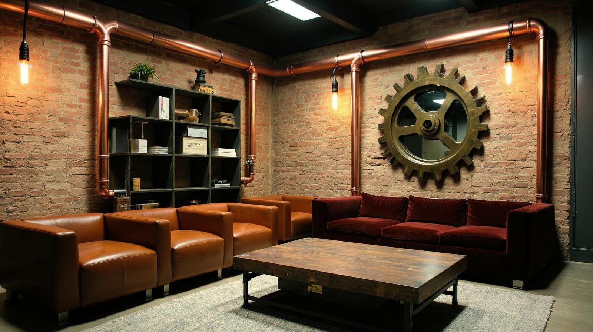

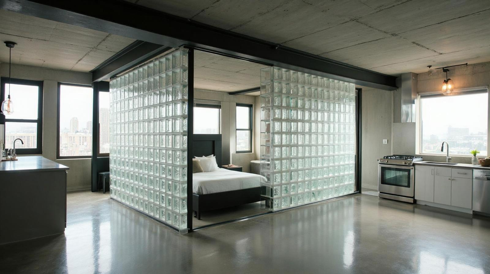

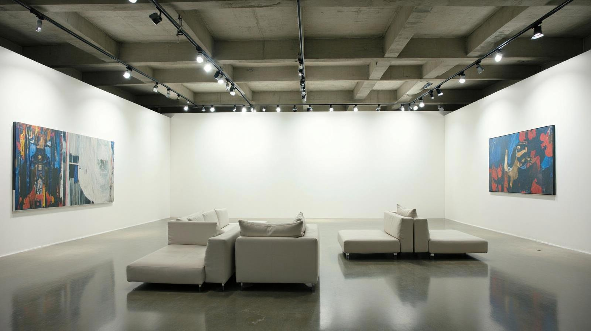

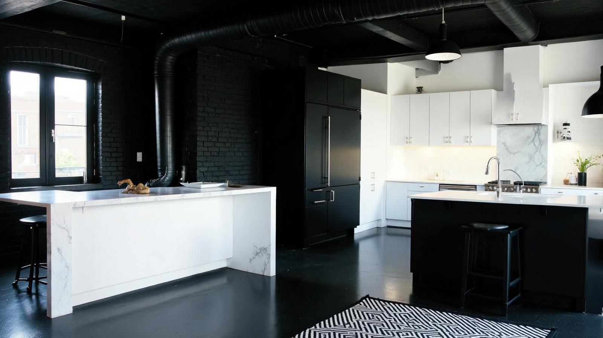

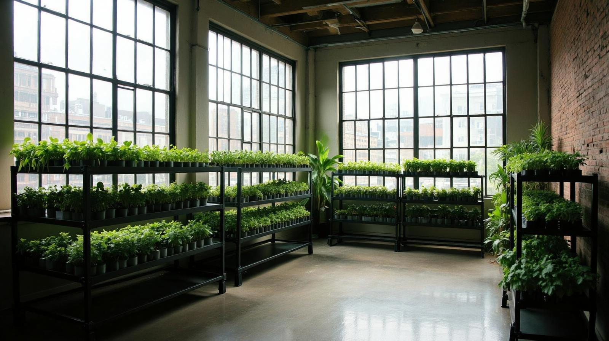

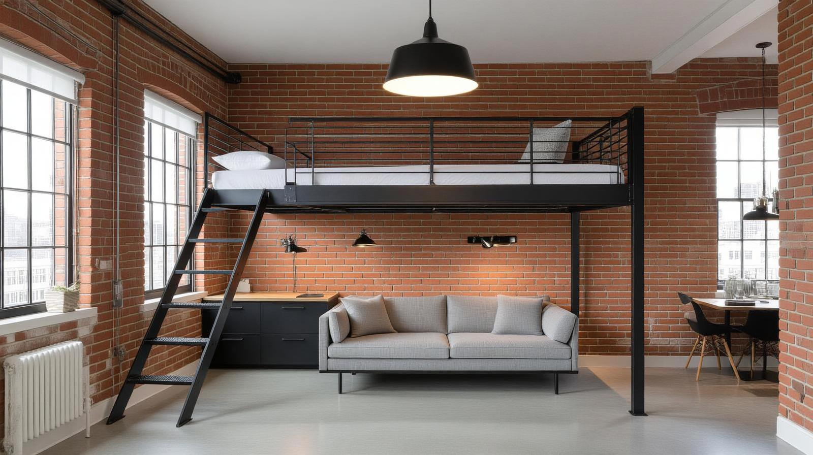

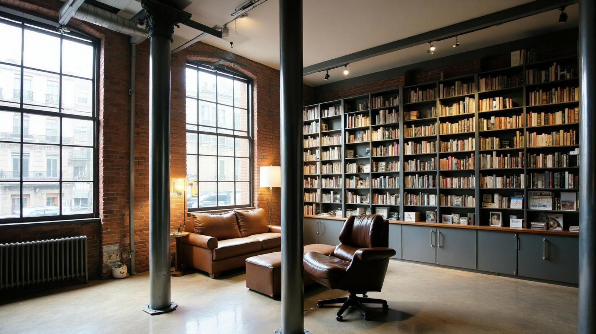

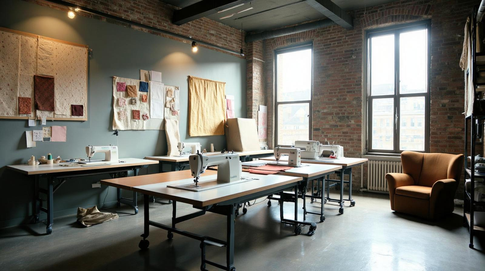
