## Cosmos室内系列：东南亚风格

本系列参考相关文章进行创建，由于包含的风格较多，缩减到20分镜。

分镜提示词如下：

#### user:

创建20个独立的东南亚风格室内设计的图片描述，用英语回答。

#### assistant:

Here are 20 independent Southeast Asian-inspired interior design descriptions, each capturing distinct elements and moods:

1.  **Balinese Spa Sanctuary:** A serene bathroom with dark teak wood walls, a large pebble-inlaid shower floor, a freestanding stone bathtub surrounded by tropical ferns, and soft light filtering through woven rattan pendant lamps.
2.  **Thai Silk & Teak Living Room:** An elegant living space featuring polished teak floorboards, deep sapphire blue Thai silk cushions on a neutral linen sofa, intricate gold-leaf motifs on a dark wood coffee table, and a large Buddha head sculpture on a pedestal.
3.  **Vietnamese Lantern Dining:** An intimate dining area under a canopy of dozens of small, multi-colored silk lanterns. A rustic reclaimed wood table pairs with sleek black lacquered chairs, set against pale mint green walls adorned with vintage Indochine posters.
4.  **Singaporean Peranakan Kitchen:** A vibrant kitchen with hand-painted floral ceramic tiles (Peranakan porcelain) as a backsplash, dark wood cabinets with brass pulls, a central island topped with Calcutta marble, and hanging brass cookware.
5.  **Modern Javanese Bedroom:** A minimalist bedroom with smooth concrete floors, a low platform bed draped in natural indigo-dyed cotton, a dramatic oversized rattan headboard, and large sliding doors opening onto a private courtyard garden.
6.  **Rustic Filipino *Bahay Kubo* Inspired Lounge:** An airy living space with woven bamboo walls and ceiling, a nipa palm roof visible inside, simple wooden furniture with abaca fiber upholstery, and large capiz shell windows filtering sunlight.
7.  **Urban Bangkok Apartment Balcony:** A compact city balcony transformed with lush vertical gardens, a small teakwood bistro set, colorful mosaic tiles on the floor, and strings of Edison bulb lights crisscrossing overhead.
8.  **Malaysian Heritage Shophouse Cafe:** The interior of a converted shophouse featuring high ceilings with exposed timber beams, vintage patterned cement floor tiles (encaustic tiles), slow-rotating ceiling fans, and dark wood communal tables.
9.  **Luxury Cambodian Resort Bath:** An opulent bathroom with a hammered copper soaking tub, walls clad in smooth river stones, rich golden silk curtains, and orchids floating in stone basins.
10. **Timorese Coastal Living:** A bright living room facing the ocean, featuring whitewashed walls, driftwood coffee tables, navy blue and white ikat patterned throw pillows, woven seagrass rugs, and fishing net art.
11. **Burmese Temple-Inspired Entryway:** A dramatic entry hall with walls painted a deep terracotta red, a gilded antique mirror with intricate carving, a low black lacquer console table holding a large brass bowl filled with marigolds, and a vintage Burmese tapestry on the wall.
12. **Indochine Colonial Study:** A sophisticated home office/library with dark mahogany bookshelves, a vintage leather-top desk, a rattan armchair with velvet cushions, a slowly rotating ceiling fan, and French colonial-style shutters on the windows.
13. **Balinese Open-Air *Bale* Pavilion:** An outdoor relaxation pavilion (*bale*) with a thatched roof supported by carved wooden pillars, featuring daybeds piled with batik cushions, a low table for tea, overlooking a lotus pond.
14. **Hoi An Lantern Maker's Workshop Vibe:** A creative studio space with walls lined with shelves displaying hundreds of colorful silk lanterns in various stages of creation. Worktables made from reclaimed wood and baskets full of bamboo frames.
15. **Sumatran Tribal Textile Gallery Bedroom:** A bedroom acting as a gallery for handwoven textiles. Neutral walls and a woven jute rug provide backdrop for vibrant *songket* and *ikat* wall hangings and bedspreads. Simple dark wood bed frame.
16. **Laotian Riverside Cafe Terrace:** Covered terrace seating with woven bamboo screens for shade, low wooden stools and tables, terracotta tile floors, and views of a river. Hanging brass coffee drippers and baskets of local fruit decorate the space.
17. **Modern Tropical Kitchen with Philippine Influence:** A clean-lined kitchen featuring cabinetry in deep forest green, brass hardware, open shelving displaying hand-thrown terracotta pottery, a large window overlooking banana trees, and a woven rattan pendant light.
18. **Thai Hill Tribe Craft Corner:** A cozy reading nook defined by a large, textured handwoven tribal rug from Northern Thailand, floor cushions in earthy tones, a low bamboo bookshelf, and a collection of handcrafted silver ornaments displayed on the wall.
19. **Indonesian *Joglo* Grand Living Room:** A spacious living area centered around the soaring, exposed wooden roof structure of a traditional Joglo house. Features a large sectional in natural linen, a massive teak root coffee table, and antique Javanese shadow puppets framed as art.
20. **Spicy Singaporean Hawker Stall-Inspired Kitchen Bar:** A vibrant kitchen breakfast bar area with stools upholstered in bold chili-red vinyl, countertops in dark green speckled granite resembling Peranakan tiles, hanging stainless steel cookware, and small potted chili plants on the counter.

Each description evokes a unique facet of Southeast Asia's diverse design heritage, from rustic simplicity to colonial elegance and vibrant cultural expressions.
<!-- AUTO-GENERATED MEDIA -->

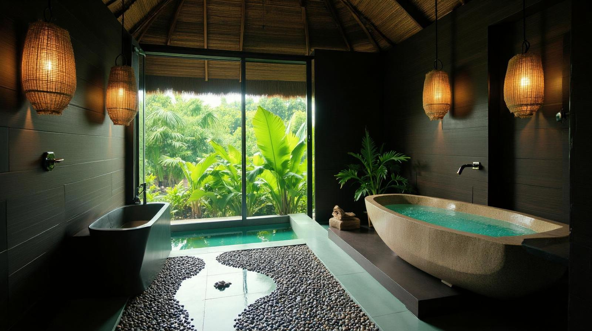

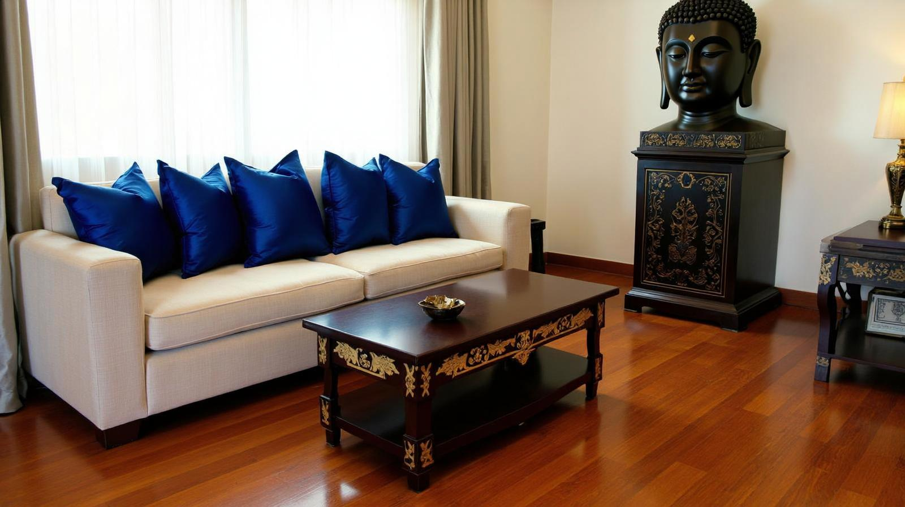

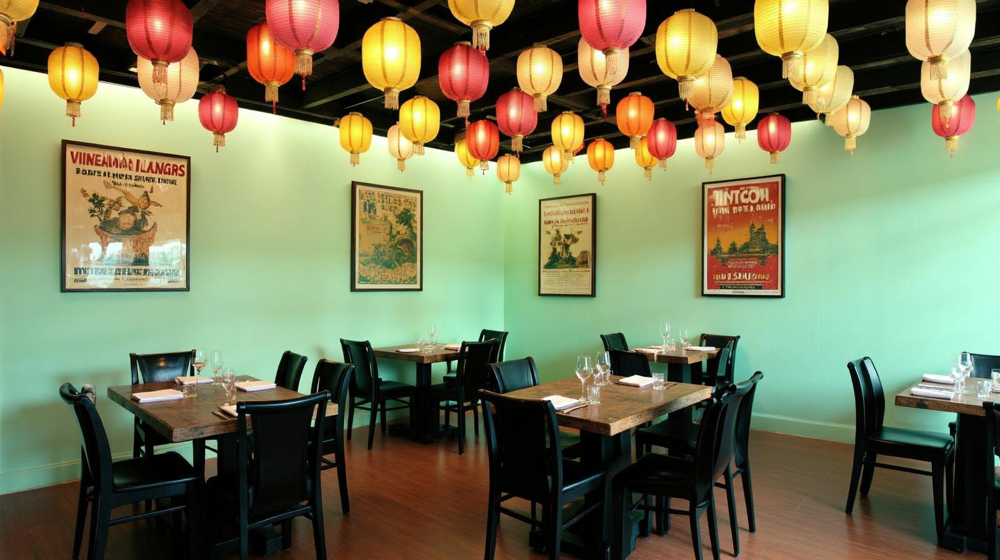

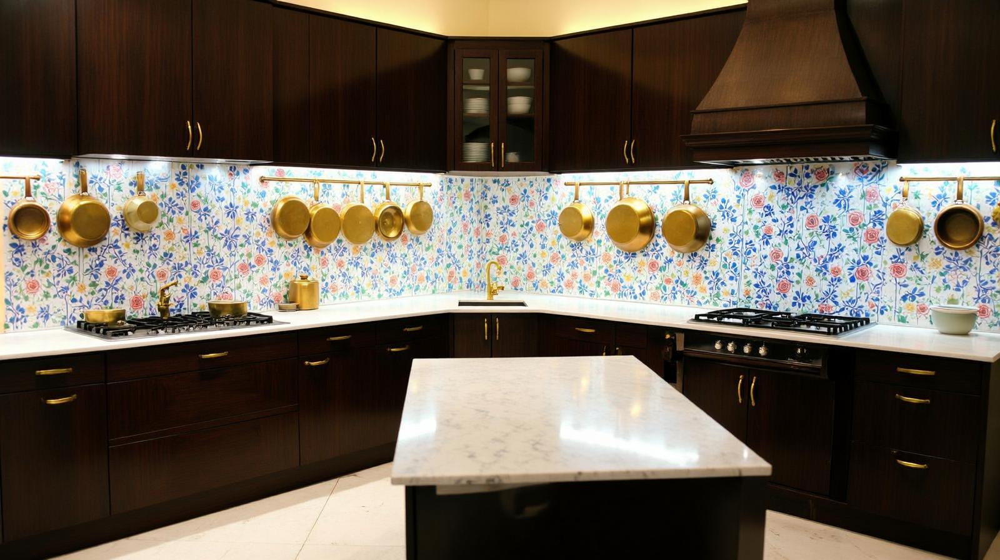

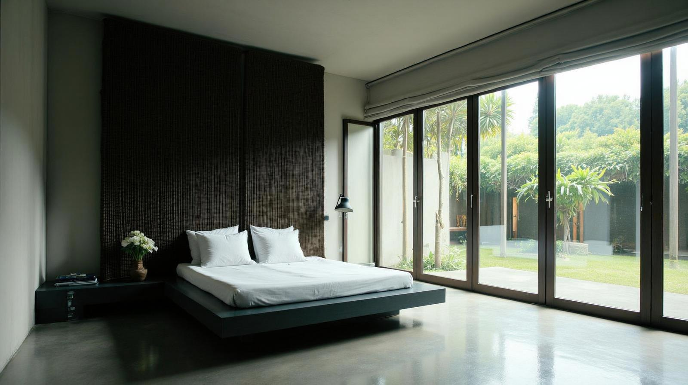

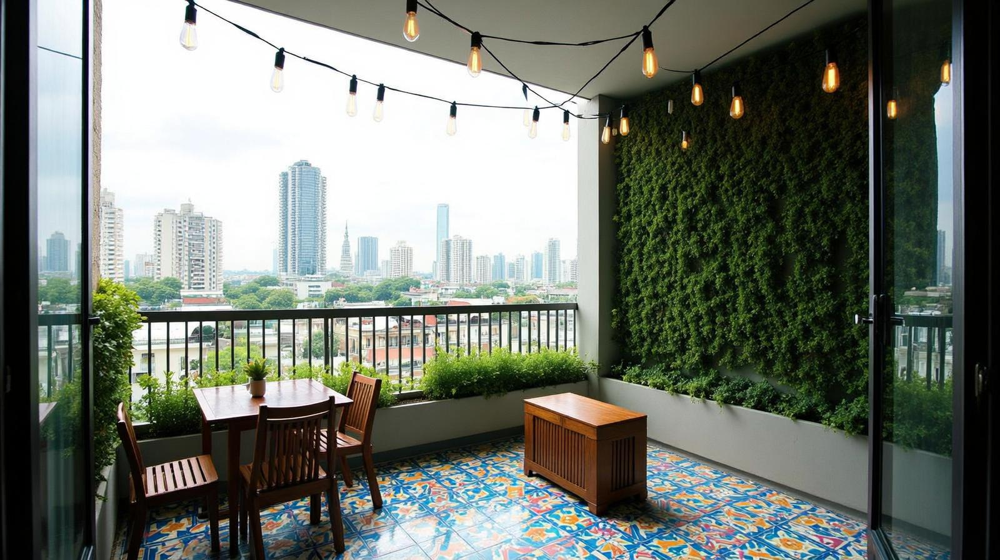

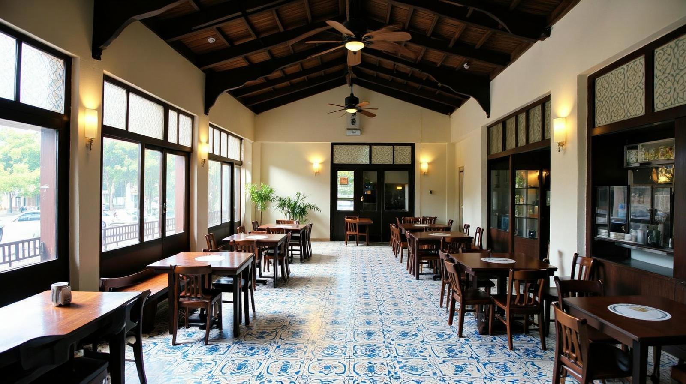

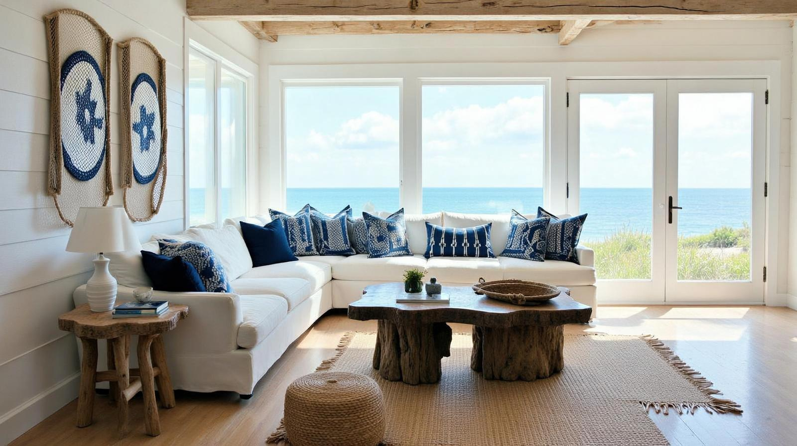

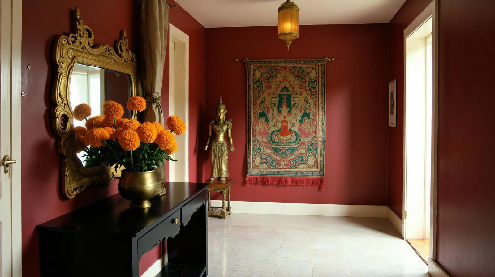

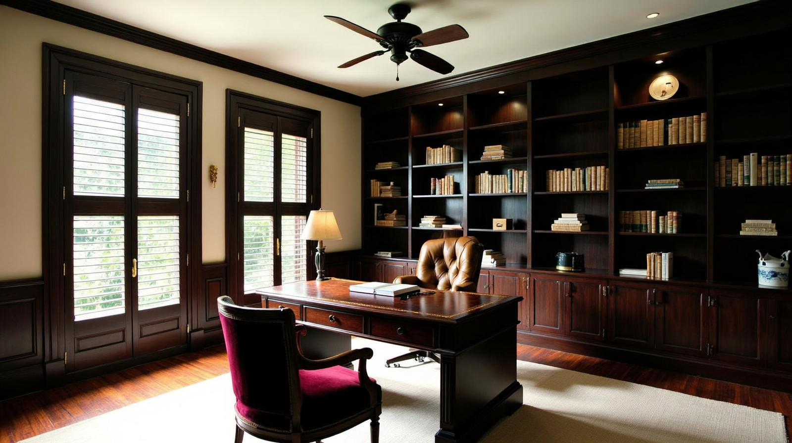

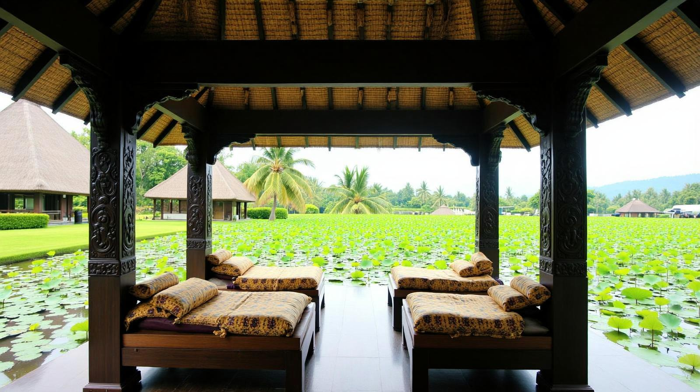

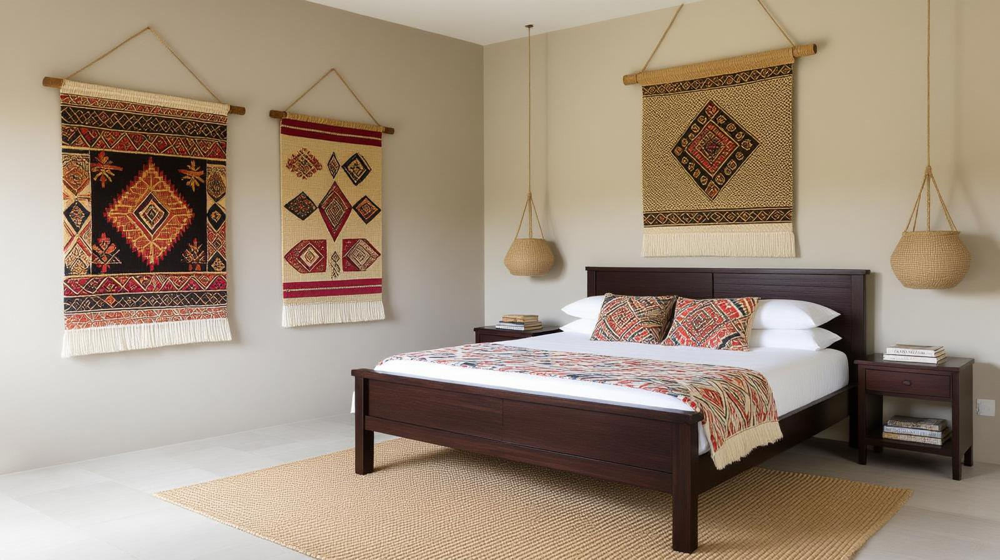

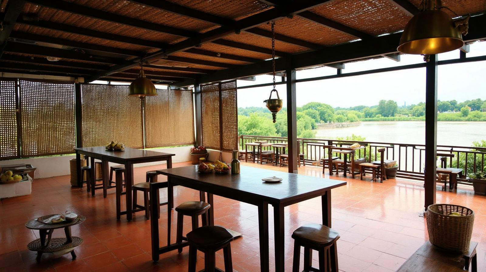

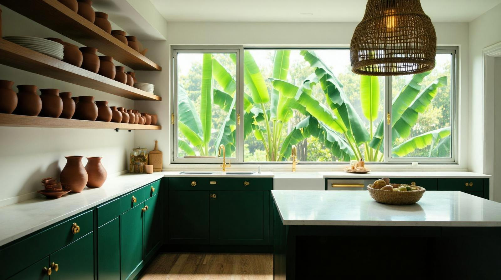

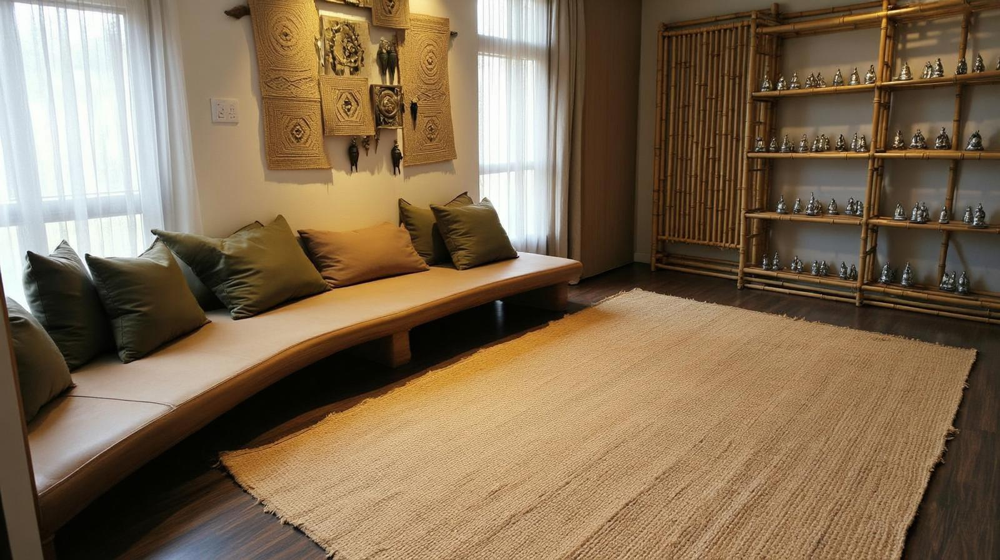

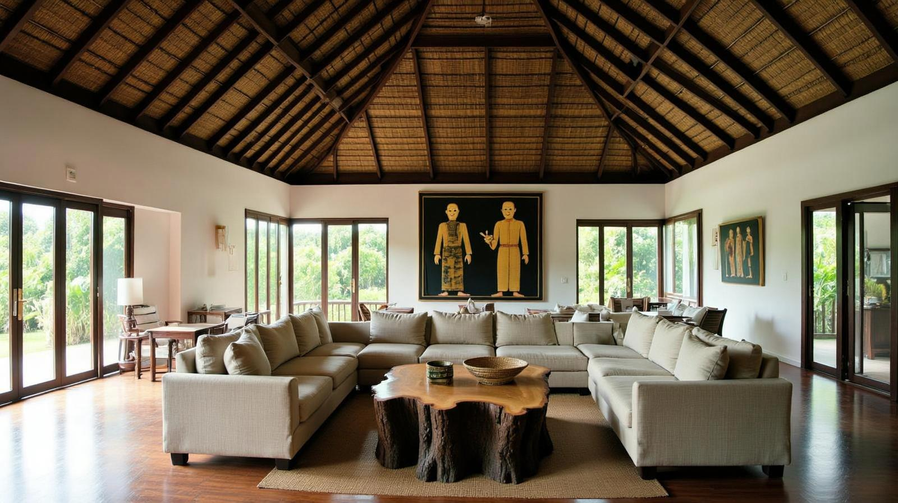

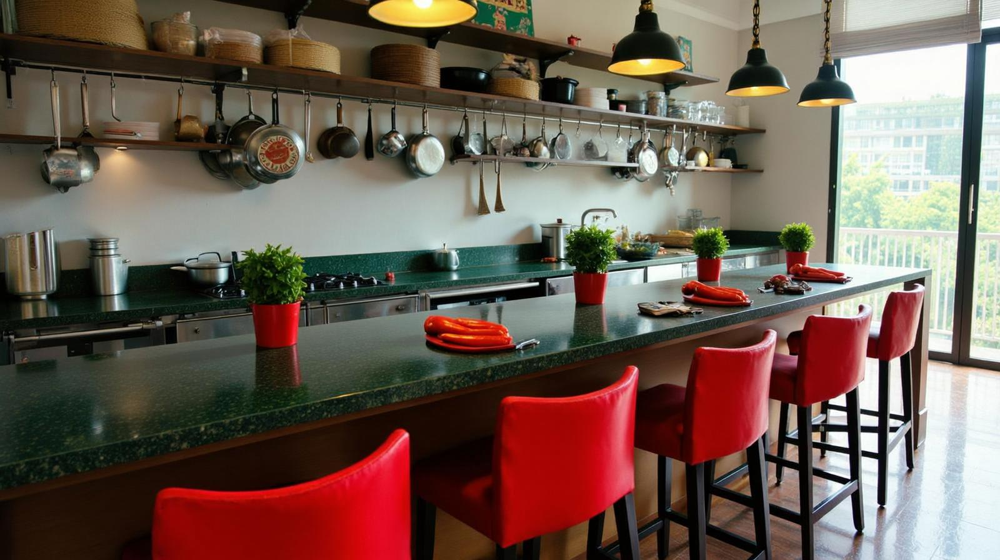
