## Cosmos室内系列：北欧风格

本系列参考相关文章进行创建，由于包含的风格较多，缩减到20分镜。

分镜提示词如下：

#### user:

创建20个独立的北欧风格室内设计的图片描述，用英语回答。

#### assistant:

Here are **20 unique Nordic-style interior design image descriptions**, each capturing distinct aspects of this minimalist, functional, and nature-inspired aesthetic:

1.  **Sunlit Minimalist Living Room:** A bright living space with white walls, pale oak flooring, and a low-profile beige linen sofa. A single abstract black-and-white artwork hangs above a sleek wood-burning stove. Large windows flood the room with natural light.
2.  **Hygge Reading Corner:** A cozy nook by a window featuring a deep charcoal armchair draped in a chunky cream knit throw. A minimalist black floor lamp arches overhead, illuminating an open book on a small teak side table beside a steaming mug.
3.  **Scandi Kitchen Serenity:** A clean-lined kitchen with matte white cabinetry, integrated handles, and pale grey quartz countertops. Open wooden shelves display simple ceramic tableware. Pendant lights with black metal shades hang over a functional island.
4.  **Forest View Bedroom:** A tranquil bedroom with walls painted soft grey. A low platform bed with crisp white linen sits opposite a wall of floor-to-ceiling windows showcasing a snowy pine forest. Minimalist black sconces flank the bed.
5.  **Organic Bathroom Retreat:** A serene bathroom featuring large grey concrete tiles, a freestanding oval bathtub on a light oak platform, and a wall-mounted teak vanity with an integrated white basin. A single potted fern adds life.
6.  **Modern Nordic Entryway:** A functional entry hall with built-in pale ash wood storage benches and hooks. A large round mirror hangs above, reflecting light from a simple geometric pendant. A textured jute rug sits on light wood flooring.
7.  **Monochrome Dining Space:** A sophisticated dining area with a long, solid oak table and matching slim-profile chairs in black. A dramatic oversized black linear pendant light hangs low above. White walls and sheer curtains provide a clean backdrop.
8.  **Textured Lounge Area:** A living space emphasizing texture: a deep grey bouclé armchair sits beside a smooth concrete side table on a thick, woven wool rug in cream and charcoal. A single sculptural branch in a ceramic vase adds organic form.
9.  **Compact Studio Efficiency:** A small studio apartment showcasing smart Nordic design. A modular sofa doubles as a guest bed, facing a wall-mounted TV above clever built-in storage units in light birch. Foldable furniture maximizes space.
10. **Home Office Clarity:** A bright, uncluttered home office with a white desk and matching wall-mounted shelving. A comfortable ergonomic chair in muted green sits on a pale rug. A task lamp with an adjustable black arm provides focused light.
11. **Child's Playroom Calm:** A light-filled, organized playroom with white walls and natural wood toy storage bins on low shelves. A soft grey rug defines the play area. Simple paper lanterns hang from the ceiling near a large window.
12. **Warm Bedroom Layers:** A welcoming bedroom featuring a beige linen headboard against a light taupe wall. Layers of bedding in cream, oatmeal, and soft grey create warmth. A vintage-inspired wooden stool serves as a bedside table.
13. **Black Accent Kitchen:** Primarily white kitchen with matte cabinetry, contrasted by deep black countertops and matching black tapware. Open shelving in light ash wood displays minimalist white ceramics. Under-cabinet lighting creates ambiance.
14. **Balcony Sanctuary:** A small urban balcony designed for simplicity: pale grey composite decking, two sleek black metal chairs with cream cushions, and a small teak side table. Potted evergreens in black concrete planters add greenery.
15. **Spa-Like Wet Room:** A minimalist wet room with large format white tiles, a ceiling-mounted rain showerhead, and a linear drain. A teak shower stool and matching teak bath mat provide warmth against the clean surfaces.
16. **Gallery Wall Living Room:** A bright living room with a curated gallery wall featuring an eclectic mix of black-and-white photography and abstract line drawings in simple black frames. A low, modular grey sofa faces the arrangement.
17. **Rustic-Meets-Modern Cabin:** Inside a timber-framed cabin, a modern Nordic interior shines: white-painted wood walls, a sleek black wood stove, and a large comfortable sofa with sheepskin throws facing panoramic forest views.
18. **Breakfast Nook Charm:** A cozy corner breakfast nook with built-in bench seating upholstered in light grey fabric and a small round oak table. A woven pendant lamp hangs low above, illuminating morning coffee.
19. **Industrial-Scandi Loft:** A spacious loft conversion blending Nordic minimalism with industrial elements: polished concrete floors, exposed ductwork painted white, large modular sofas in muted tones, and oversized abstract art on a brick wall.
20. **Muted Tone Bedroom:** A calming master bedroom featuring walls in a soft, dusty blue. Light birch wood nightstands flank a upholstered bed in a warm grey fabric. Textured linen curtains filter light from a large window. A single woven basket holds extra blankets.

Each description emphasizes the core Nordic principles: **light, simplicity, natural materials, functionality, and a connection to nature**, while offering unique settings and details.

<!-- AUTO-GENERATED MEDIA -->

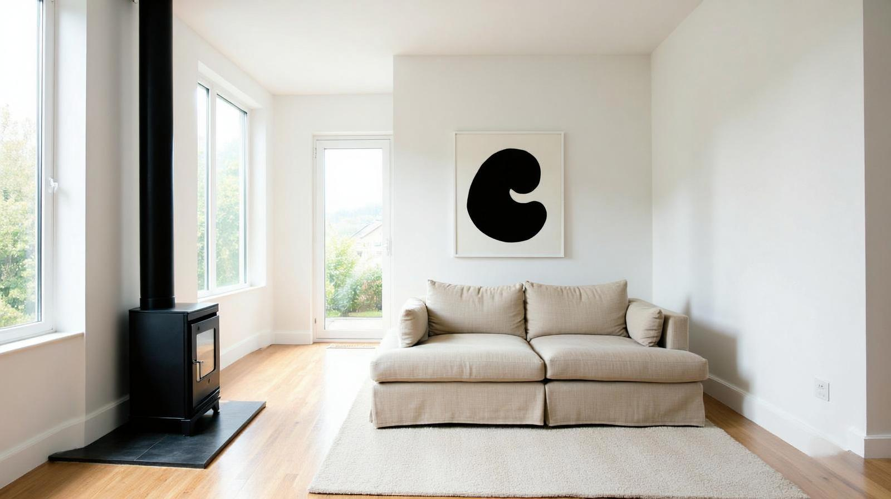

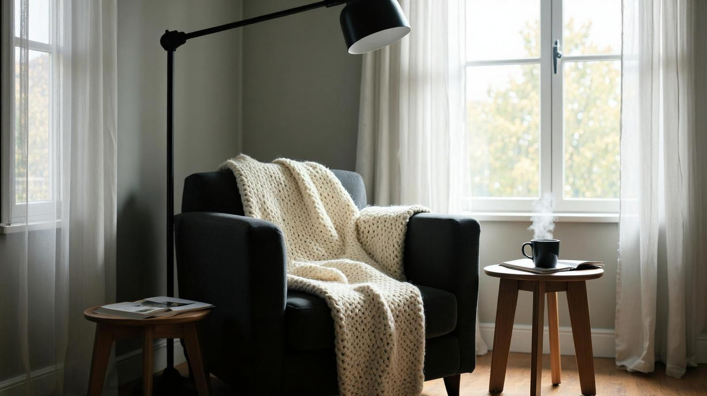

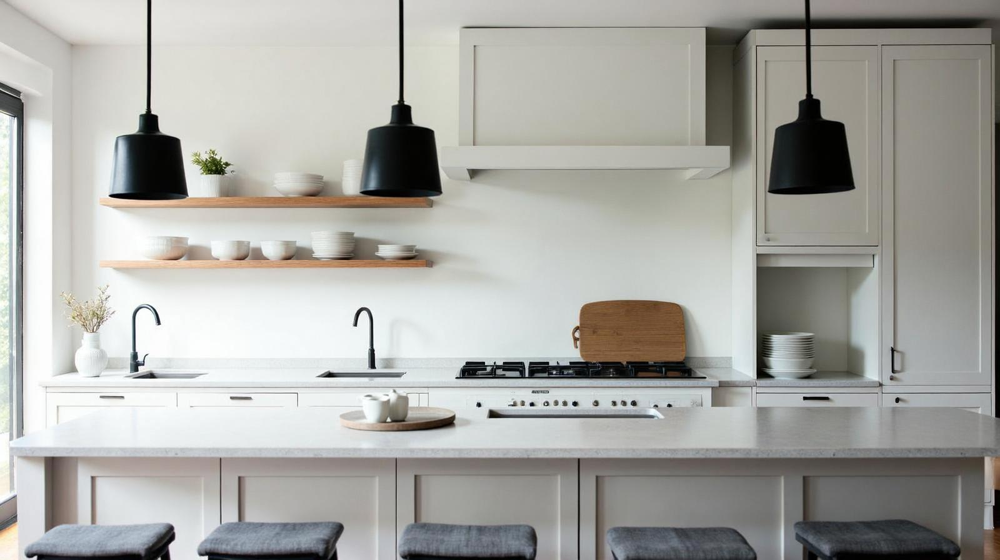

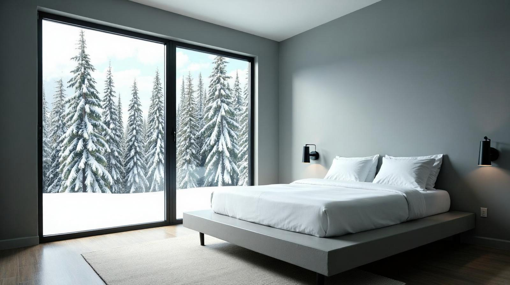

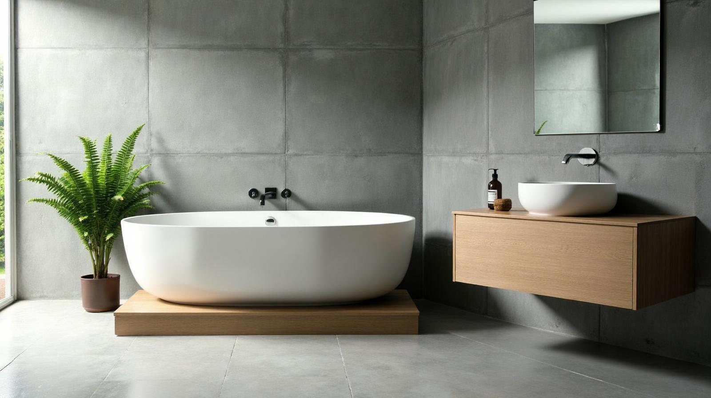

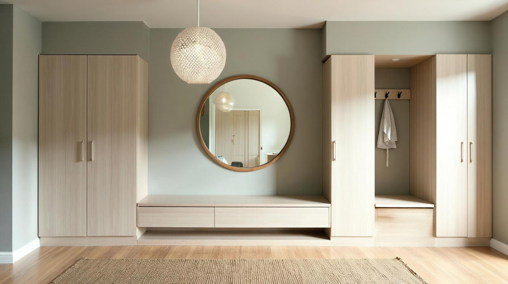

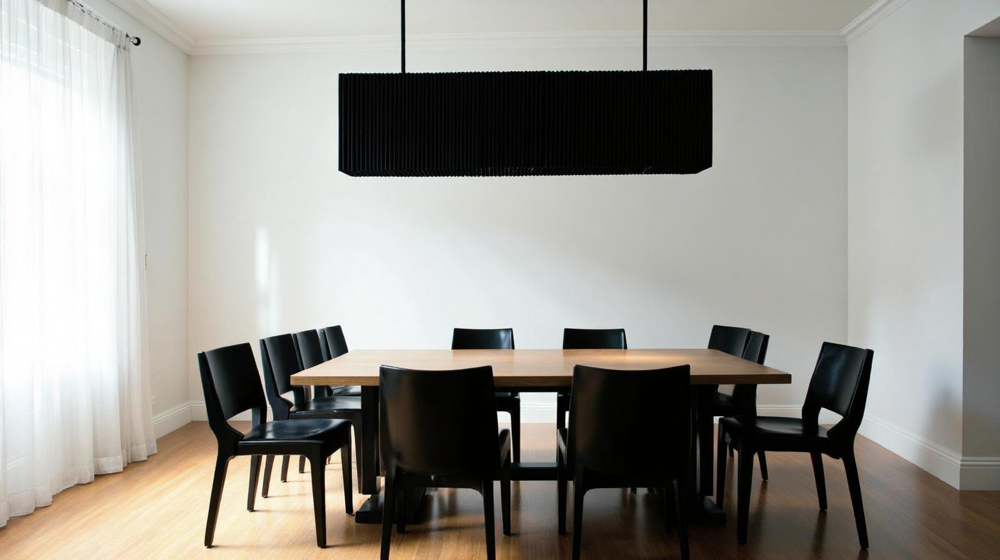

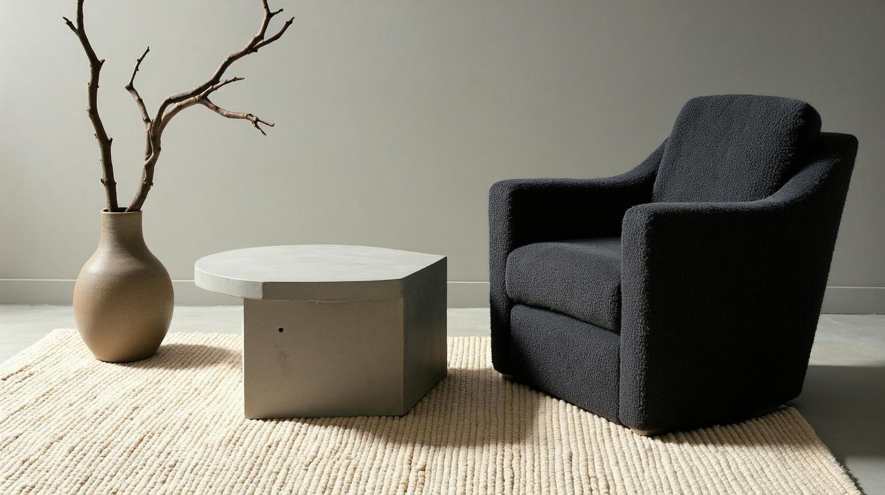

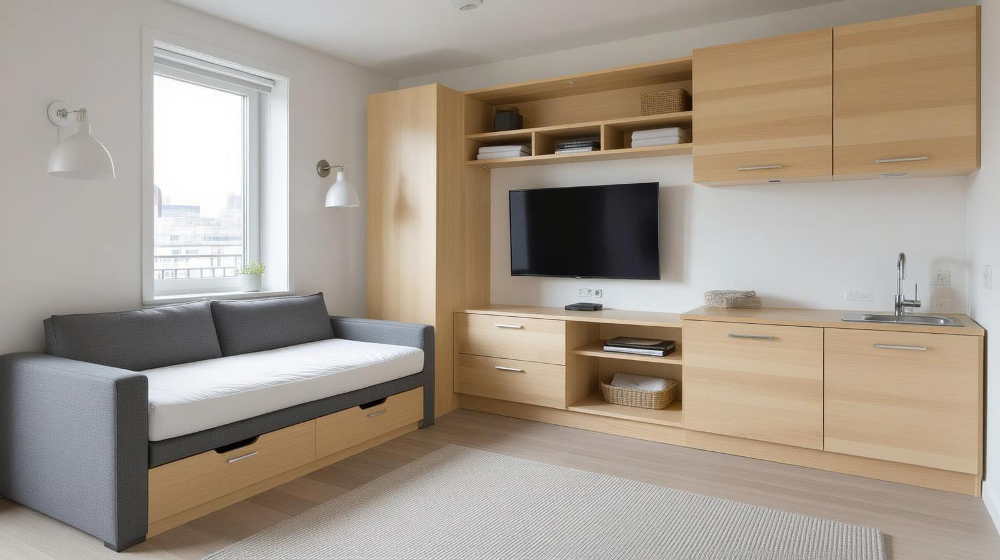

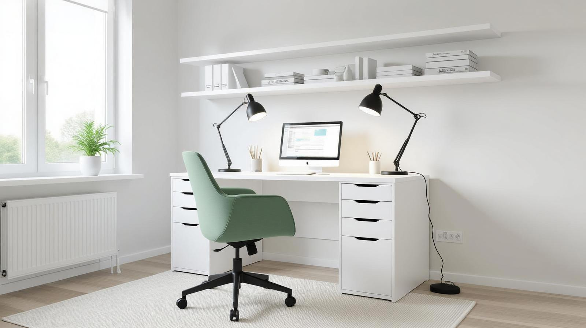

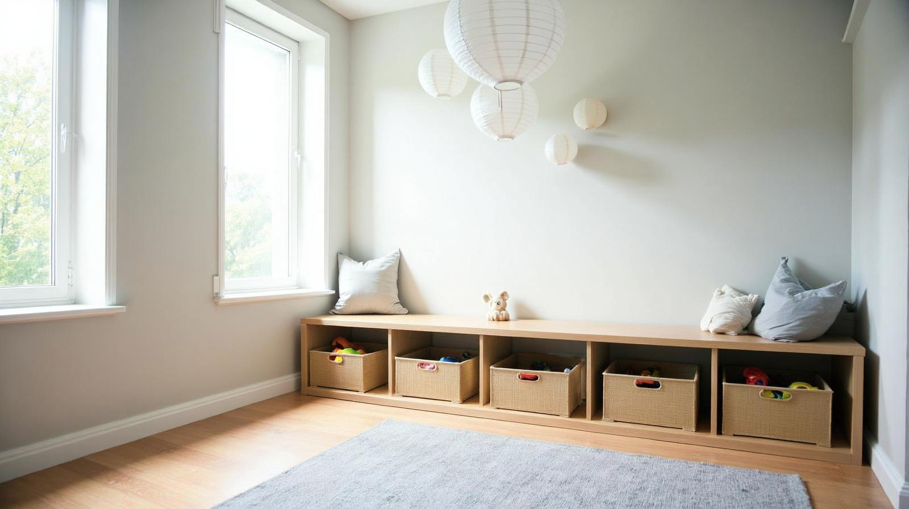

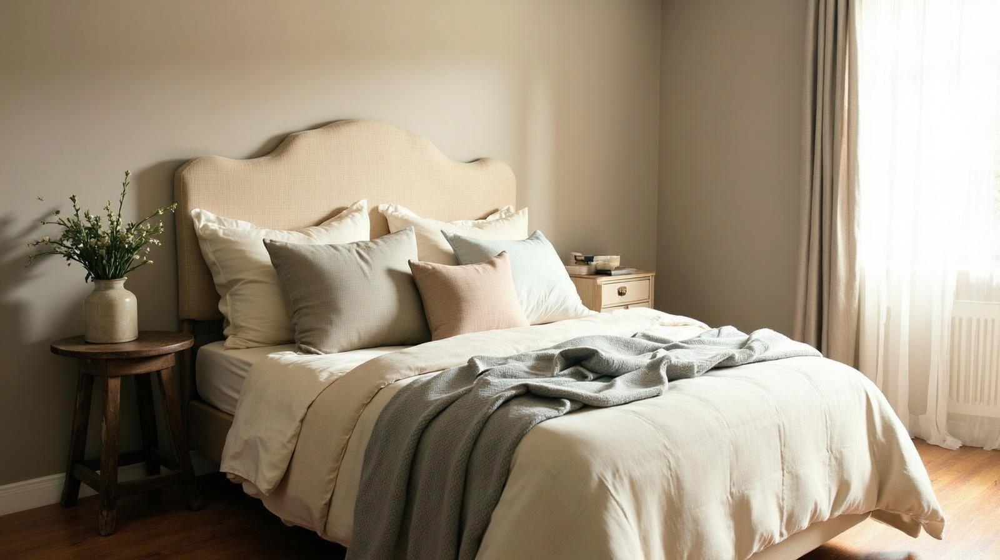

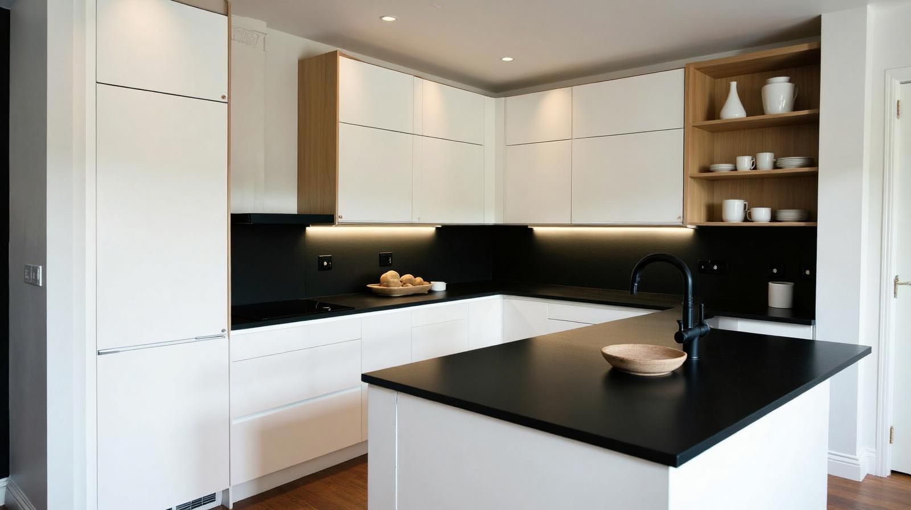

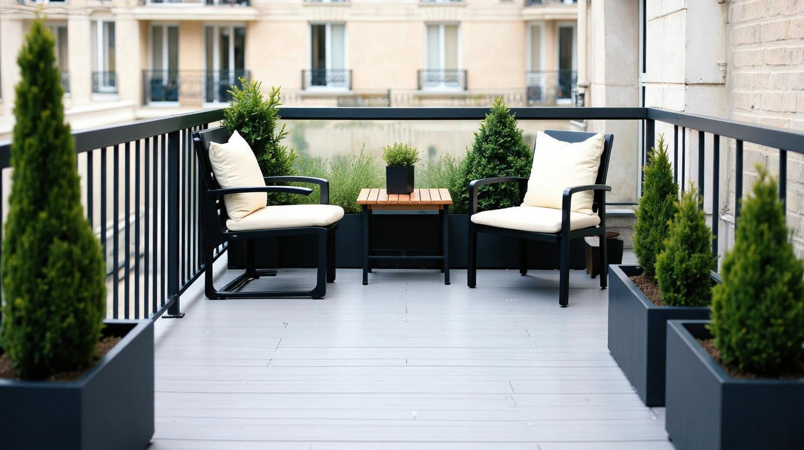

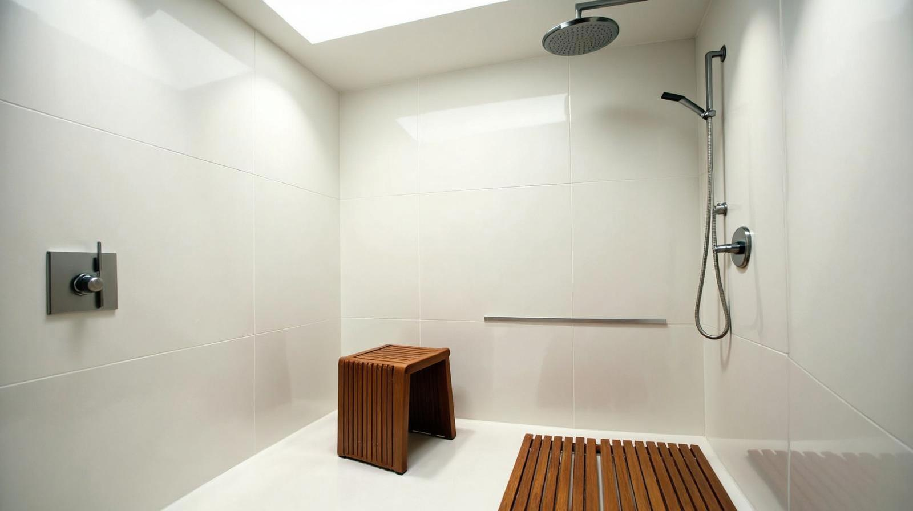

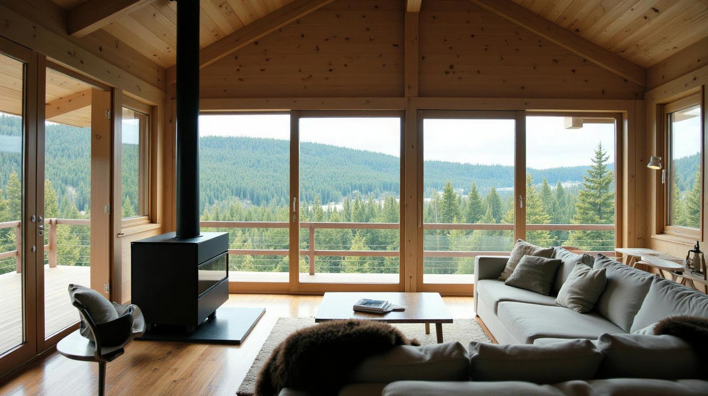

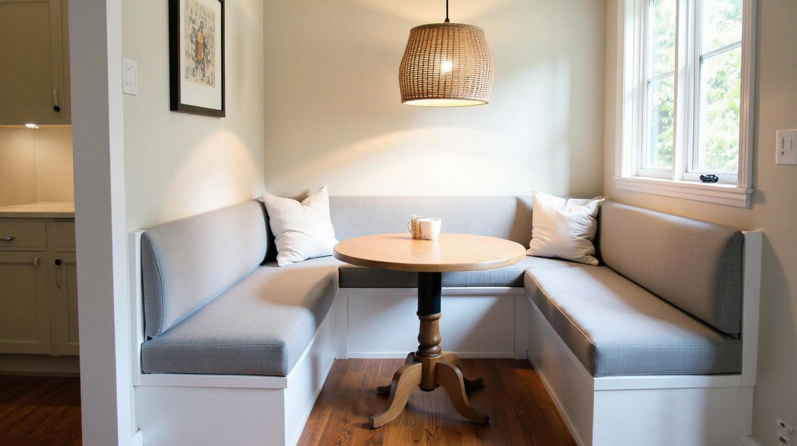

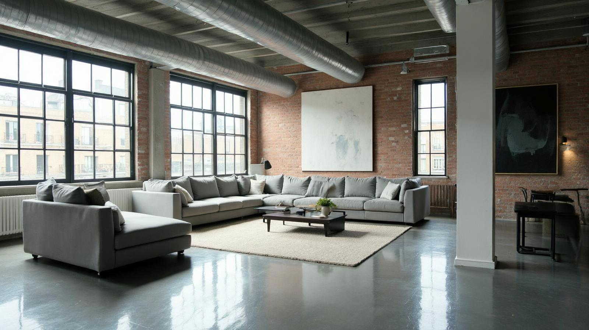

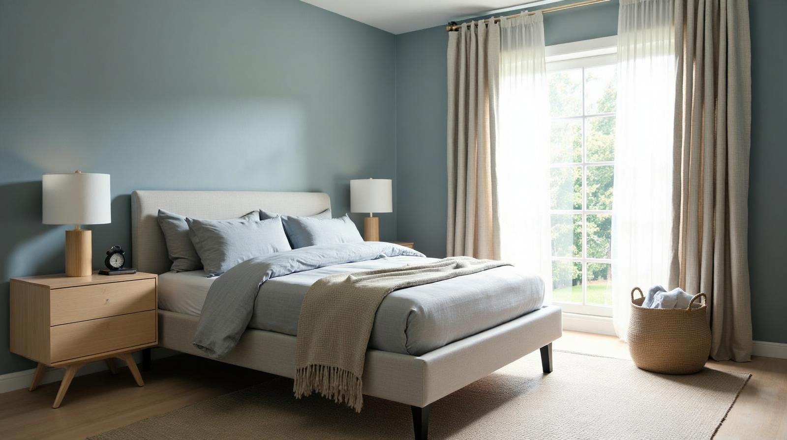
