## Cosmos室内系列：古埃及风格

本系列参考相关文章进行创建，由于包含的风格较多，缩减到20分镜。

分镜提示词如下：

#### user:

创建20个独立的古埃及风格室内设计的图片描述，用英语回答。

#### assistant:

Here are 20 unique image descriptions for independent Ancient Egyptian-style interior designs, focusing on varied settings, purposes, and details:

1.  **Pharaoh's Morning Chamber:** Sunlight streams through a high, narrow window onto a polished limestone floor. A massive ebony bed with gold lion-paw feet dominates the room. Walls are covered in vibrant frescoes depicting the Pharaoh's divine lineage and hunting scenes. A simple alabaster vanity holds cosmetic jars.
2.  **Scribe's Papyrus Library:** Cool, dim light filters into a small, windowless room lined with wooden shelves overflowing with rolled papyri. A low writing desk holds reed pens, ink palettes (red and black), and a water pot. Hieroglyphic labels mark shelf sections. A simple woven mat covers the floor.
3.  **Temple Offering Hall:** Towering fluted columns painted red, yellow, and blue support a high ceiling lost in shadow. Sunlight slants down, illuminating massive statues of gods along the walls. Low stone altars piled with fruits, bread, and flowers stand before them. The air feels still and sacred.
4.  **Noblewoman's Dressing Room:** An intimate space with walls painted pale turquoise. An ornate cedar chest inlaid with ivory and faience tiles sits open, revealing fine linens. A polished bronze mirror reflects light from an oil lamp. Perfume cones and jewelry boxes litter a low table.
5.  **Artisan's Pottery Workshop:** Sun-baked mudbrick walls. Workbenches are cluttered with unfired clay vessels, shaping tools, and pigment pots. A potter's wheel sits ready. Shelves display finished pieces – bowls, jars, figurines – some with simple geometric patterns. Sunlight pours through a large doorway.
6.  **Royal Banquet Hall:** A grand hall with lotus-bud column capitals. Low dining couches covered in rich fabrics surround low tables laden with roasted fowl, figs, bread, and wine amphorae. Musicians play harp and sistrum in a corner. Murals show bountiful harvests and river scenes.
7.  **Under-River Cliff Tomb Antechamber:** Rough-hewn rock walls meet precise limestone blockwork. Flickering torchlight reveals intricate painted scenes of the deceased's journey through the underworld. A sealed doorway leads deeper into the tomb. Offerings of grain and beer sit untouched.
8.  **Merchant's Riverside Storeroom:** Practical space opening onto the Nile. Sturdy wooden shelves hold amphorae stamped with hieratic script (grain, oil, wine). Sacks of spices lean against the wall. A simple scale hangs from a beam. Light reflects off the water onto the ceiling.
9.  **Temple Priest's Scriptorium:** A quiet, austere room. A high desk holds papyrus scrolls open for copying religious texts. Precise hieroglyphs fill the pages. A small shrine niche holds a statue of Thoth. Reed mats cover the floor. Light comes from a single high slit window.
10. **Children's Bedroom in a Wealthy Home:** Brightly painted walls feature playful animals and birds. Low wooden beds with simple linens. Reed chests hold toys – carved wooden animals, rag dolls, balls. A small, colorful mural depicts children playing by the river.
11. **Palace Garden Pavilion:** An open-sided structure amidst lush date palms and lotus pools. Slender papyrus-form columns support the roof. Low benches offer views of fish in the pools and tame birds. Delicate floral motifs adorn the columns and ceiling beams. Dappled sunlight filters through.
12. **Military Commander's Strategy Room:** Walls painted with maps of Egypt and neighboring lands on plaster. A large, low table holds clay tablets and papyrus scrolls. Weapons (a khopesh sword, shield) hang ceremonially on one wall. A simple stool sits before the table. Light is functional.
13. **Linen Weaver's Workshop:** Large vertical looms dominate the space, strung with fine flax threads. Baskets of raw flax and spun thread sit nearby. Light floods in from a high window, illuminating the dust motes. Finished bolts of white and naturally dyed linen lean against a wall.
14. **Sacred Cat Shrine Room (Bubasteion Inspired):** Small niche or room within a temple complex. Statuettes of Bastet in bronze and faience fill shelves. Offerings of milk, fish, and small jewels lie before them. Murals depict cats hunting and being revered. Soft, reverent atmosphere.
15. **Nubian Mercenary Captain's Quarters (Aswan Garrison):** A blend of Egyptian and Nubian styles. Mudbrick walls, Egyptian-style furniture, but vibrant Nubian patterned textiles cover a low bed and cushions. A distinctive Nubian shield hangs beside an Egyptian spear. Desert views from the window.
16. **Perfumer's Alchemy Room:** Shelves lined with delicate glass and alabaster vessels containing oils, resins (myrrh, frankincense), and crushed flowers. Mortars and pestles rest on a workbench. The air is thick with complex, heady scents. Diagrams of distillation processes adorn the walls.
17. **Grand Vizier's Reception Hall:** Imposing yet elegant. Massive papyrus-bundle columns. A raised dais holds the Vizier's ornate chair. Lower stools for petitioners. Walls depict scenes of administration, tribute bearing, and the Vizier receiving honors from the Pharaoh. Highly formal.
18. **Boat Builder's Riverside Shed:** Open structure facing the Nile. The skeletal wooden frame of a small reed boat or wooden skiff is under construction. Tools (adzes, chisels, mallets) hang neatly on the walls. Bundles of papyrus reeds or planks of acacia wood are stacked nearby. Water reflections dance on the ceiling.
19. **Temple Sanctuary (Holy of Holies):** Profoundly dark and silent except for flickering light from a single oil lamp. A small, enclosed space housing the cult statue of the god, likely gold or gilded wood, barely visible in the gloom. The air feels thick with incense residue. Utterly sacred and inaccessible.
20. **Middle-Class Home Courtyard at Dusk:** The heart of a modest home. A small, paved courtyard open to the stars. A simple mudbrick oven glows. Low stools surround a central mat where a family might gather. Potted plants (mandrake?) line the edges. Warm light spills from surrounding rooms' doorways. Peaceful and domestic.

Each description aims for a distinct setting, function, and atmosphere while incorporating key Egyptian elements like hieroglyphs, specific colors (ochre, turquoise, blue, red), column styles, materials (limestone, mudbrick, wood, reeds), and thematic murals.

<!-- AUTO-GENERATED MEDIA -->

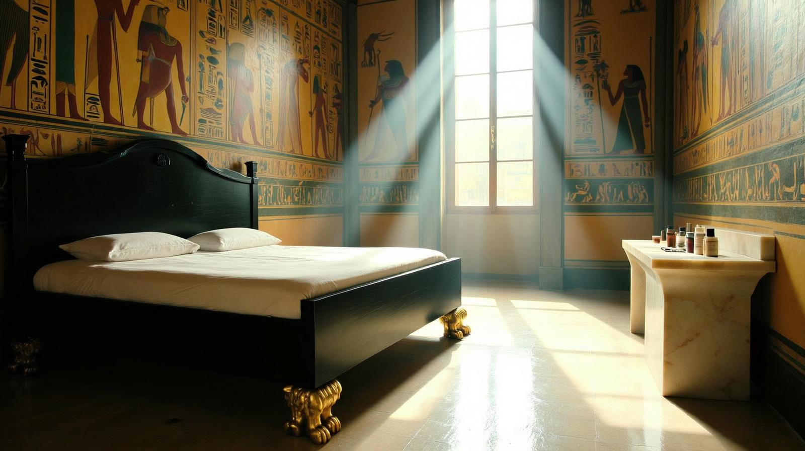

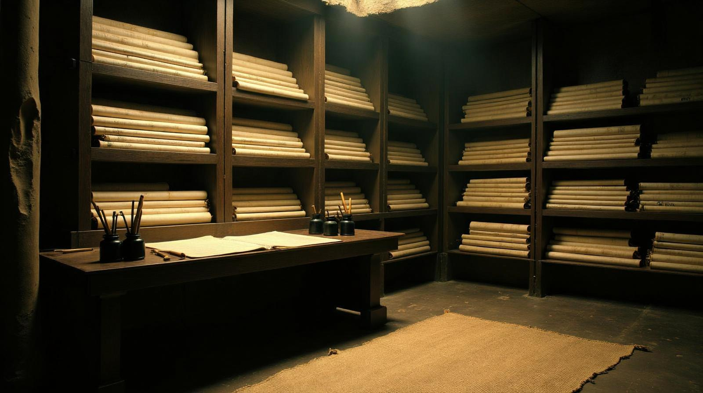

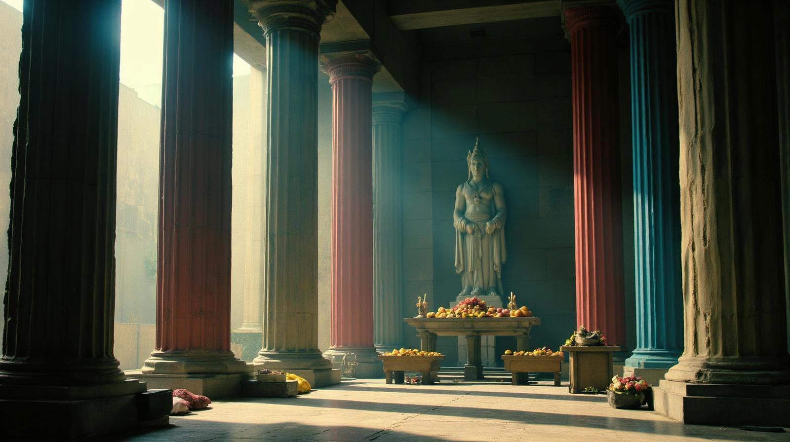

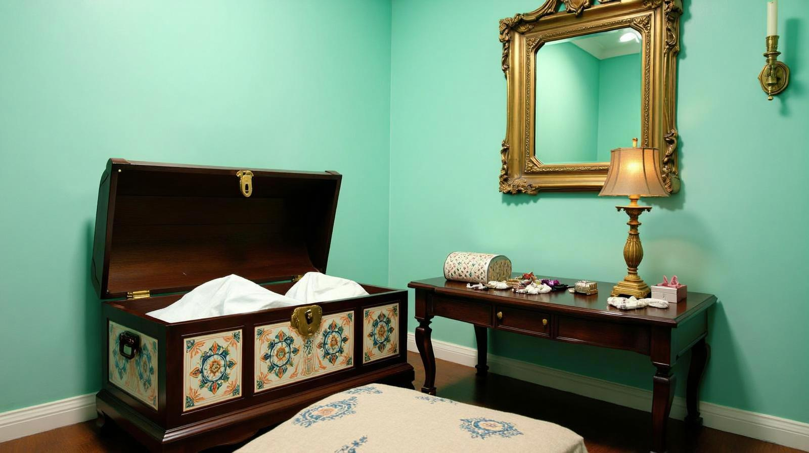

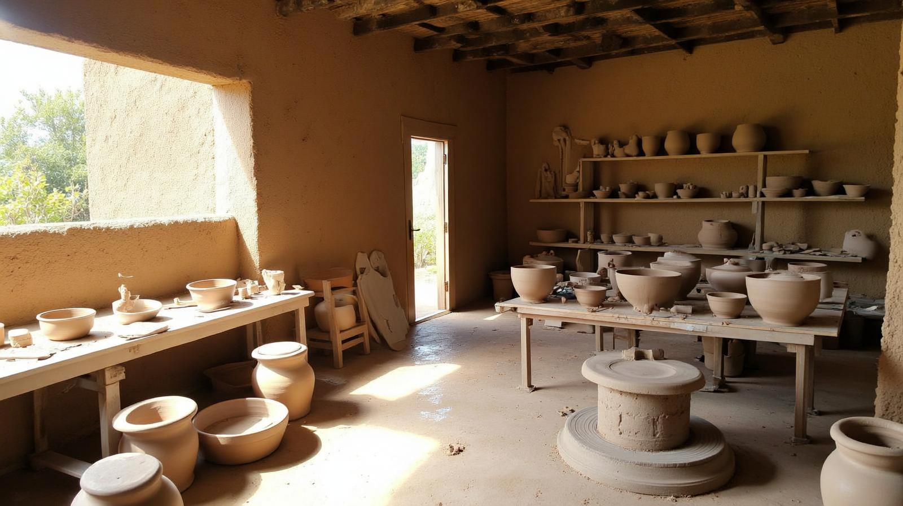

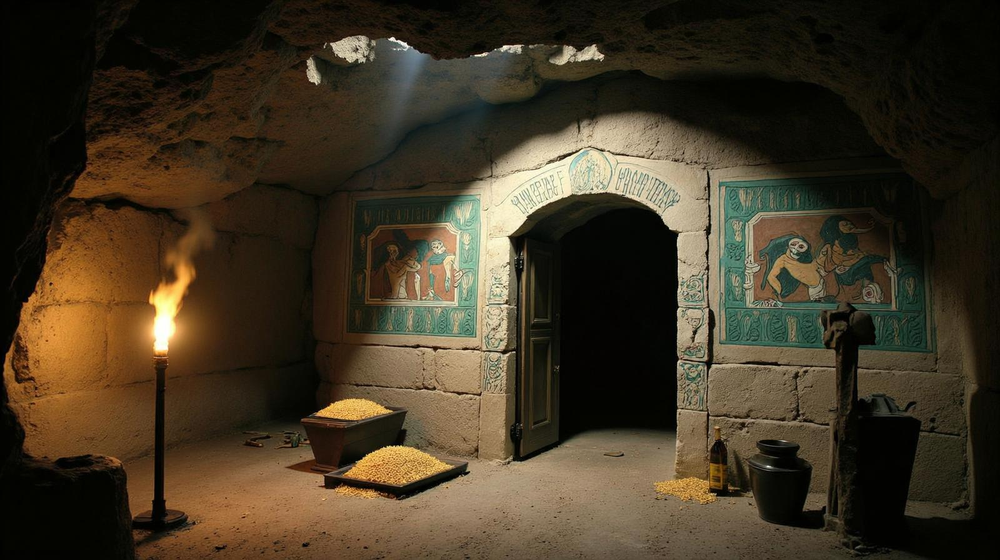

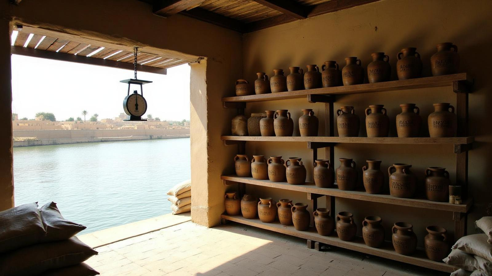

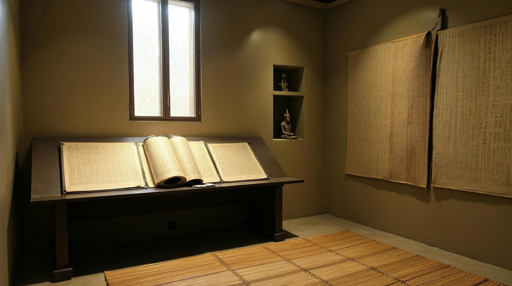

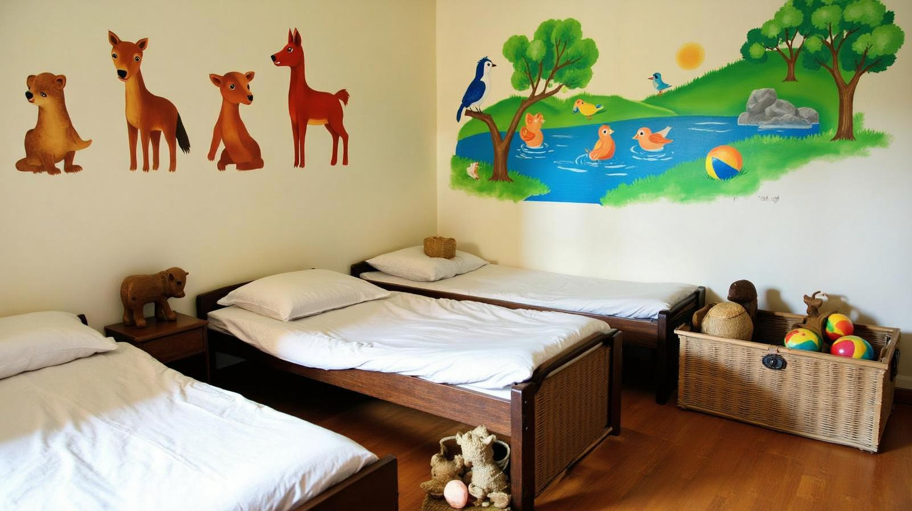

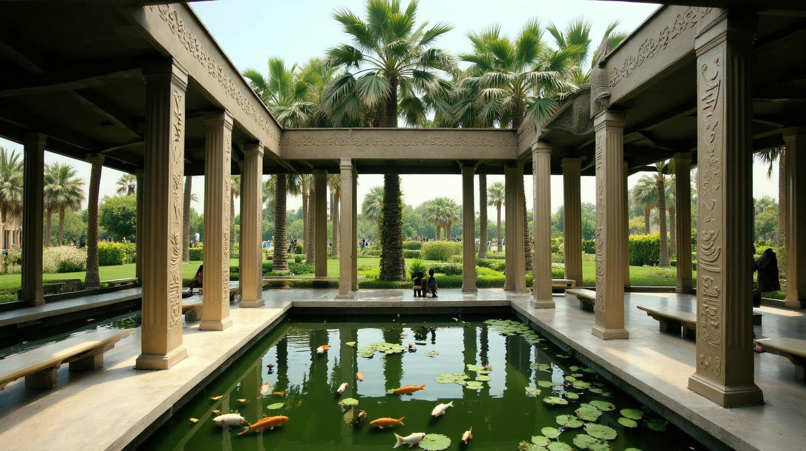

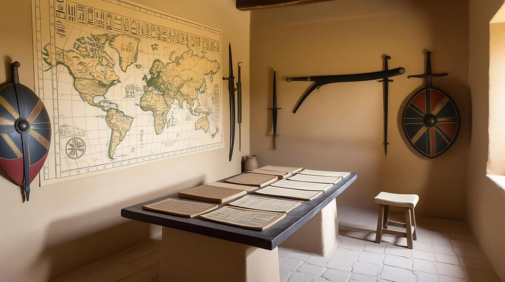

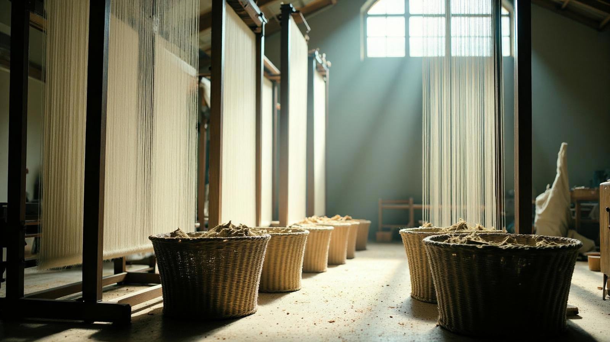

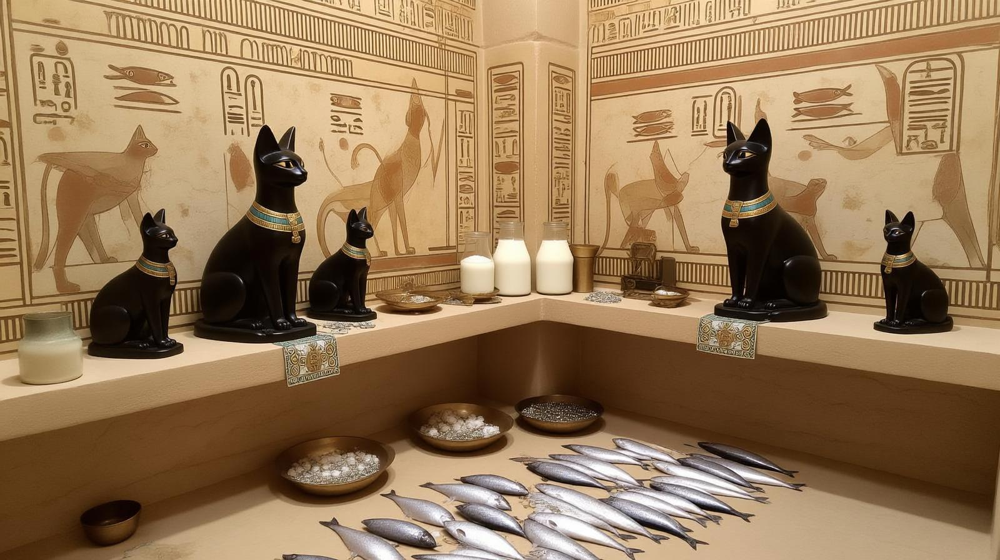

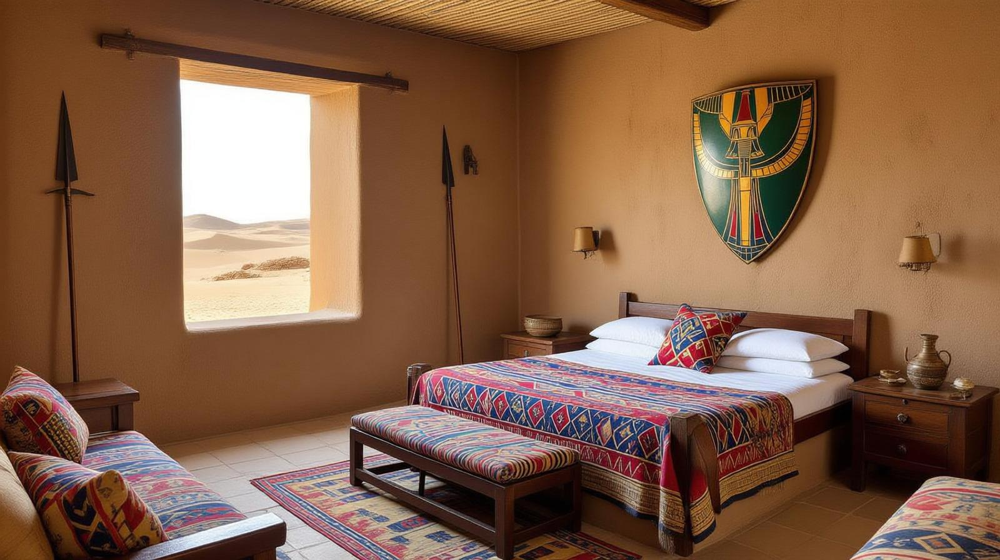

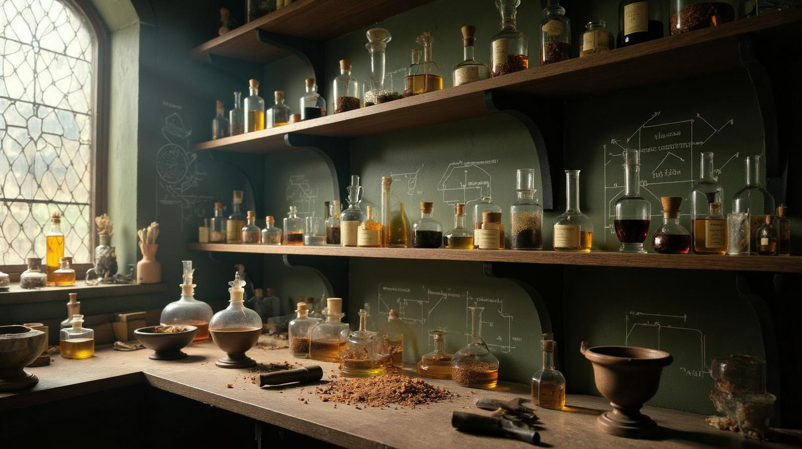

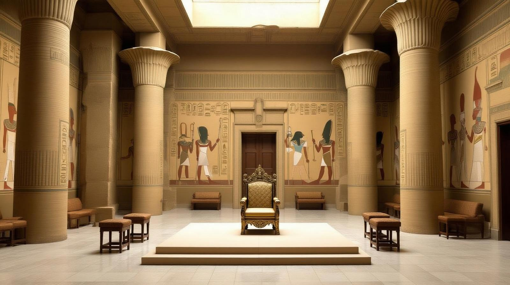

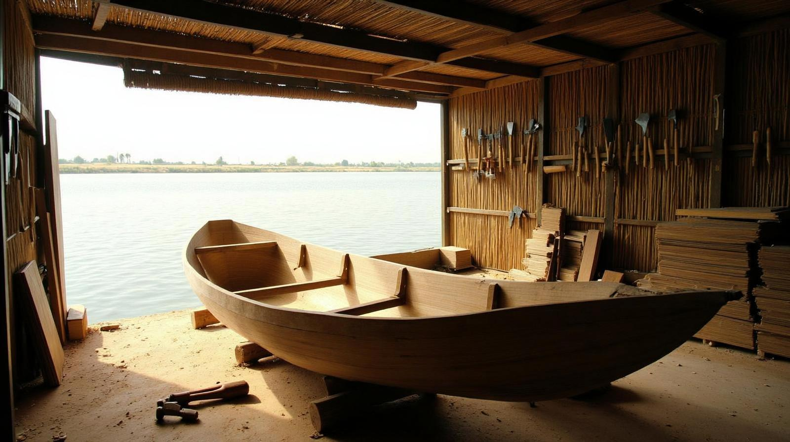

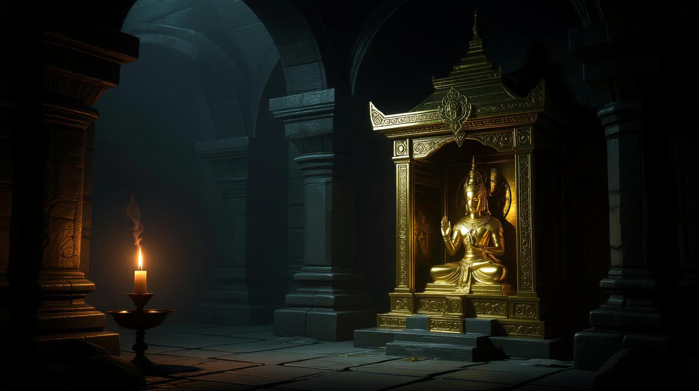

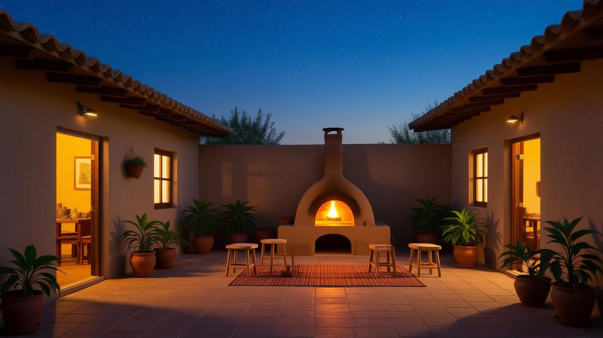
