## Cosmos室内系列：地中海风格

本系列参考相关文章进行创建，由于包含的风格较多，缩减到20分镜。

分镜提示词如下：

#### user:

创建20个独立的地中海风格室内设计的图片描述，用英语回答。

#### assistant:

Here are 20 unique Mediterranean-style interior design descriptions, focusing on distinct spaces and elements:

1.  **Sunlit Coastal Living Room:** Vaulted whitewashed wood-beamed ceiling. Large arched windows frame turquoise sea views. Plush, deep blue sofas face a rustic stone fireplace. Woven jute rug, terracotta pots with olive trees, and scattered azure cushions complete the look.
2.  **Rustic Tuscan Kitchen:** Warm terracotta tile floor. Massive central farmhouse table with wrought-iron base under a wrought-iron chandelier. Open shelves display colorful ceramic dishes. Rough-hewn stone walls and a large brick pizza oven anchor the space.
3.  **Andalusian Courtyard Breakfast Nook:** Intimate space opening onto an inner courtyard fountain. Arched French doors. Mosaic-tile topped bistro table with wrought-iron chairs. Walls in warm ochre, climbing bougainvillea visible outside.
4.  **Moroccan Riad Lounge:** Low, carved dark wood platform seating piled with vibrant silk cushions (emerald, sapphire, ruby) around a brass inlaid table. Intricate stucco archways, hanging brass lanterns casting patterned light, and rich Berber rugs on cool tile.
5.  **Greek Island Bedroom Sanctuary:** Crisp white walls and linen bedding. Headboard crafted from driftwood. Dominated by a large arched window overlooking a caldera, framed by flowing white cotton curtains. Simple blue accents and a woven seagrass rug.
6.  **Provençal Farmhouse Dining Room:** Long, reclaimed wood dining table on stone floors. French country chairs with faded floral upholstery. Large antique armoire displays china. Sunlight streams through shuttered windows onto lavender bundles in terracotta vases.
7.  **Spanish Villa Wine Cellar & Tasting Room:** Cool, dim space with arched brick ceilings. Rough stone walls lined with wooden wine barrels. Heavy wooden tasting table surrounded by leather stools. Wrought-iron sconces and candlelight.
8.  **Santorini-Inspired Bathroom:** Smooth, curved white plaster walls and built-in niches. Deep soaking tub nestled beside a large window with sea views. Pebble tile shower floor, minimal chrome fixtures, single vibrant blue glass vase.
9.  **Corsican Stone Cottage Library:** Cozy room with thick stone walls and small deep-set windows. Floor-to-ceiling dark wood bookshelves. Plush armchairs in burnt orange velvet beside a crackling fire in a stone hearth. Persian rug underfoot.
10. **Mountain View Loggia (Covered Terrace):** Arched openings overlook olive groves and distant hills. Tiled floor, whitewashed walls. Wrought-iron furniture with thick, comfortable cream cushions. Hanging lanterns and potted lemon trees.
11. **Monastery-Inspired Refectory Kitchen:** Long, communal space. Massive central stone island with a marble countertop. Exposed heavy wood beams. Open shelving with copper pots. Large fireplace for cooking, simple wooden stools.
12. **Aegean Blue & White Guest Bathroom:** White subway tiles with bright cobalt blue penny round tiles in the shower. Pedestal sink, simple chrome fixtures. Woven basket for towels. Small arched window with shutters.
13. **Majorelle Garden-Inspired Sunroom:** Inspired by Marrakech. Walls painted a vibrant cobalt blue. Wrought-iron furniture with yellow cushions. Lush green potted palms and ferns. Geometric patterned tile floor and colorful mosaic side tables.
14. **Tuscan Vineyard Great Room:** Expansive room with wide-plank oak floors and exposed stone accent walls. Large leather sectional faces a grand stone fireplace. Timbered ceiling. Wine barrel end tables, views of rolling vineyards through French doors.
15. **Mediterranean Herb Kitchen Garden Nook:** Small indoor space flowing to an herb garden. Stone sink, open shelving with green glazed pottery. Hanging dried herbs. Small bistro set under a wrought-iron chandelier with botanical prints on sage green walls.
16. **Urban Mediterranean Balcony Retreat:** Compact city balcony. Tiled floor in a geometric pattern. Whitewashed walls with built-in blue-tiled planter boxes overflowing with geraniums and herbs. Wrought-iron bistro set, string lights, colorful cushions.
17. **Cretan Fishing Village Taverna Style Kitchen:** Rough plaster walls in warm beige. Open shelves with blue and white striped pottery. Small wooden table with mismatched painted chairs. Rope details, fishing net art, simple pendant lights.
18. **Luxury Riviera Bedroom Suite:** High ceilings with intricate plasterwork. Soft lavender walls. Canopy bed with sheer white drapes. Marble fireplace, ornate gilded mirror. Large balcony doors opening to sea views, plush silk rugs.
19. **Andalusian Tile Entryway:** Dramatic arched entrance hall. Intricate hand-painted geometric tiles (azulejos) cover the floor and climb the lower walls. White plaster upper walls. Wrought-iron console table, large terracotta urn, hanging lantern.
20. **Courtyard Fountain Atrium:** Central open-air courtyard within the home. Trickling stone fountain as the focal point. Surrounding arched loggia with colorful tile accents. Potted citrus trees, bougainvillea climbing walls, wrought-iron benches with tile insets.

Each description emphasizes key Mediterranean elements: natural materials (stone, wood, terracotta), arches, vibrant tiles, wrought iron, connection to outdoors, rustic charm, and a sun-drenched palette.

<!-- AUTO-GENERATED MEDIA -->

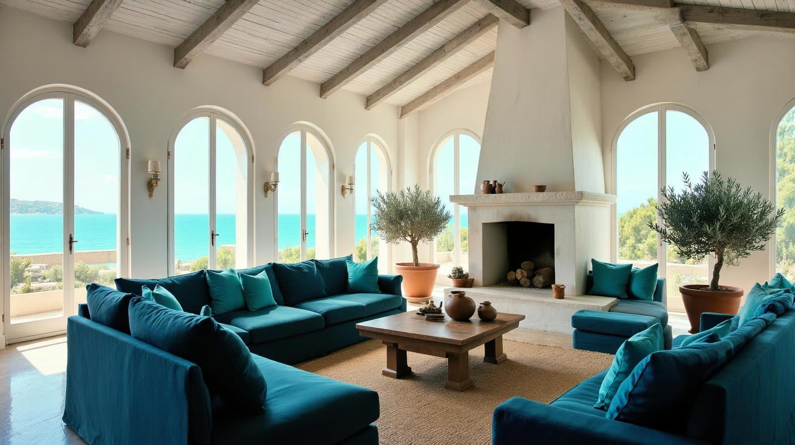

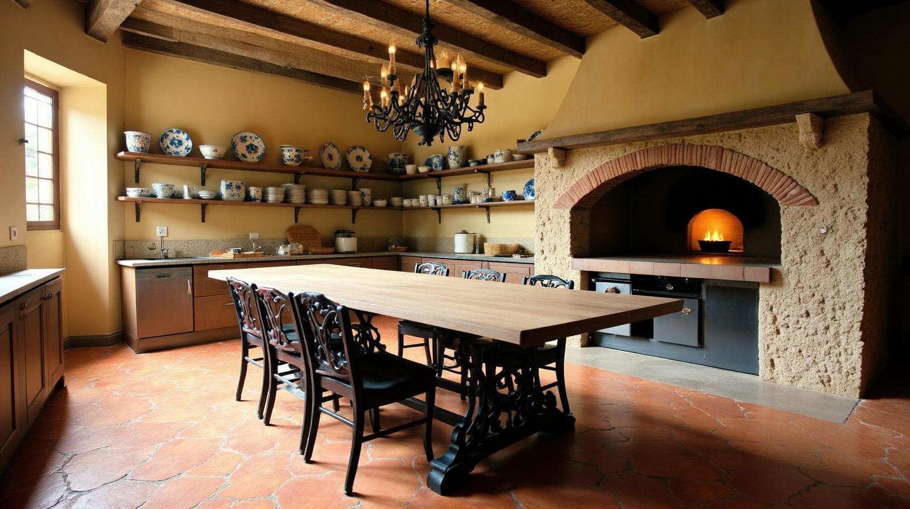

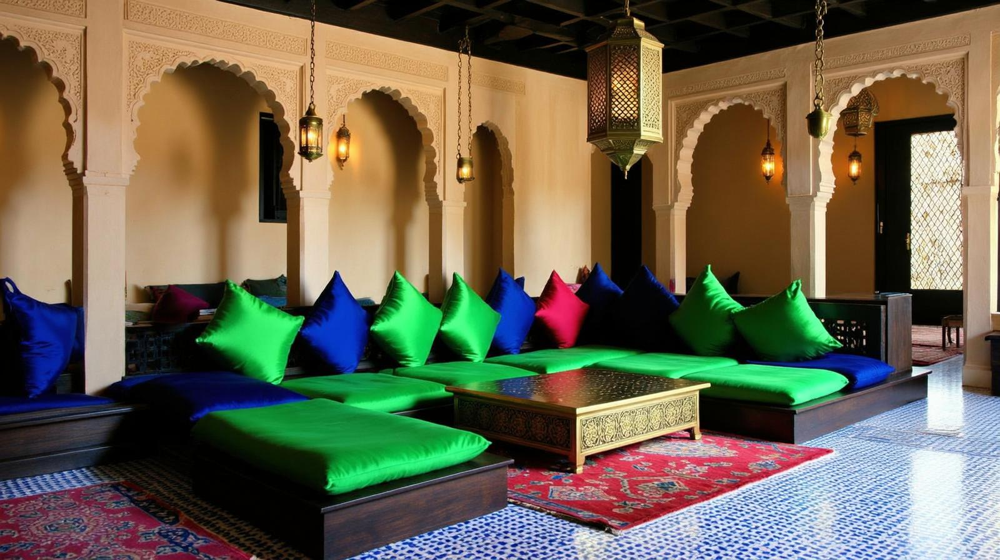

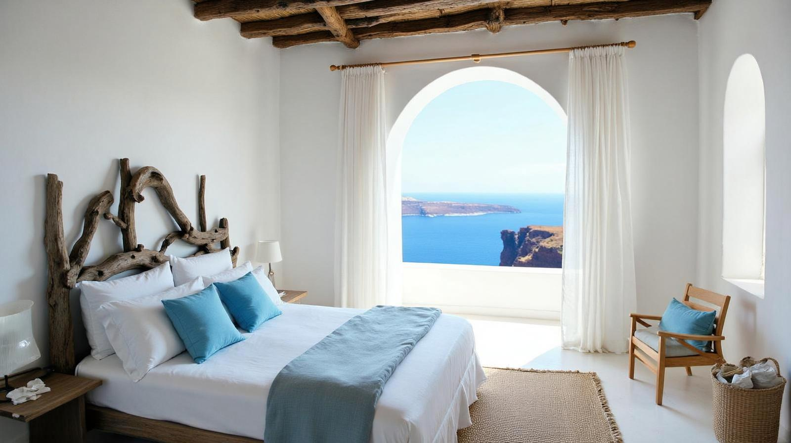

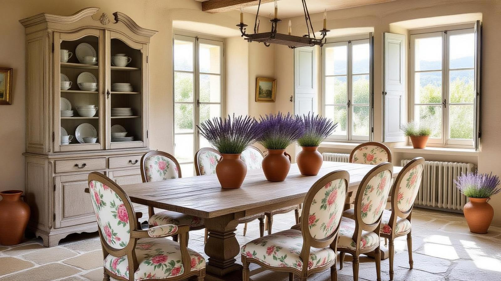

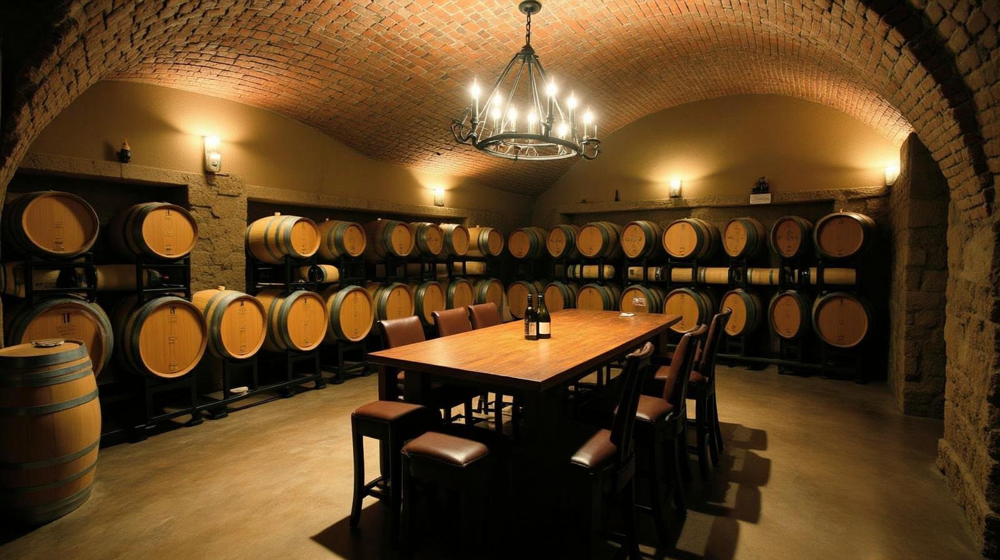

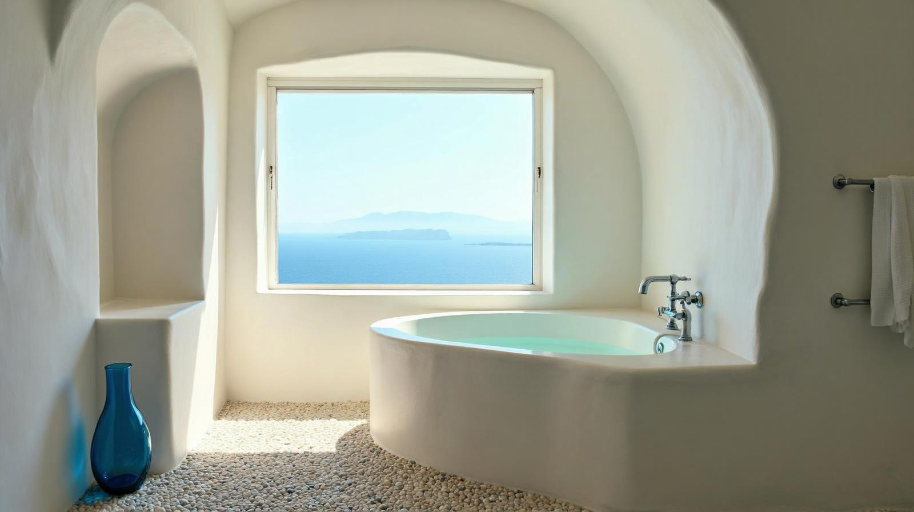

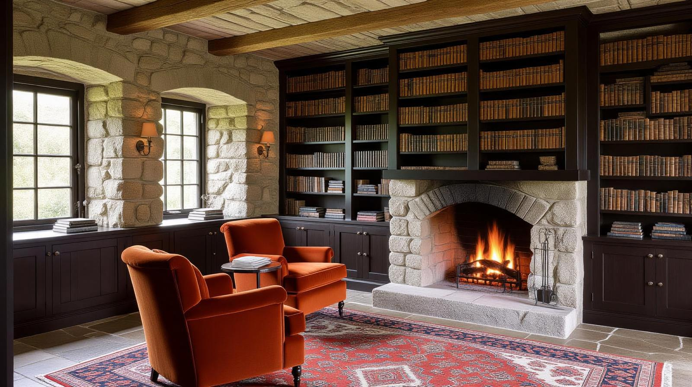

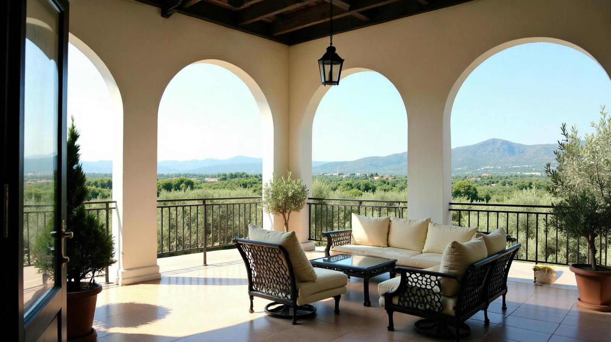

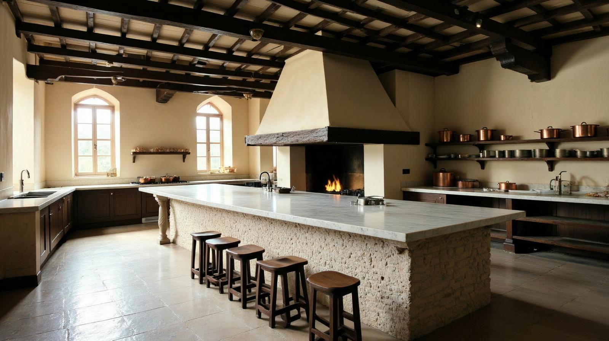

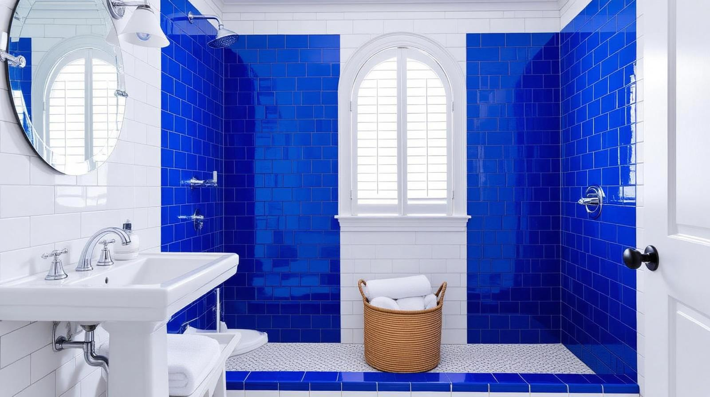

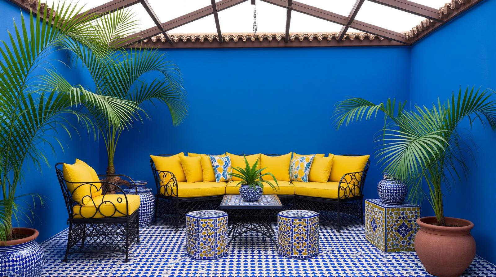

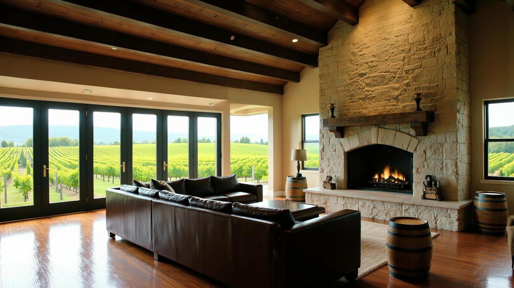

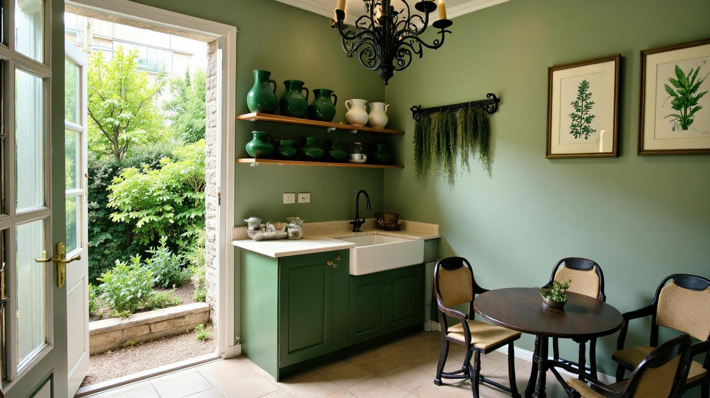

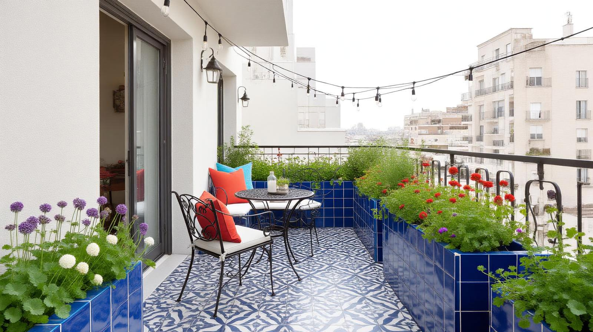

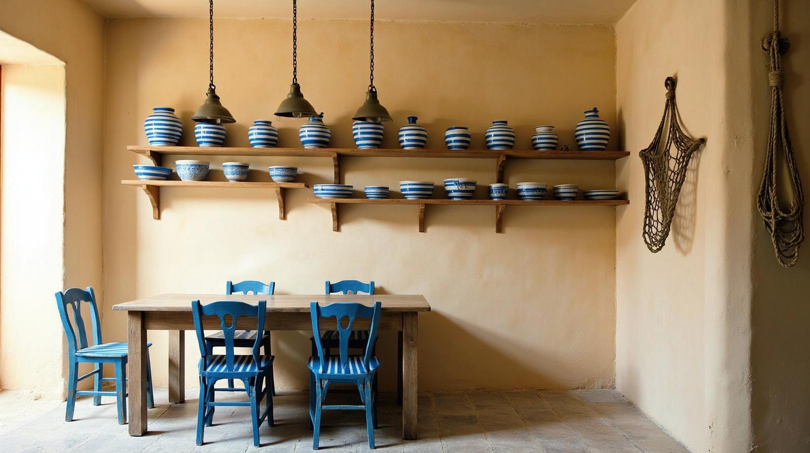

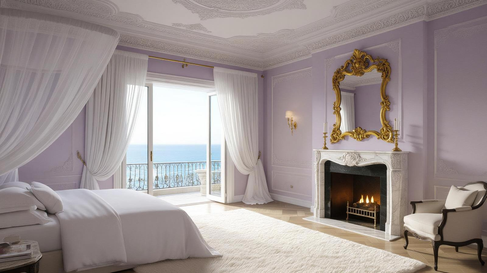

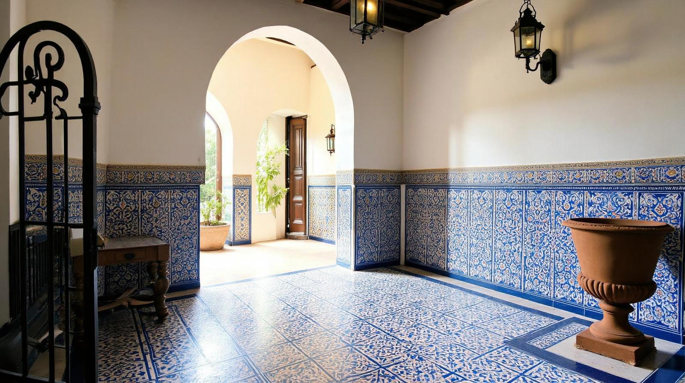

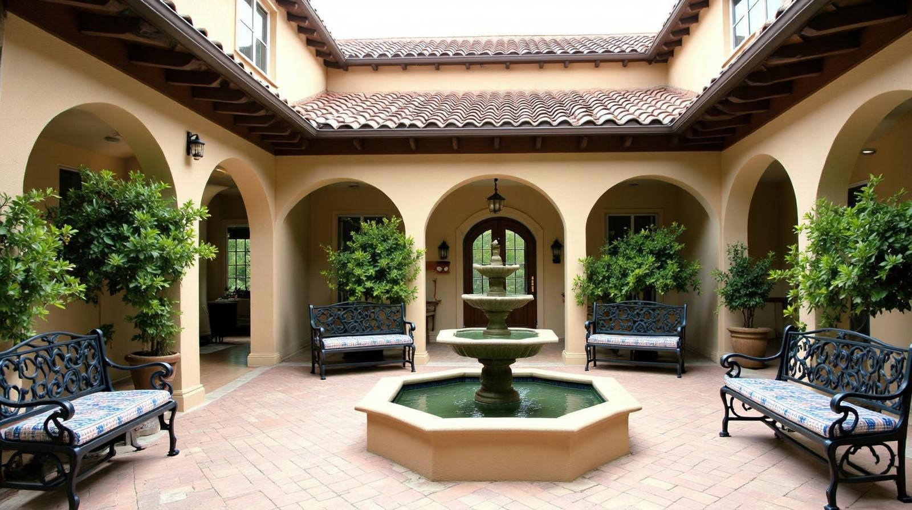
