## Cosmos室内系列：摩洛哥风格

本系列参考相关文章进行创建，由于包含的风格较多，缩减到20分镜。

分镜提示词如下：

#### user:

创建20个独立的摩洛哥风格室内设计的图片描述，用英语回答。

#### assistant:

Here are **20 unique and independent descriptions** for Moroccan-style interior design images, each capturing distinct elements and atmospheres:

1.  **Sunlit Courtyard Oasis:** A serene interior courtyard with intricate white plaster arches framing a central turquoise zellige tile fountain. Lush potted palms cast shadows on terracotta floors, surrounded by deep-cushioned banquettes in saffron and teal textiles.
2.  **Luxurious Bedroom Canopy:** A carved dark wood four-poster bed draped in layers of sheer crimson and gold fabric, forming a canopy. Richly patterned Berber rugs layer the floor beside hammered brass lanterns casting warm light on ornate stucco walls.
3.  **Cozy Tea Nook:** An intimate alcove with built-in seating covered in vibrant striped cushions (mint, coral, navy). A low, engraved brass table holds a silver teapot and glasses. Small stained-glass windows filter colorful light onto geometric floor tiles.
4.  **Arched Library Niche:** Floor-to-ceiling wooden shelves set within a horseshoe arch, filled with leather-bound books. Below, a plush emerald velvet pouf sits beside a stack of antique trunks under the soft glow of a multi-faceted metal pendant lamp.
5.  **Hammam-Inspired Bath:** A steamy, vaulted bathroom with smooth tadelakt plaster walls in warm terracotta. A central marble soaking tub sits under a small star-shaped skylight, surrounded by copper basins and flickering candlelight.
6.  **Rooftop Terrace Sunset:** An open-air terrace with low, mosaic-tiled tables and oversized floor cushions in sunset hues (orange, purple, deep blue). Views of terracotta rooftops under a dusky sky, illuminated by intricate wrought-iron lanterns.
7.  **Grand Living Room Archway:** A majestic living space dominated by a large, keyhole archway revealing another room. Walls feature intricate moucharabieh screens casting lattice shadows on plush sofas layered with embroidered pillows and sheepskin throws.
8.  **Minimalist Desert Retreat:** A calming bedroom showcasing Moroccan minimalism: whitewashed walls with subtle geometric relief carving, a low platform bed with crisp linen, a single vintage kilim rug, and a simple black wrought-iron lantern.
9.  **Colorful Kitchen Hub:** A bustling kitchen with cobalt blue zellige tile countertops and backsplash. Open shelves display vibrant ceramic tagines and copper pots. A large wooden prep table stands on patterned encaustic cement tiles.
10. **Spa-Like Relaxation Room:** A dimly lit room centered around a low fire pit. Deep floor cushions and low divans in soft linens (cream, grey, ochre) surround it. Sheer white curtains billow gently, and incense smoke curls upwards.
11. **Ornate Entryway:** A dramatic entrance hall featuring a massive, studded wooden door. Walls are adorned with intricate painted floral motifs on a deep indigo background. A vintage runner rug leads to an inner courtyard glimpsed through an arch.
12. **Bohemian Dining Corner:** A vibrant dining space with a reclaimed wood table topped with hammered brass. Eclectic mismatched chairs are draped with woven blankets. Walls are covered in a patchwork of colorful rugs and tapestries.
13. **Private Riad Garden View:** Looking out from a shaded loggia through ornate white arches onto a small, lush garden filled with orange trees and jasmine. The floor is cool terracotta, and carved wooden screens filter the sunlight.
14. **Modern Moroccan Lounge:** Contemporary interpretation: clean lines of a low, curved sofa in deep aubergine velvet. Abstract geometric patterns on a large rug complement a statement plaster fireplace surround with traditional motifs. Sleek brass side tables.
15. **Herbal Apothecary Alcove:** A small niche wall lined with hundreds of tiny wooden drawers labeled in Arabic. Below, a rustic wooden table holds brass scales, dried herbs in baskets, and bundles of fragrant roses and lavender.
16. **Textile-Rich Sitting Room:** An explosion of texture: walls hung with intricate Suzani embroideries, silk brocade cushions piled high on a carved wooden sofa, a thick shaggy rug underfoot, and velvet curtains pooling on patterned tiles.
17. **Starlit Courtyard Dining:** Night scene in a courtyard. A long table draped in white linen is set under strings of fairy lights and large metal lanterns. Plates are colorful ceramics, and the central fountain reflects the moonlight.
18. **Artisan Workshop Corner:** A creative space with a large loom partially woven with vibrant wool. Baskets overflow with dyed yarns. Tools hang on a rough plaster wall beside shelves displaying finished ceramics and metalwork.
19. **Ceiling Detail & Lanterns:** Focus on the architecture: an ornate cedar wood ceiling (muqarnas or painted beams). Suspended at different heights are multiple sizes of pierced metal lanterns, casting intricate star-like patterns on the walls below.
20. **Desert Palette Lounge:** A sophisticated lounge using a muted desert-inspired palette: sandy beige walls, a large rug in charcoal and ochre geometric patterns, deep terracotta leather poufs, and accents of black wrought iron in the furniture and lighting.

Each description offers a unique vignette of Moroccan design, emphasizing different elements, colors, textures, lighting, and moods.

<!-- AUTO-GENERATED MEDIA -->

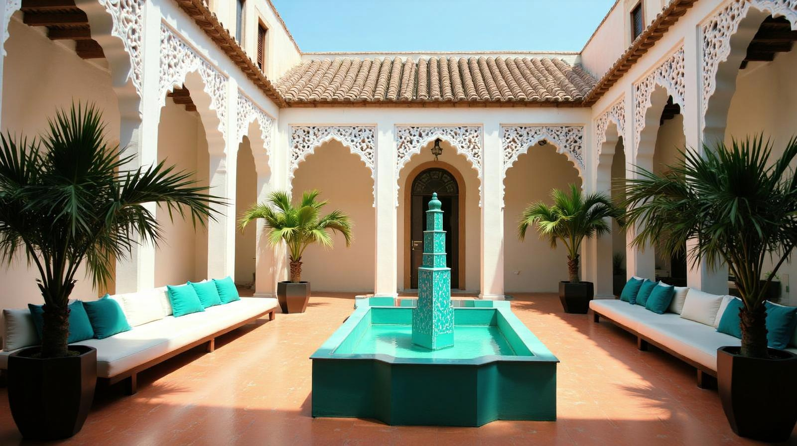

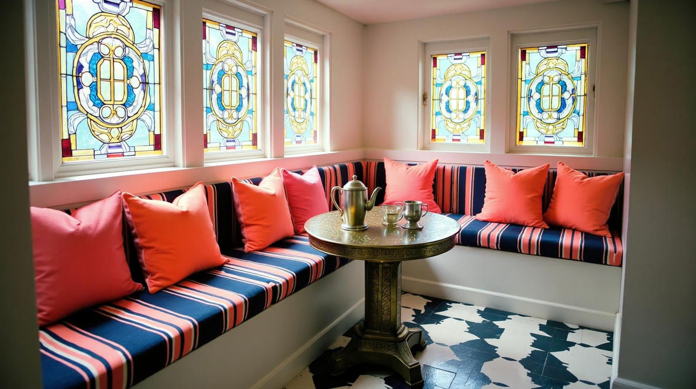

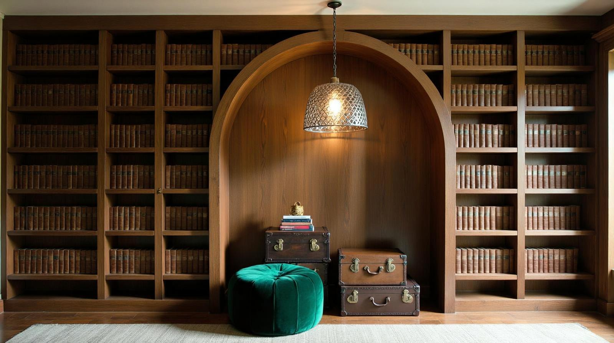

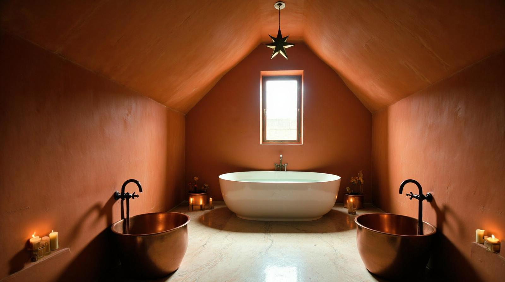

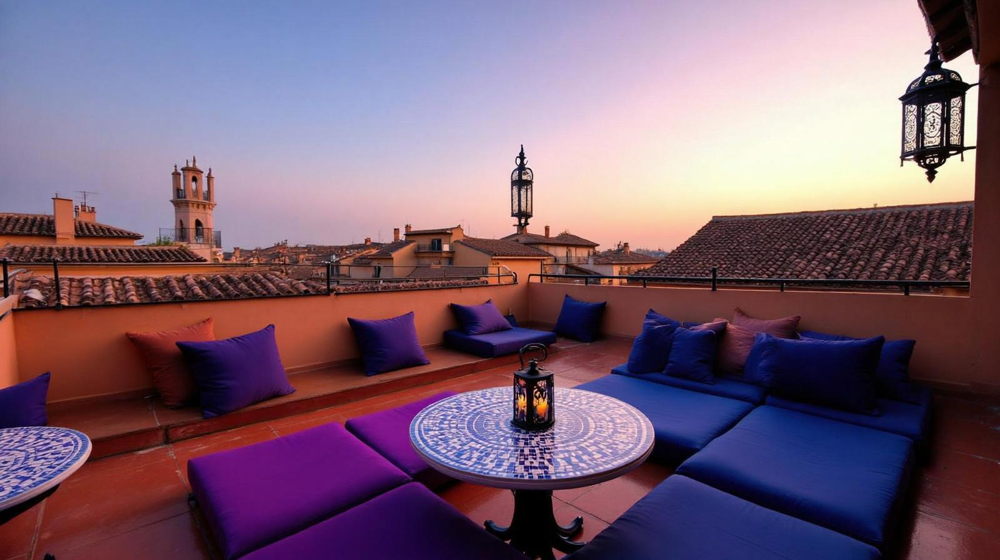

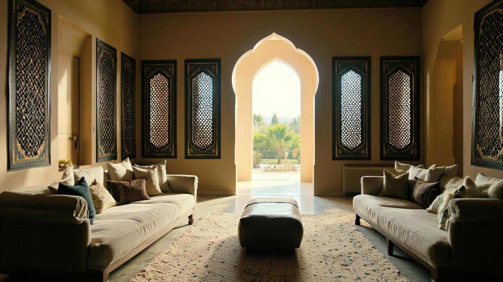

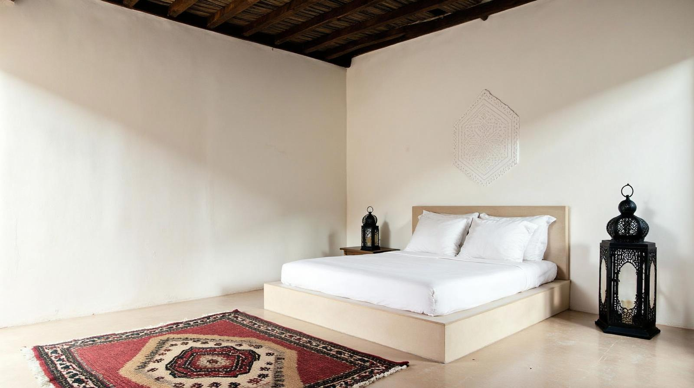

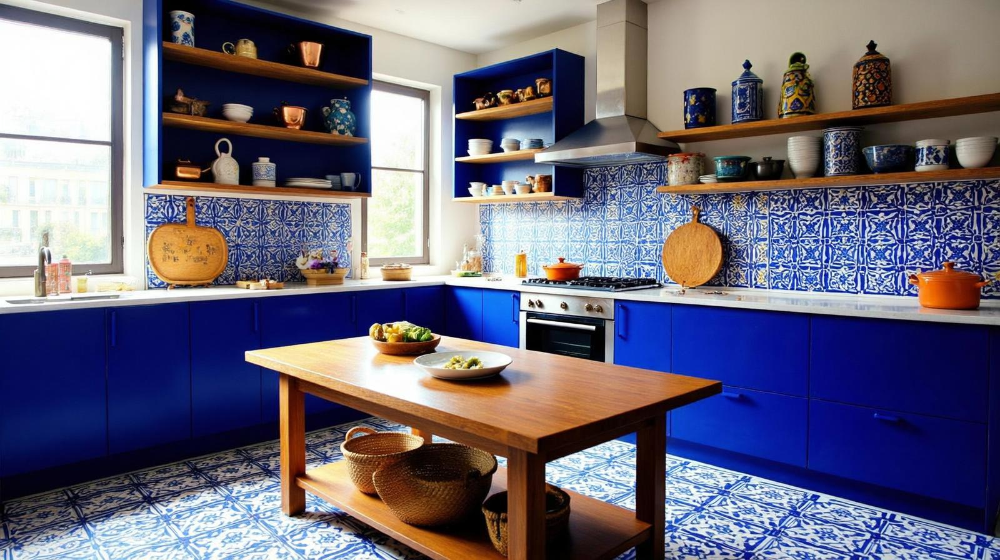

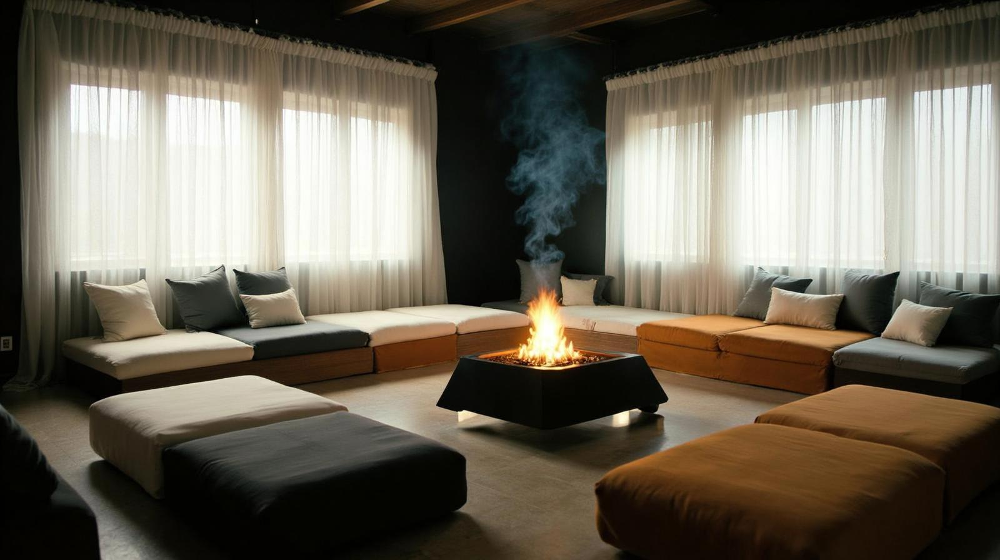

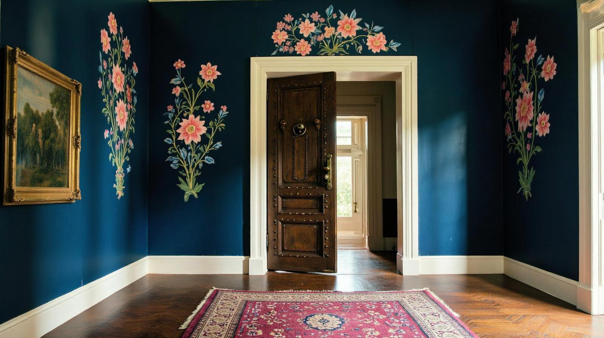

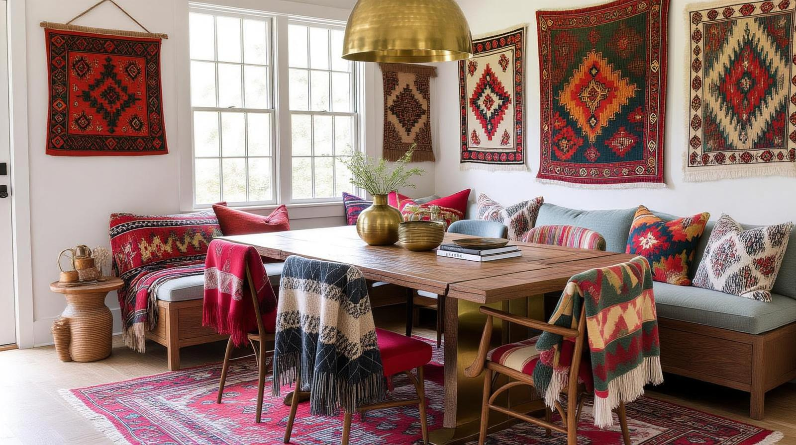

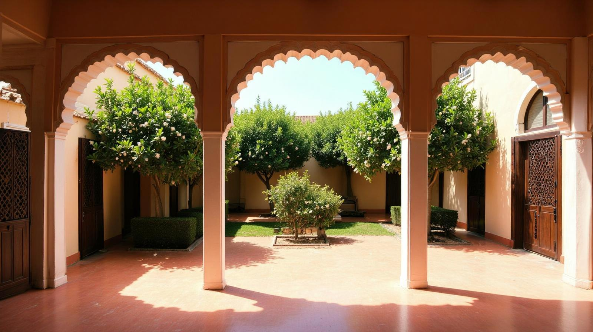

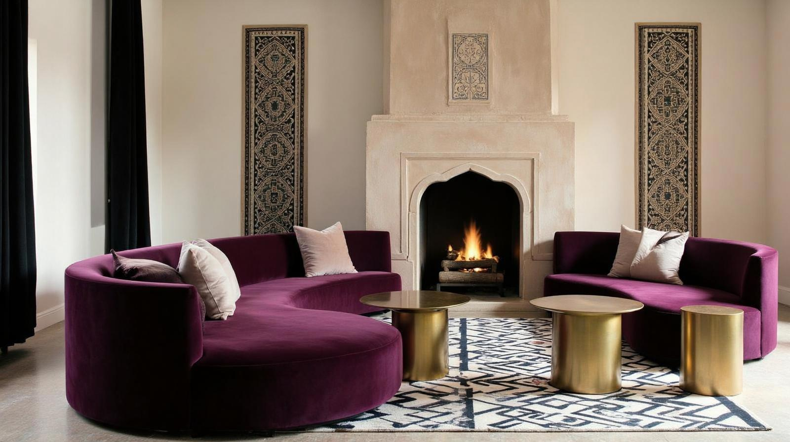

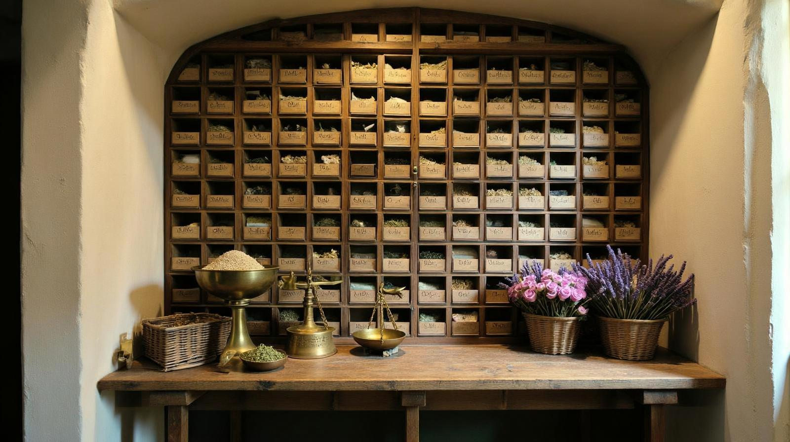

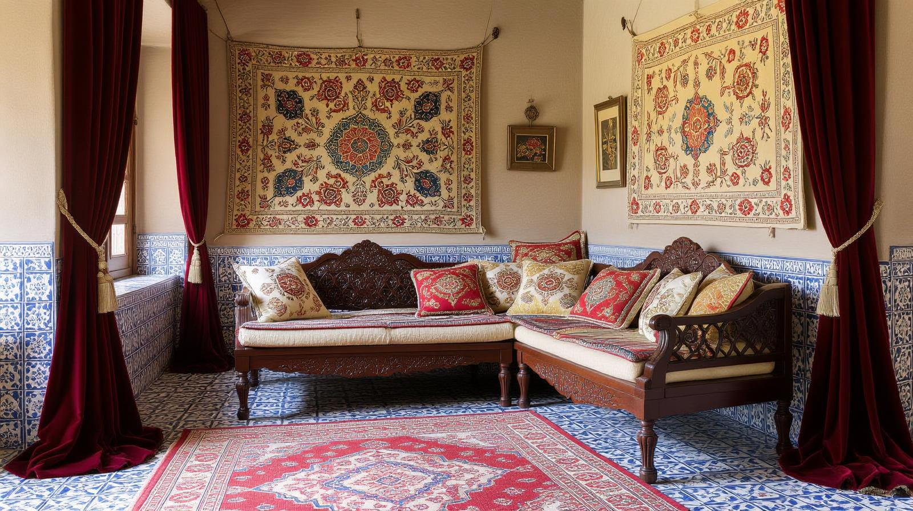

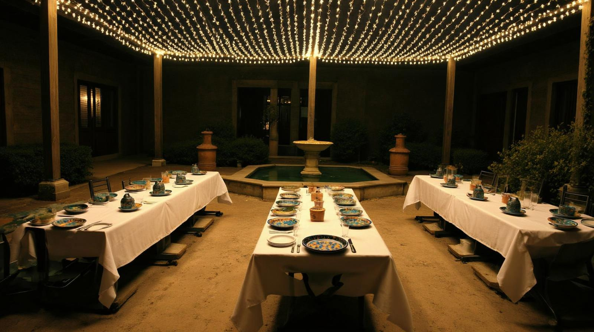

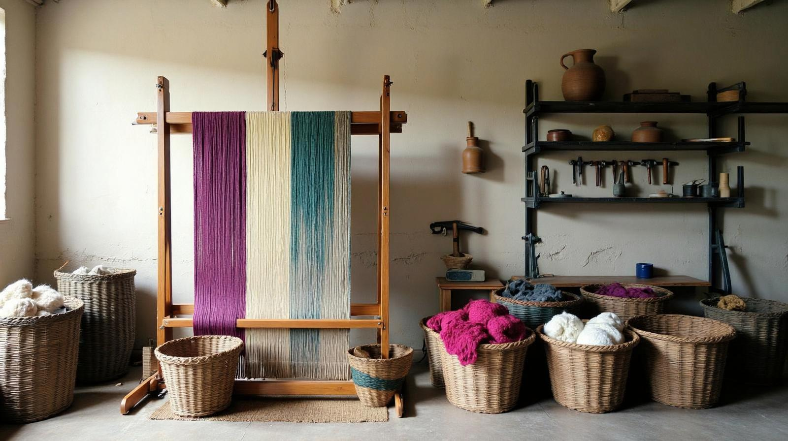

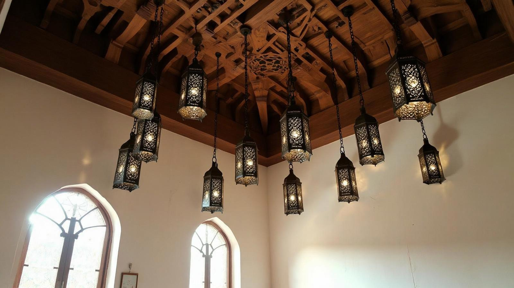

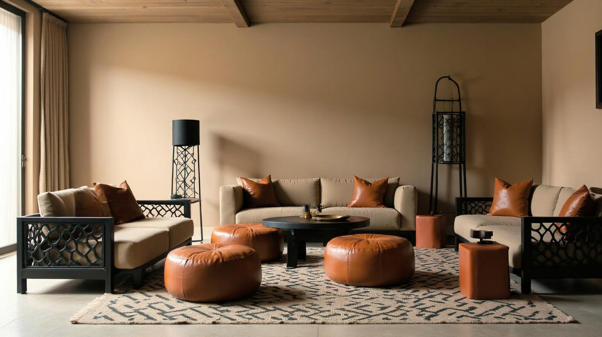
