## Cosmos室内系列：新中式风格

本系列参考相关文章进行创建，由于包含的风格较多，缩减到20分镜。

分镜提示词如下：

#### user:

创建20个独立的新中式风格室内设计的图片描述，用英语回答。

#### assistant:

Here are 20 unique **New Chinese Style** interior design image descriptions, emphasizing harmony, modern minimalism, and subtle cultural elements:

1.  **Serene Tea Lounge:** A sunken seating area with low, dark-stained walnut platforms, cushioned in dove-gray silk. A monolithic granite tea table anchors the space, flanked by minimalist reinterpretations of Ming chairs. A single framed ink-wash mountain scroll adorns a textured plaster wall. Soft, concealed cove lighting.
2.  **Modern Scholar's Study:** Floor-to-ceiling bookshelves in matte black lacquer frame a window overlooking a bamboo garden. A streamlined writing desk in pale elm wood holds a contemporary ceramic inkstone and a single orchid. A sleek, abstract bronze desk lamp provides focused light.
3.  **Floating Staircase Atrium:** A dramatic central staircase with open-tread steps of pale oak, appearing to float within a double-height space. Walls of textured, off-white stone. A large, abstract bronze sculpture evokes mountain forms, subtly lit from below.
4.  **Translucent Screen Dining:** A dining room defined by a floor-to-ceiling folding screen of laser-cut metal with a delicate chrysanthemum pattern. A live-edge elm dining table pairs with chairs upholstered in deep indigo linen. A cluster of hand-blown glass pendant lights hangs low.
5.  **Courtyard-Inspired Bath:** A spacious bathroom centered around a freestanding oval soaking tub of dark basalt stone. One wall is entirely glass, looking onto a private interior courtyard with smooth river rocks and a single gnarled pine. Vanity in light ash wood with an integrated stone basin.
6.  **Textured Bedroom Retreat:** Platform bed with a deep charcoal velvet headboard framed by vertical slats of charred cedar wood (Shou Sugi Ban). Layered bedding in cream, slate, and a single burnt orange silk throw pillow. Asymmetric rice paper pendant lights.
7.  **Heritage Wall Kitchen:** An open-plan kitchen featuring sleek, handle-less cabinetry in matte sage green. The focal point is a preserved section of original, weathered brick wall. Countertops are honed black granite. Pendant lights above the island are made of woven bamboo strips in a modern form.
8.  **Lattice & Light Living:** A bright living room where a large-scale, geometric wooden lattice screen partially divides the space, casting intricate shadows. Low-profile sofas in warm beige linen face a fireplace clad in smooth, pale river stones. A large celadon glazed vase sits in a corner.
9.  **Moon Gate Corridor:** A hallway passage featuring a perfectly circular "Moon Gate" opening framed in dark-stained wood. Walls are rendered in smooth, warm gray Venetian plaster. Recessed floor lighting illuminates the path towards a glimpse of a serene interior garden.
10. **Minimalist Tea Alcove:** A compact, intimate space within a larger room. A built-in platform in light oak holds a low table and floor cushions upholstered in raw hemp. A narrow vertical niche displays a single, exquisite Yixing clay teapot. Focused downlighting.
11. **Silk & Stone Entry:** A grand entrance foyer with walls clad in large, honed slate tiles. A console table of solid, dark wenge wood holds a long, shallow vessel with smooth black stones. A vertical silk embroidery panel in abstract indigo and gold hangs beside a simple round mirror.
12. **Bamboo & Glass Extension:** A modern conservatory-style dining area. Structural columns wrapped in natural bamboo poles support a glass roof. A long, rustic-chic table of reclaimed elm is surrounded by chairs with woven rattan seats and blackened steel frames.
13. **Lacquered Screen Bedroom:** A master bedroom featuring a dramatic headboard wall covered in high-gloss, deep oxblood red lacquer. The rest of the room is muted: pale wood floor, cream linen bedding, sheer charcoal curtains. Asymmetrical black metal sconces.
14. **Water Feature Meditation Corner:** A small, dedicated nook by a window. A low platform holds a zabuton cushion facing a shallow, integrated basin of black stone filled with water, reflecting light. A single branch in a simple celadon vase rests beside it. Serene and sparse.
15. **Reinterpreted Armory Library:** Floor-to-ceiling shelving in dark-stained oak with integrated lighting. Comfortable modern armchairs in deep navy velvet and a low sofa face a fireplace with a surround of hammered bronze metal. Antique scholar's rocks displayed on shelves.
16. **Floating Shelves & Ink Wash:** A minimalist home office wall. Long, thin floating shelves in pale ash wood display curated objects: a small bonsai, a stack of rice paper books, a celadon bowl. Beside it, a large, framed contemporary ink-wash painting depicting abstracted clouds.
17. **Courtyard View Bath:** A wet room style bathroom with large format, pale limestone tiles. A frameless glass shower overlooks a small, enclosed pebble garden with a sculptural stone lantern. Floating vanity in teak with an underlit stone counter.
18. **Copper & Elm Kitchen:** Warm kitchen with cabinetry fronts in vertically-grained elm wood. A striking range hood is clad in patinated copper panels. Countertops are pale quartz with subtle veining. Simple black metal bar stools line the island.
19. **Layered Screens Lounge:** A sophisticated living area where multiple sheer, floor-length curtains in varying shades of gray and oatmeal create soft layers and depth. Low, modular sofas in charcoal wool. A low black lacquer coffee table holds a sculptural bronze vessel.
20. **Boutique Hotel Lobby:** A reception area featuring a dramatic wall covered in large, overlapping panels of textured, dark gray fabric resembling scholar's rocks. The reception desk is a single slab of pale, striated marble on a dark wood base. Low, sculptural armchairs in deep plum velvet provide seating.

Each description focuses on the blend of traditional Chinese elements (materials, philosophy, subtle motifs) with contemporary design principles (clean lines, open space, minimalist forms, modern lighting).
<!-- AUTO-GENERATED MEDIA -->

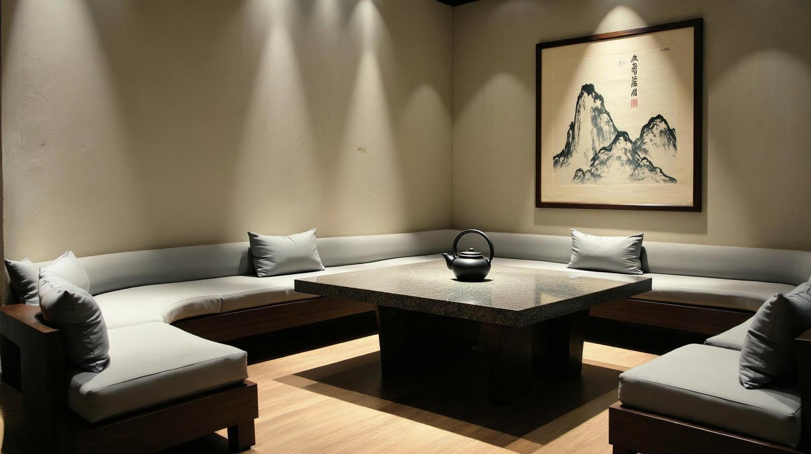

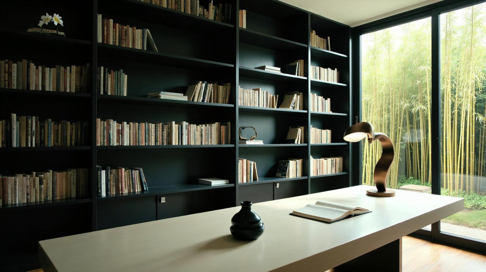

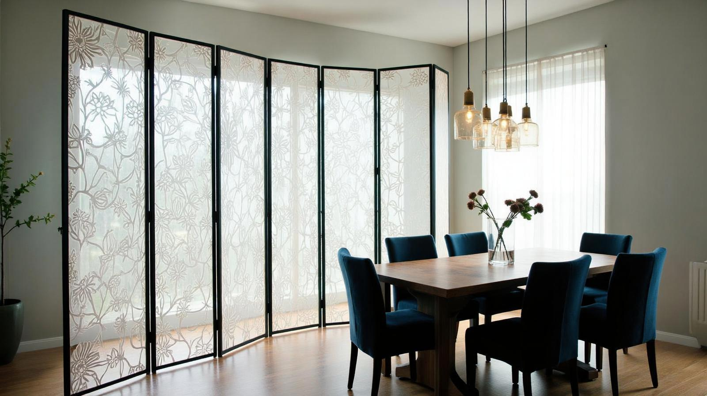

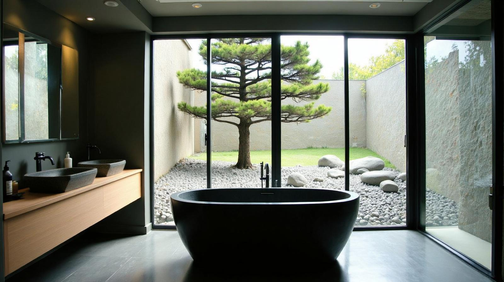

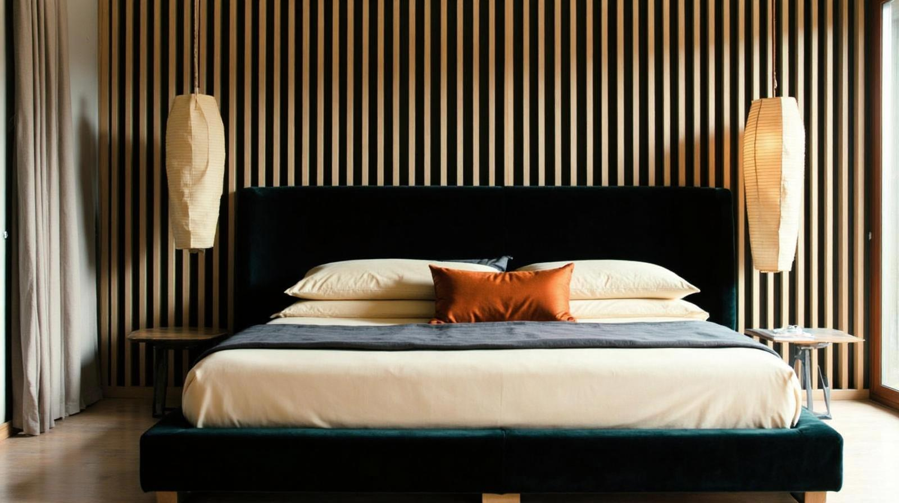

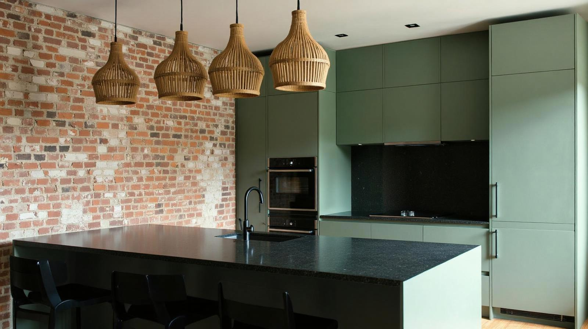

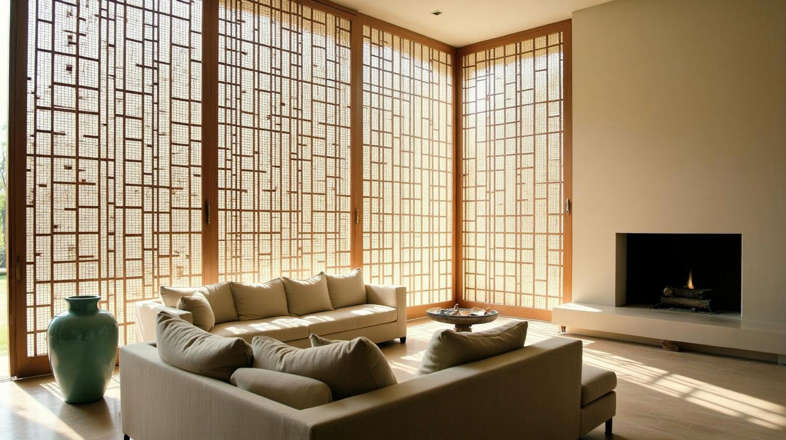

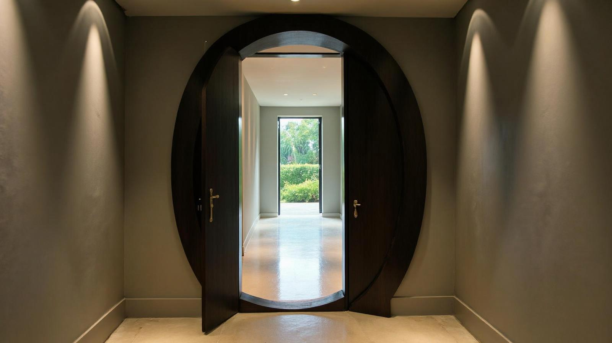

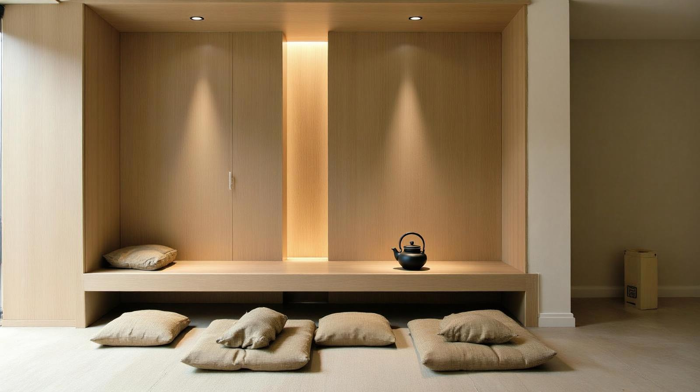

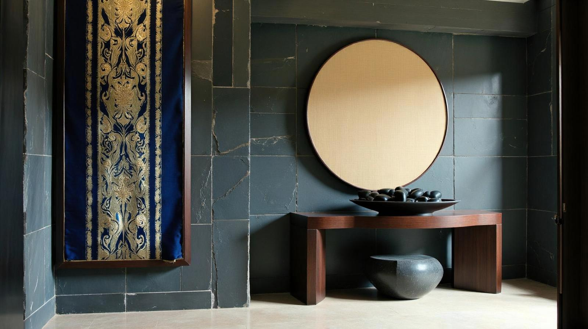

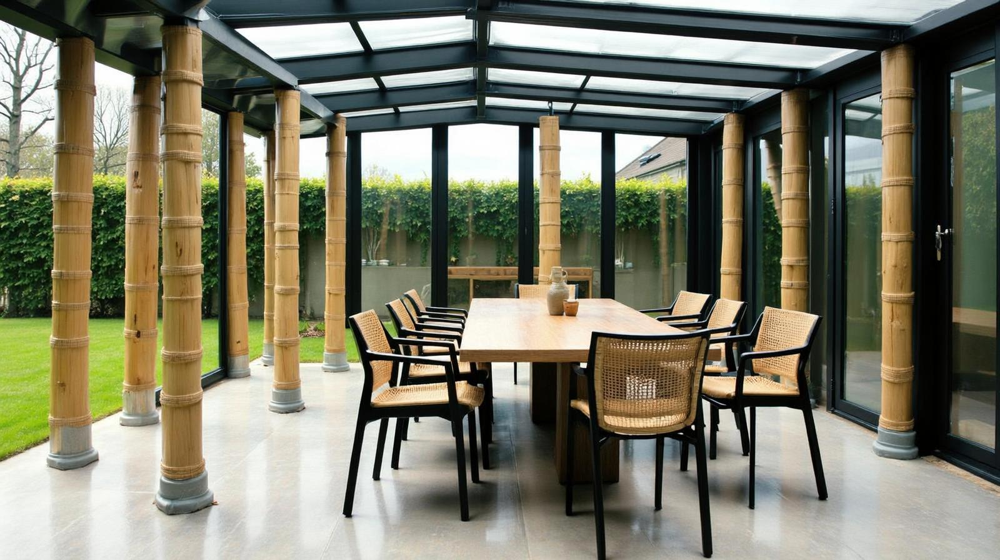

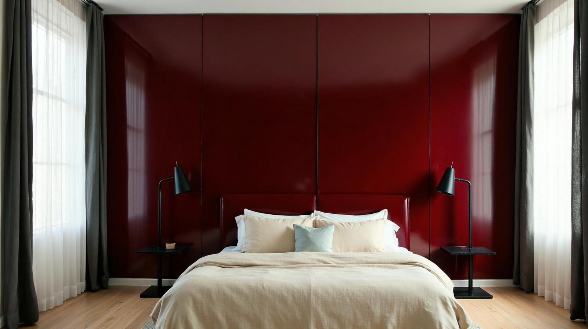

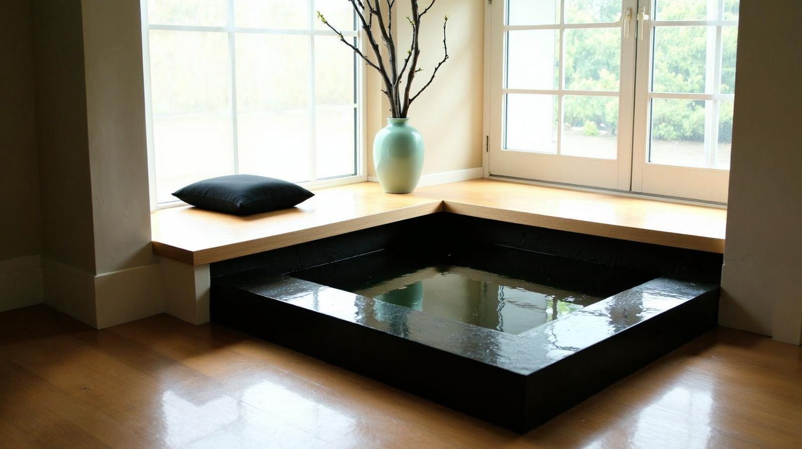

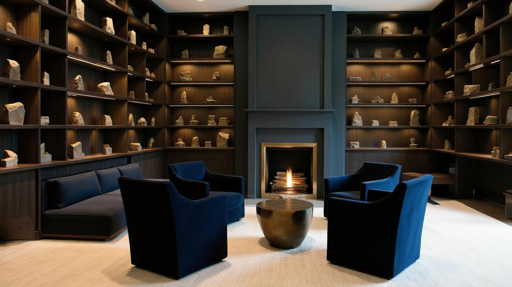

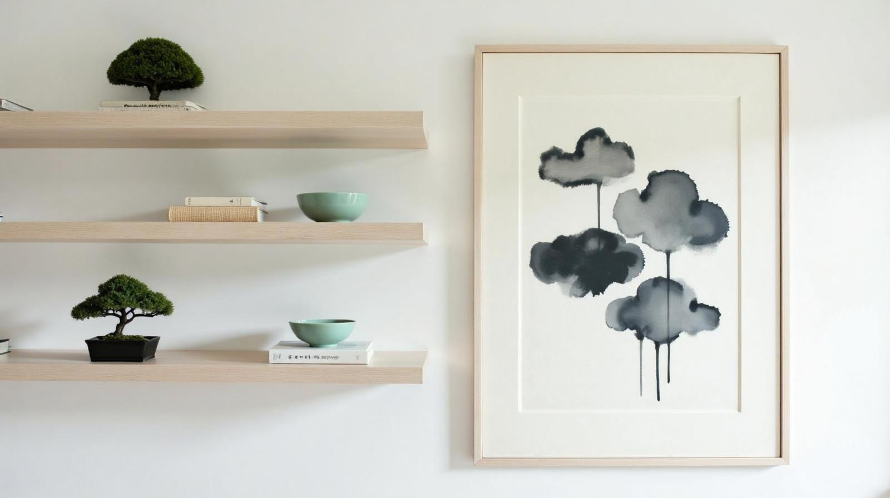

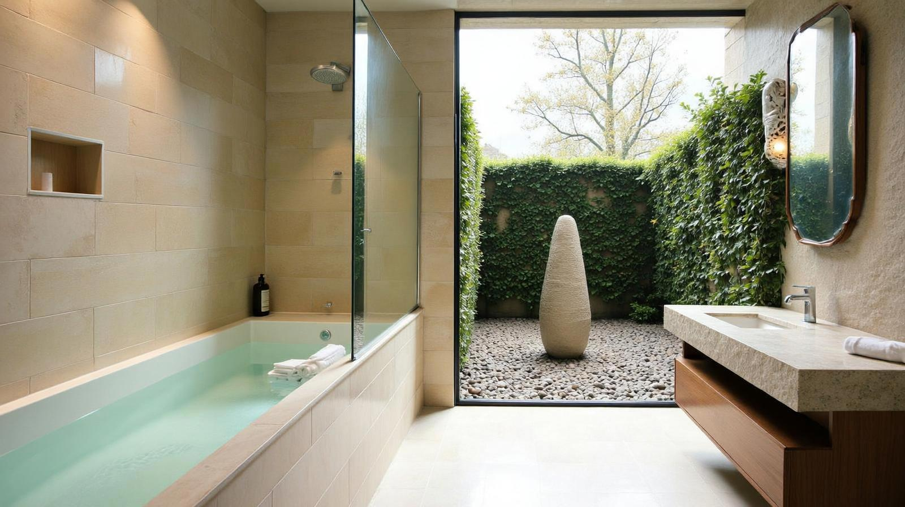

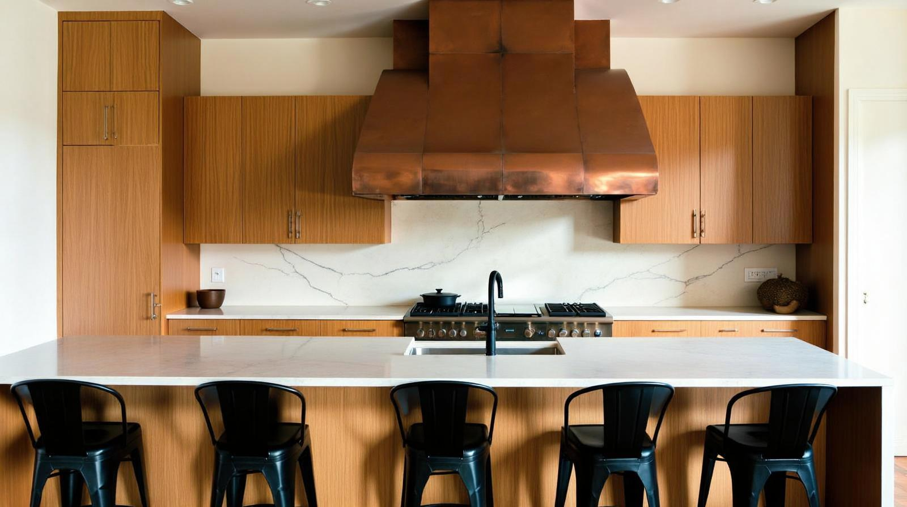

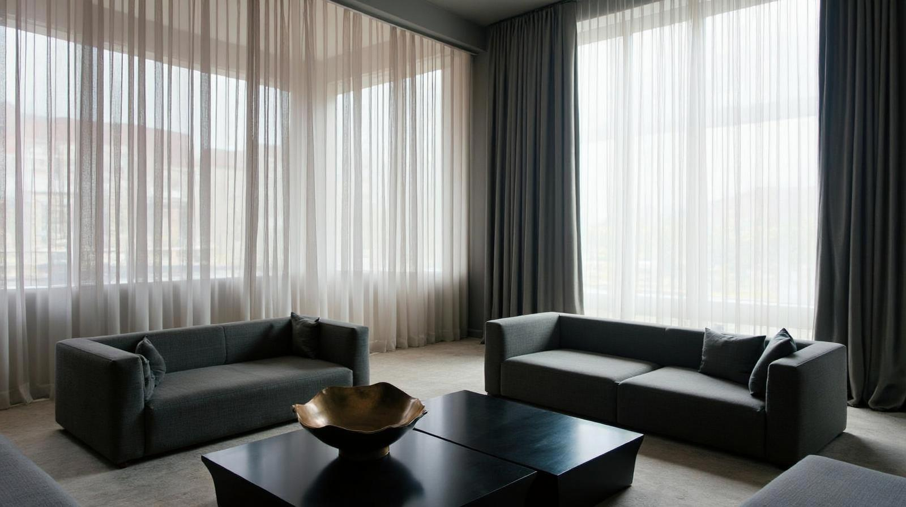

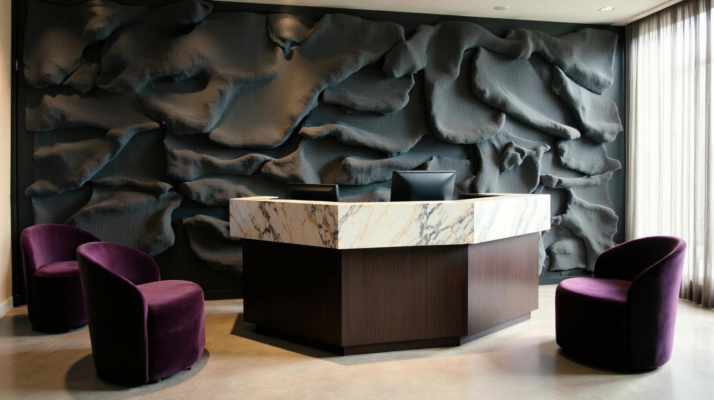
