## Cosmos室内系列：新古典主义

本系列参考相关文章进行创建，由于包含的风格较多，缩减到20分镜。

分镜提示词如下：

#### user:

创建20个独立的新古典主义室内设计的图片描述，用英语回答。

#### assistant:

Here are 20 distinct neoclassical interior design descriptions for images:

1.  **Grand Salon:** A symmetrical drawing room featuring fluted Corinthian pilasters flanking floor-to-ceiling windows draped in heavy ivory silk. A central Rococo-revival crystal chandelier illuminates gilded Louis XVI-style armchairs and a Savonnerie rug over polished parquet de Versailles flooring.
2.  **Refined Library:** Floor-to-ceiling mahogany bookshelves with classical dentil molding frame a room centered on a marble fireplace with a broken pediment. Deep green velvet upholstered Chesterfield sofas and a brass-inlaid octagonal reading table create a scholarly yet luxurious atmosphere.
3.  **Sunlit Morning Room:** Bathed in natural light from tall, arched windows with shutters, this space boasts pale grey walls with applied plaster wreath motifs. Delicate Chippendale-inspired chairs surround a circular satinwood table, while a neoclassical convex mirror reflects the serene space.
4.  **Formal Dining Room:** A dramatic space dominated by a long, polished ebony dining table under a linear arrangement of Empire-style bronze doré chandeliers. Upholstered Klismos chairs in sapphire blue face walls adorned with trompe l'oeil panels depicting classical ruins.
5.  **Stately Master Bedroom:** A focal point is a massive canopy bed with fluted column posts and draped in ivory linen. Soft celadon green walls feature applied plaster medallions, complemented by a plush, patterned Aubusson rug and gilded Girandole wall sconces.
6.  **Opulent Foyer:** A dramatic black-and-white checkerboard marble floor leads to a sweeping staircase with a wrought iron balustrade featuring Greek key motifs. A colossal bronze urn filled with branches stands beneath a coffered ceiling with rosette details.
7.  **Minimalist Neoclassical Study:** Clean lines define this office. Crisp white walls with subtle recessed panels, a sleek black marble-topped desk with tapered legs resembling columns, a single Eames lounge chair in leather, and a geometric abstract sculpture offer a contemporary interpretation.
8.  **Music Room with Panorama:** Graceful arched windows offer garden views. Walls painted in "Etruscan red" are adorned with framed engravings of Greek vases. A grand piano with candelabra stands near a marble-topped console table holding classical busts.
9.  **Intimate Breakfast Nook:** Nestled in a bay window, this cozy corner features built-in banquettes upholstered in a delicate toile de Jouy fabric depicting pastoral scenes. A petite, white marble-topped bistro table and simple neoclassical pendant light complete the scene.
10. **Gallery Hall:** A long hallway serves as an art gallery. Neutral stone-colored walls provide a backdrop for large, framed classical oil paintings and sculptures on pedestals. Recessed lighting highlights the art, while the herringbone wood floor adds warmth.
11. **Lavish Bathroom Sanctuary:** Inspired by Roman baths, this space features walls clad in large slabs of Carrara marble with subtle grey veining. A freestanding slipper bathtub sits on a mosaic tile floor with a Greek meander pattern, flanked by nickel-finished sphinx faucets.
12. **Gentleman's Smoking Room:** Rich, dark teal walls with white enameled woodwork create a clubby atmosphere. Deep leather club chairs surround a chess table, while a classical marble fireplace mantel holds antique scientific instruments. Persian Tabriz rug underfoot.
13. **Chic Powder Room:** A jewel box of luxury. Walls covered in hand-painted chinoiserie wallpaper featuring pagodas and birds. A petite pedestal sink with ormolu mounts sits beneath an elaborate gilded Rococo mirror. Black and white marble floor.
14. **Serene Sitting Room:** Soft dove grey walls with applied plaster laurel wreath friezes. Furniture is light and elegant: a cream silk damap sofa, bergère chairs in pale blue, and delicate giltwood side tables. A crystal chandelier provides sparkle.
15. **Neoclassical Kitchen with Aga:** Traditional cabinetry with Shaker-inspired panel doors and brass hardware meets modern function. A central island features a marble waterfall edge. The focal point is a classic green Aga range set within a proscenium arch of simple moldings.
16. **Modernist Neoclassical Lounge:** Architectural simplicity reigns. High-gloss lacquered walls in a pale taupe, a low-profile sofa in charcoal wool, and a single striking black lacquered column pedestal holding a white marble sphere. Large abstract art provides contrast.
17. **Orangerie-Inspired Conservatory:** A light-filled space with tall arched windows and a glass roof supported by slender white iron columns. Wrought iron bistro sets and lush potted citrus trees and palms evoke a Mediterranean villa. Terracotta tile flooring.
18. **Grand Staircase Landing:** A spacious landing acts as a sitting area. A large round rug in muted neoclassical patterns anchors a pair of antique Directoire fauteuils facing a tall Palladian window. A classical statue niche is carved into one wall.
19. **Walk-In Dressing Room:** Elegant built-in wardrobes with paneled doors and fluted pilasters. A central island with a marble top for folding. A plush velvet ottoman sits before a large, ornate gilt-framed cheval mirror. Crystal sconces provide glamorous lighting.
20. **Domed Rotunda Sitting Area:** A breathtaking circular room under a shallow dome adorned with a delicate coffered pattern and central oculus. The curved walls feature niches holding classical urns. Low, curved sofas in cream linen face inward, centered on a monumental stone fireplace.

<!-- AUTO-GENERATED MEDIA -->

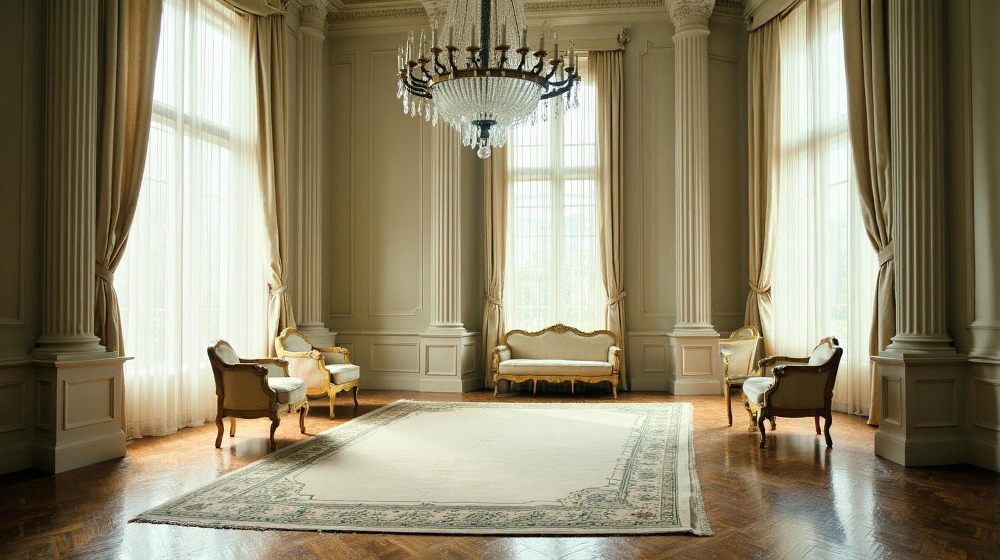

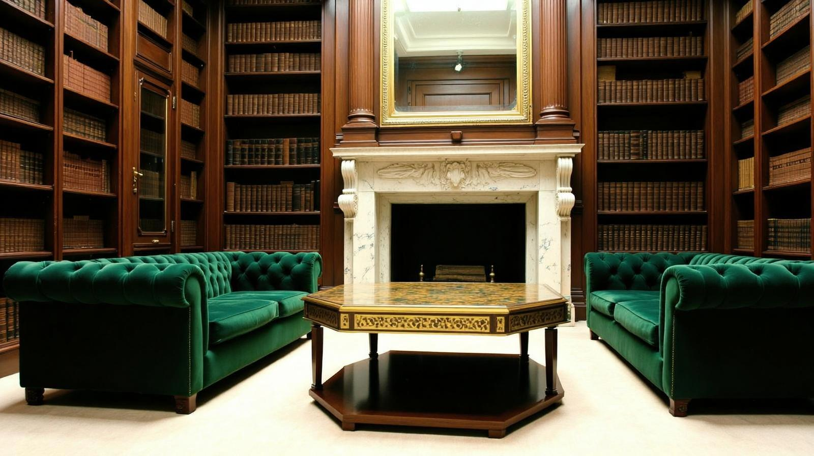

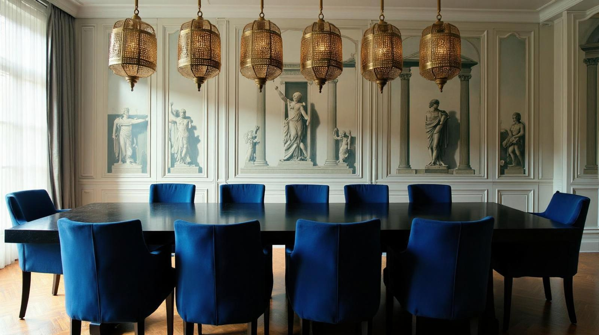

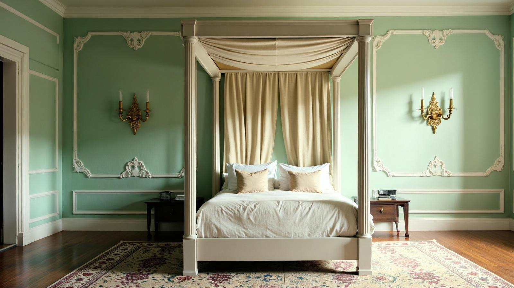

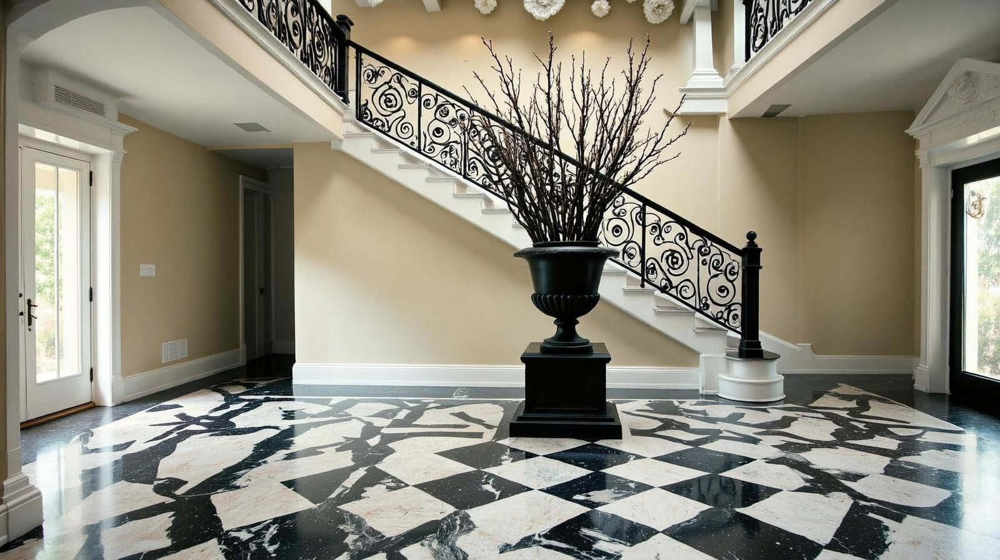

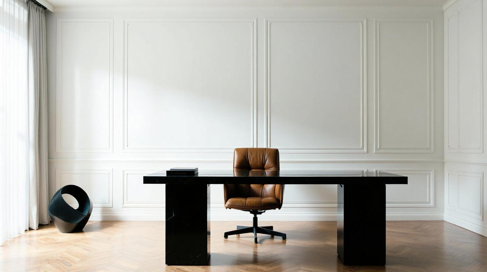

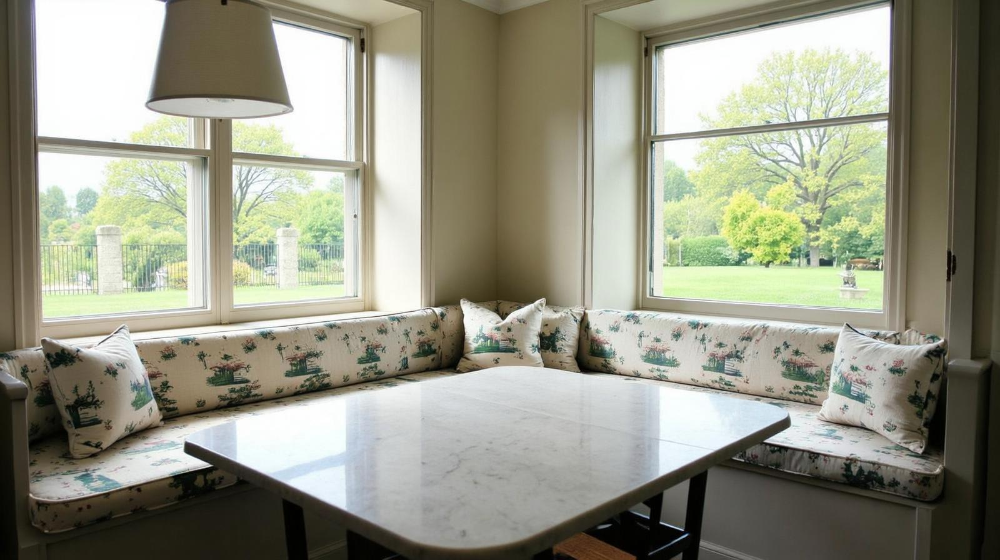

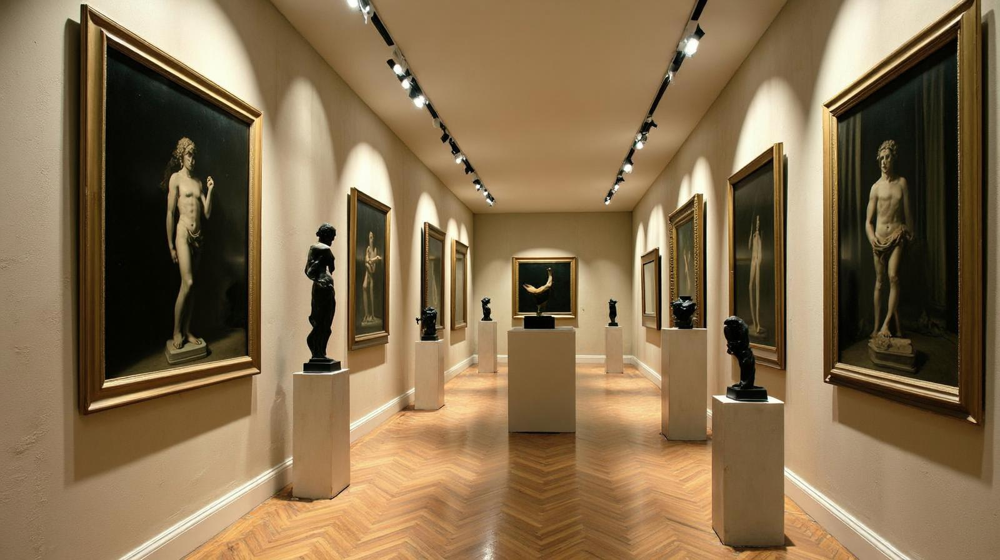

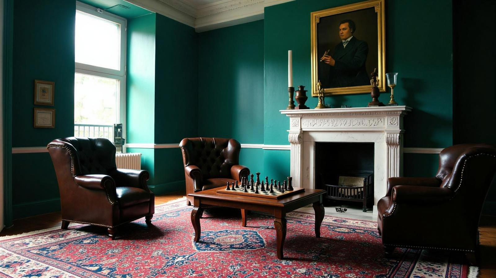

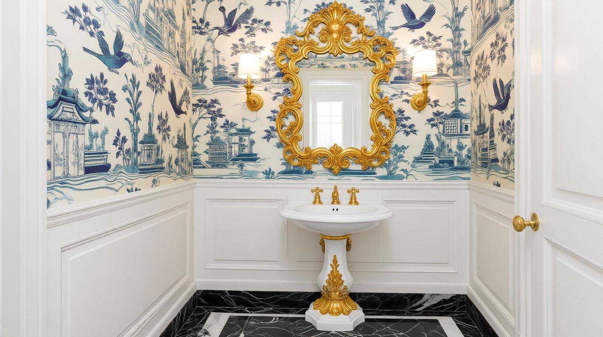

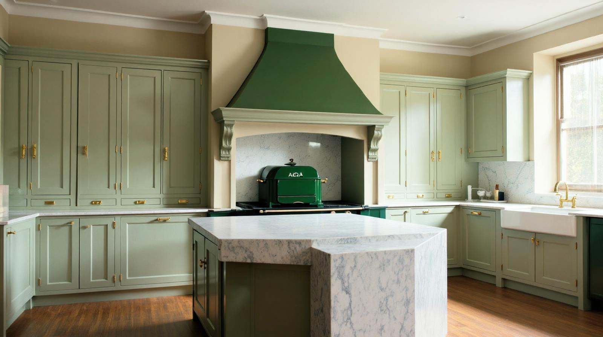

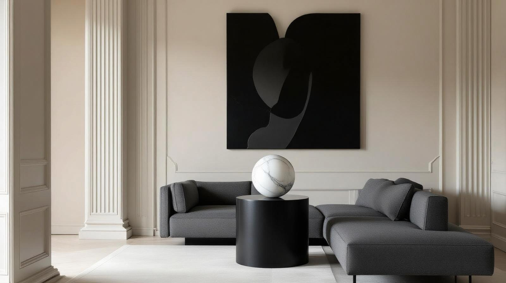

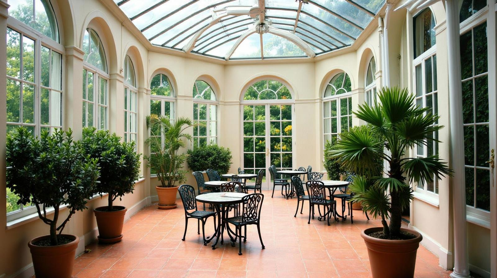

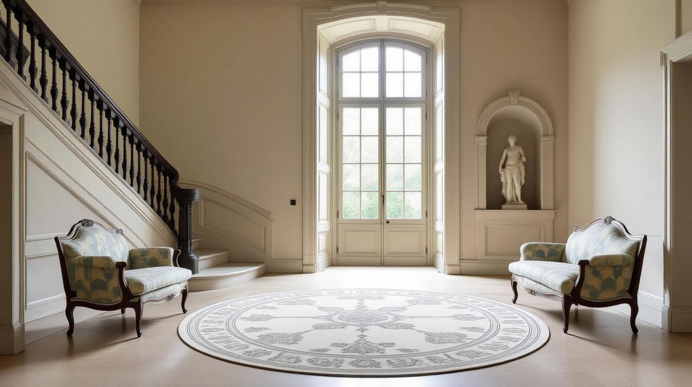

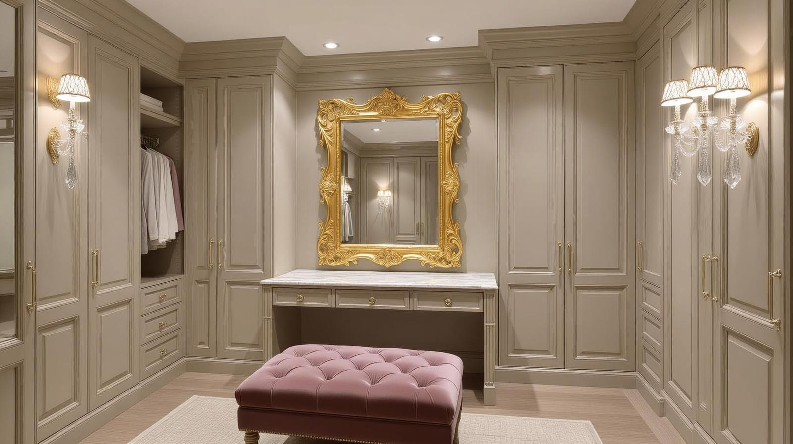

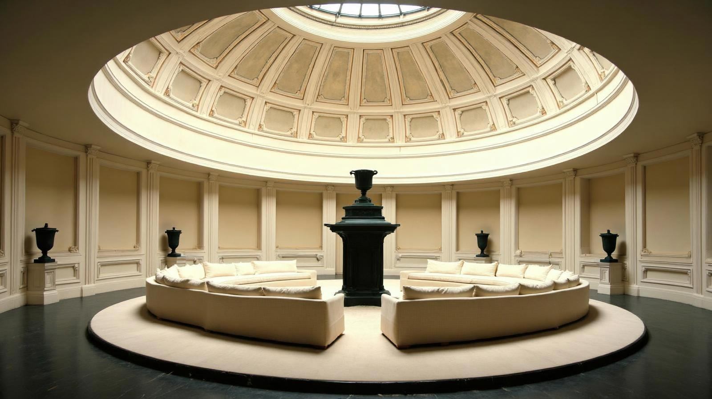
