## Cosmos室内系列：欧式古典风格

本系列参考相关文章进行创建，由于包含的风格较多，缩减到20分镜。

分镜提示词如下：

#### user:

创建20个独立的欧式古典风格室内设计的图片描述，用英语回答。

#### assistant:

Here are 20 independent and distinct European Classical Style interior design descriptions, each aiming for a unique atmosphere and focus:

1.  **Grand Baroque Ballroom:** Soaring ceilings adorned with intricate, gilded stucco work depicting cherubs and clouds. Massive crystal chandeliers drip with prisms, reflecting light onto polished white-and-black marble floors. Walls are lined with floor-to-ceiling mirrors in ornate gold frames, interspersed with crimson silk damask panels. A gilded orchestra balcony overlooks the vast, empty dance floor.
2.  **Rococo Salon Intimacy:** A small, feminine salon bathed in soft pastels – pale pink walls, powder blue upholstered bergère chairs, and creamy white boiserie. Asymmetrical, delicate gilded motifs (shells, flowers, C-curves) cover every surface. Light filters through lace curtains onto a small, marble-topped table holding Sèvres porcelain figurines. A crystal girandole candle holder adds sparkle.
3.  **Renaissance Library Grandeur:** Dark, carved walnut paneling covers walls reaching towards a coffered ceiling. Tall, mullioned windows with leaded glass illuminate rows of leather-bound books. A massive stone fireplace dominates one wall, flanked by suits of armor. A large, intricately inlaid writing desk sits atop an antique Persian rug.
4.  **Neoclassical Drawing Room Elegance:** Serene symmetry reigns. Pale grey walls with white plaster reliefs (Greek key, laurel wreaths) frame tall windows draped in deep emerald velvet. Mahogany furniture with clean lines and saber legs is arranged precisely. A white marble fireplace features classical urns, and a geometric Savonnerie carpet anchors the space.
5.  **French Provincial Kitchen Charm:** Sunlight streams into a warm, rustic kitchen. Rough-hewn exposed ceiling beams. Walls painted a soft ochre with simple, painted cabinetry. A large, scrubbed pine table sits central. Copper pots hang above a grand, tiled hearth oven. Terracotta tiles underfoot and baskets of dried lavender add country charm.
6.  **Gothic Revival Chapel Tranquility:** Stained glass windows in deep blues, reds, and golds cast colored light onto worn stone flagstones. Pointed arches frame the space, leading to a rib-vaulted ceiling. Simple wooden pews face a carved stone altar. Minimal ornamentation emphasizes the spiritual, vertical space. Candles flicker in iron sconces.
7.  **Palladian Music Room Harmony:** Perfect proportions define this double-cube room. Tall, arched windows offer garden views. Walls covered in soft blue silk. A grand piano sits near a harp. Gilded plasterwork highlights the cornices and ceiling medallion. Elegant, curved lyre-back chairs are arranged for listeners. Light parquet de Versailles flooring gleams.
8.  **Biedermeier Study Comfort:** Understated bourgeois elegance. Warm cherrywood furniture with clean, slightly rounded lines – a large desk, glass-fronted bookcases, a comfortable reading chair. Walls papered in a subtle striped pattern. A green-shaded brass desk lamp provides focused light. Plush wool rug. Focus on comfort and practicality within classic forms.
9.  **Versailles-Inspired Hall of Mirrors Fragment:** A long gallery corridor, one wall entirely composed of tall, arched mirrors in elaborate gilded frames. The opposite wall features matching arched windows overlooking formal gardens. Crystal chandeliers hang in a procession down the center. Polished parquet floors reflect the grandeur. (Focuses on the mirror/window interplay).
10. **Empire Style Bedroom Opulence:** A bed with massive, dark mahogany posts topped with bronze ormolu eagles, draped in rich crimson velvet hangings. Walls covered in dark green or deep red striped silk. Furniture features classical motifs (sphinxes, lions) in heavy gilt bronze mounts. A large, gilded cheval mirror stands nearby.
11. **Georgian Gentleman's Study:** Refined masculinity. Dark green walls with dark wood wainscoting. A large, leather-topped partners desk faces the window. Walls lined with books and framed maps. A globe stands on a stand. A wingback leather chair sits beside a brass-bound campaign chest used as a side table. A stag's head mounted above the fireplace.
12. **Viennese Secessionist Salon (Early Modern Classical):** Transitional elegance. Cleaner lines than Rococo, but still ornate. Walls covered in stylized floral or geometric Jugendstil wallpaper in gold and white. Curved, pale wood furniture with inlaid details. A distinctive, geometric-patterned glass chandelier provides light. Large, abstract floral motifs on textiles.
13. **Italian Renaissance Loggia:** An airy, covered terrace with arched openings overlooking a courtyard garden. Terracotta tile floor. Walls frescoed with trompe l'oeil landscapes or classical scenes. Stone benches built into the walls. Large terracotta urns overflowing with lemon trees and trailing ivy. Sunlight dapples through climbing vines.
14. **Russian Imperial Winter Palace Room:** Extravagant scale. Walls covered in vibrant malachite green panels or deep blue lapis lazuli-effect paint. Massive, ornate white Carrara marble fireplace. Gilded furniture upholstered in sapphire blue velvet. Elaborate parquet floors. Enormous, multi-tiered crystal chandelier dominating the high ceiling.
15. **Spanish Colonial Hacienda Courtyard:** Interior courtyard focus. Whitewashed stucco walls. Terracotta tiles underfoot, partially covered by vibrant woven rugs. A central stone fountain trickles water. Heavy, dark wood furniture with leather cushions arranged under shady arcades. Lush potted palms and bougainvillea cascade from balconies above.
16. **Baroque Church Sacristy:** A functional yet ornate room. Intricately carved dark wood cabinetry storing vestments lines the walls. A large, marble-topped central table. Walls adorned with religious paintings in heavy gilt frames. A single, focused light falls on an elaborate golden monstrance displayed on a velvet stand. Stone floor.
17. **Neo-Gothic Library Nook:** Intimate and scholarly. Dark oak paneling, rising to pointed arches within the ceiling. Stained glass heraldic panels in the windows. Leather armchairs flank a stone fireplace carved with gargoyles. Bookshelves built into arched recesses. Brass reading lamps cast pools of warm light on Persian rugs.
18. **Louis XVI Boudoir Delicacy:** Extreme refinement and lightness. Pale powder blue walls with white and gold neoclassical boiserie panels. Furniture with slender, fluted legs and oval backs, upholstered in pale silk brocade. A delicate writing desk with marquetry. Small porcelain vases hold fresh roses. Parquet floor with a central Aubusson rug featuring floral motifs.
19. **Ruins-Inspired Romantic Garden Room:** 19th Century folly aesthetic. Part of a conservatory or garden pavilion. Walls incorporate faux crumbling stonework and fragments of classical columns. Lush ferns and ivy grow around and over the "ruins". Wrought-iron furniture with velvet cushions. A mosaic floor fragment is visible. Atmosphere of picturesque decay.
20. **Victorian Conservatory Oasis:** Grand iron and glass structure filled with exotic greenery – towering palms, ferns, orchids. Wrought-iron benches painted white, cushioned in floral chintz. Tiled pathways meander past a small central fountain. Sunlight streams through the glass ceiling, dappling the foliage and casting intricate shadows from the iron framework. Classical statues peek out from behind large leaves.

Each description emphasizes distinct elements, eras, functions, and atmospheres within the broad European Classical tradition.
<!-- AUTO-GENERATED MEDIA -->

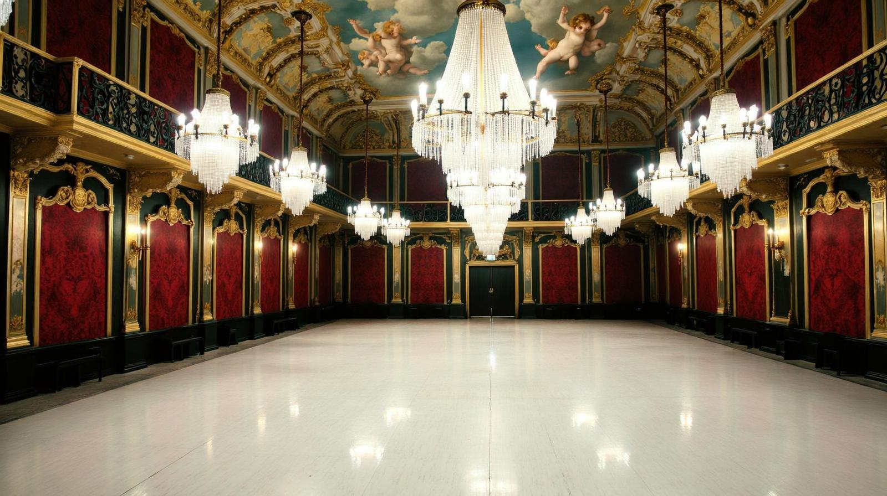

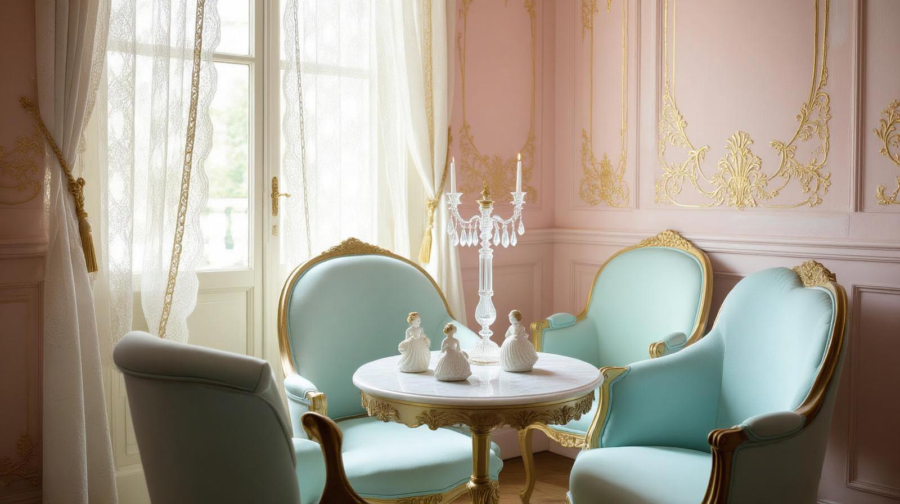

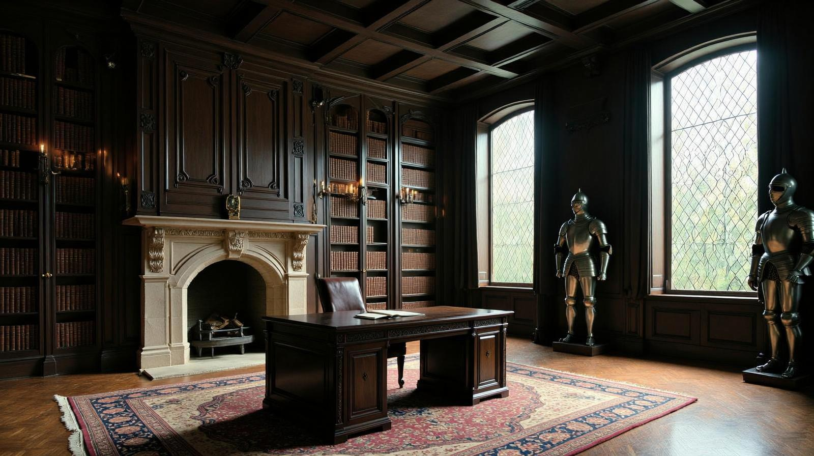

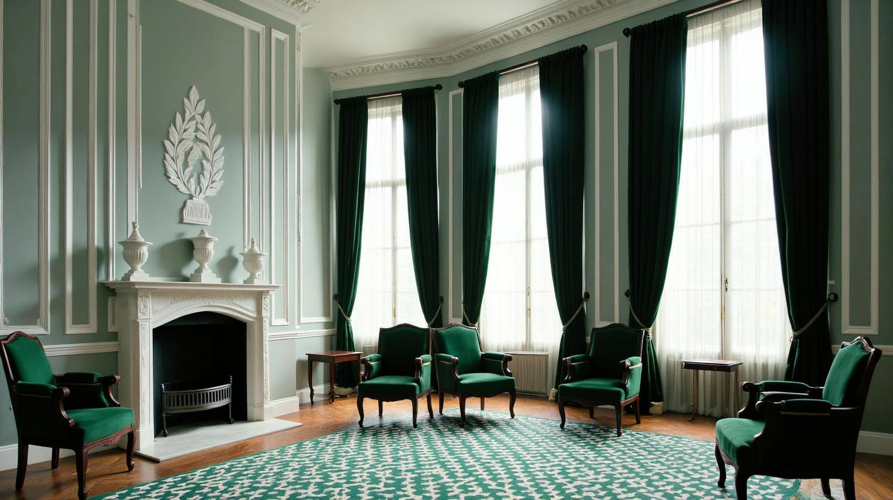

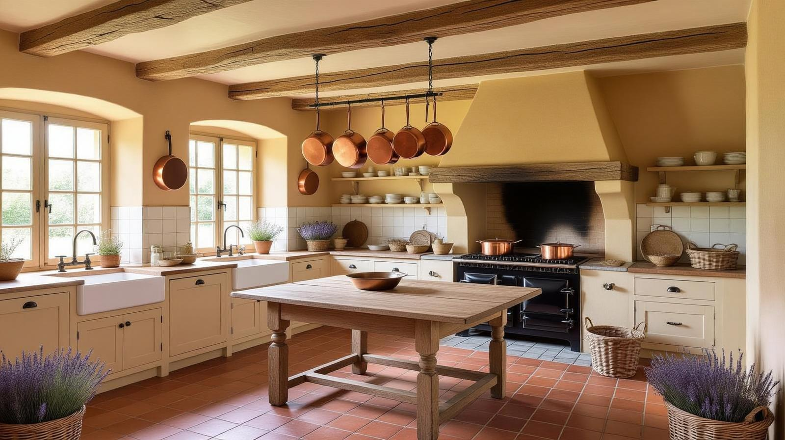

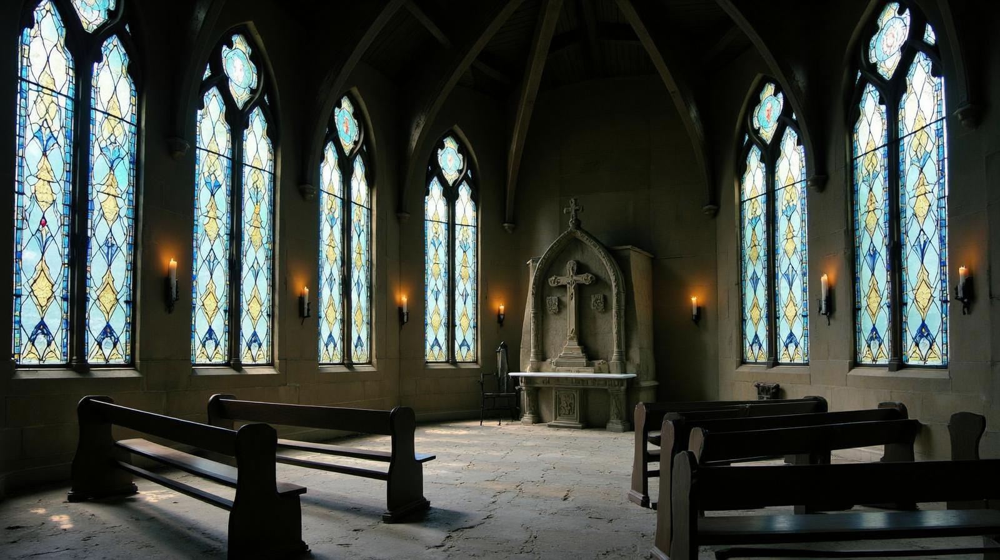

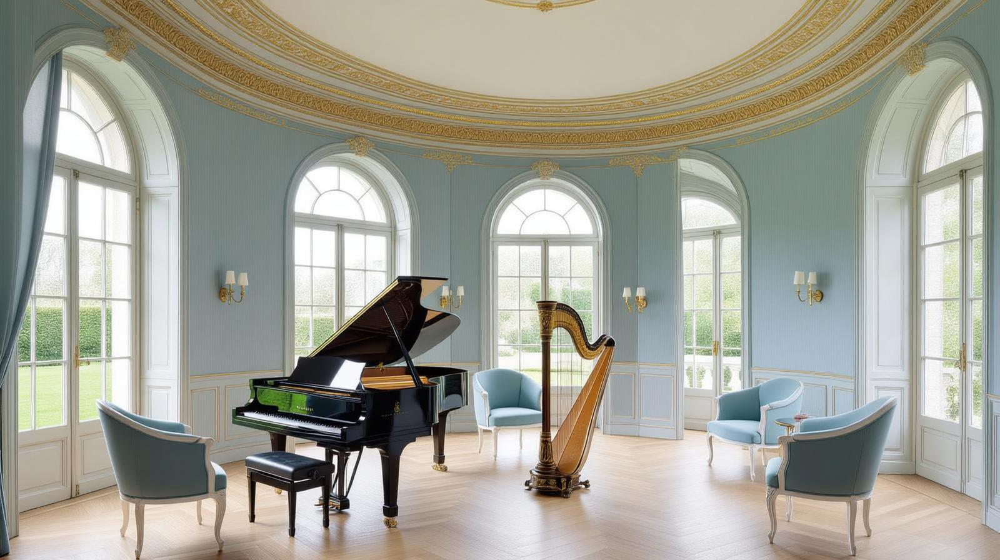

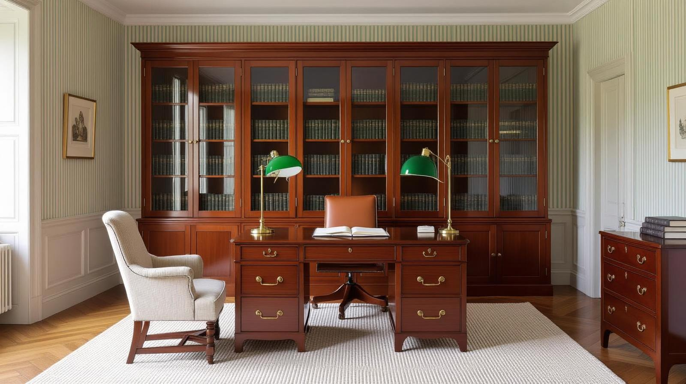

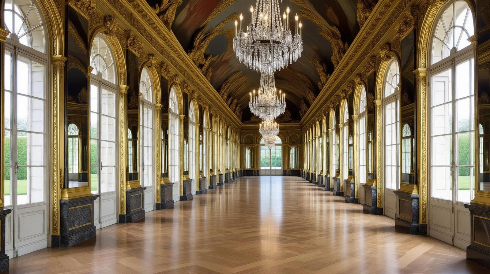

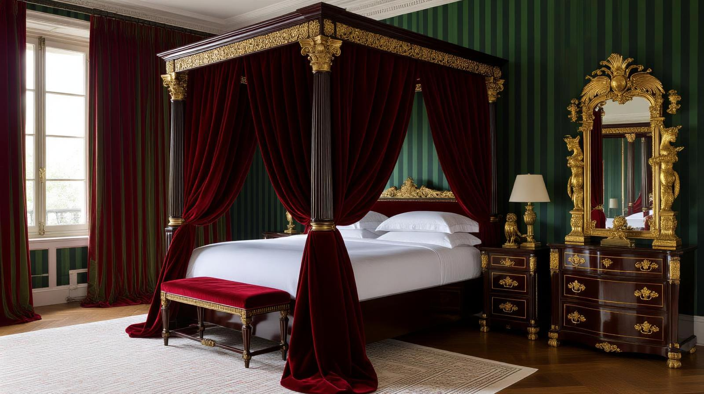

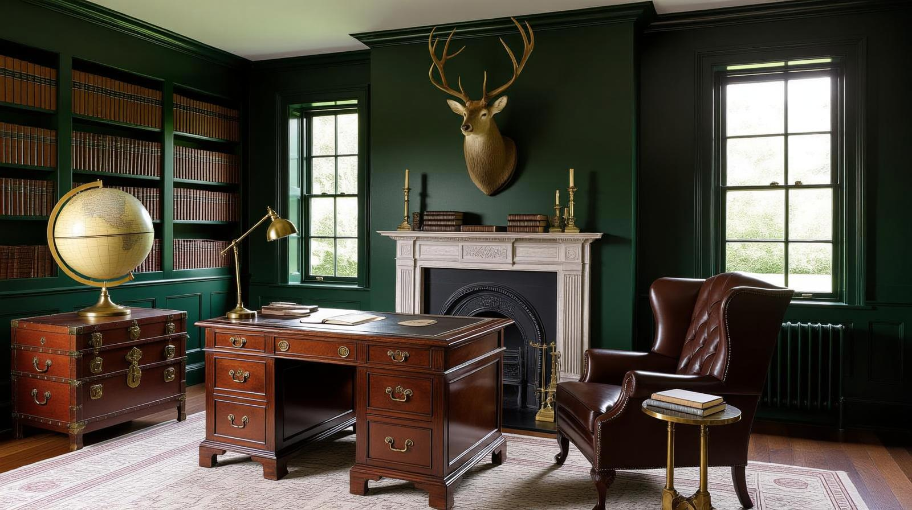

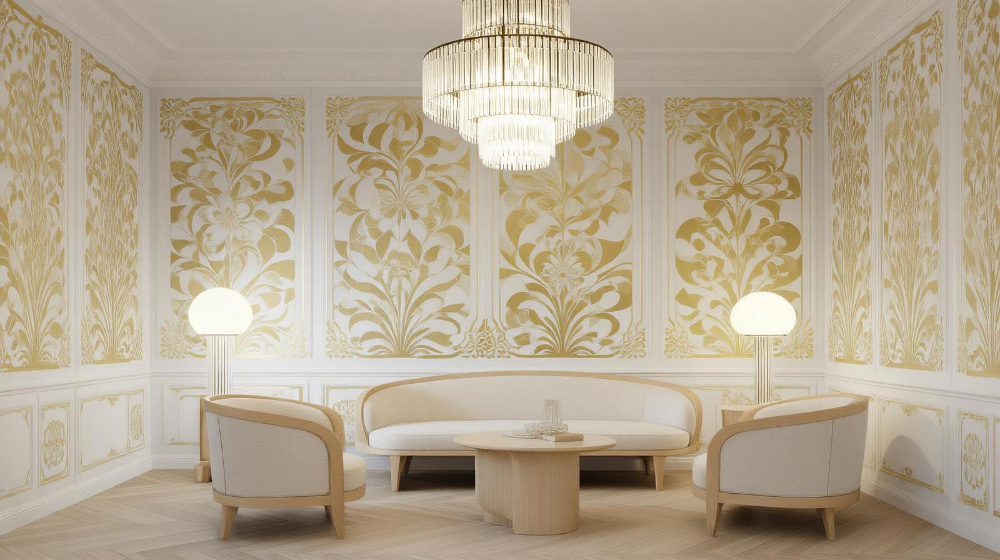

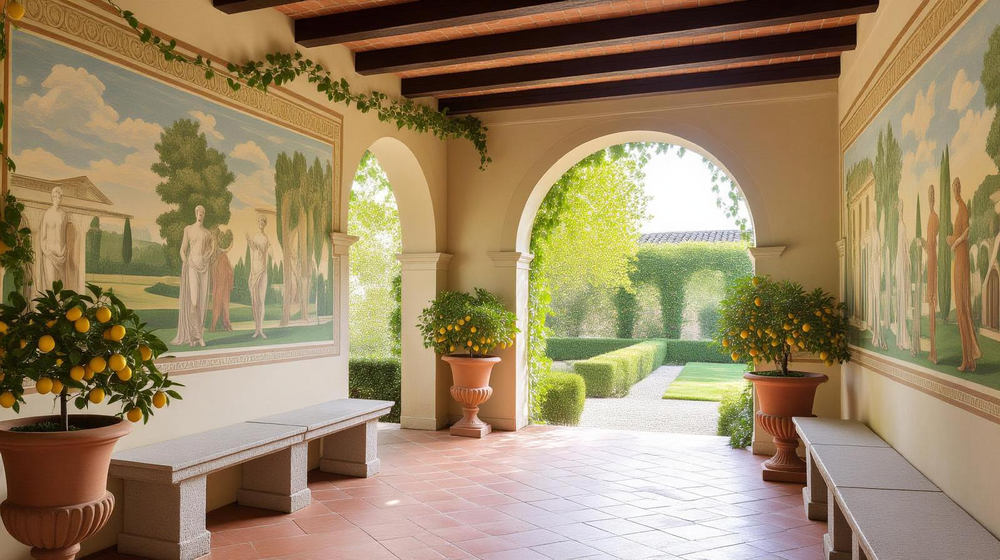

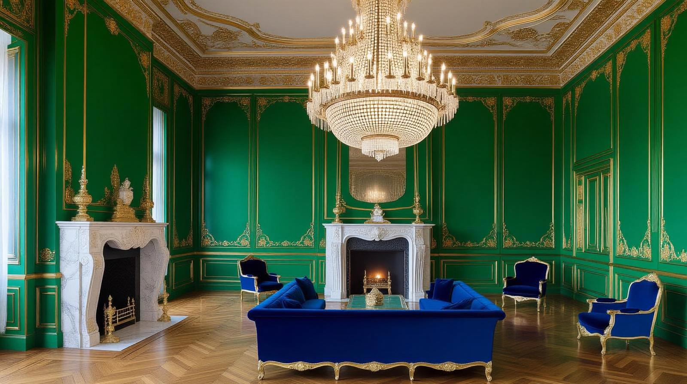

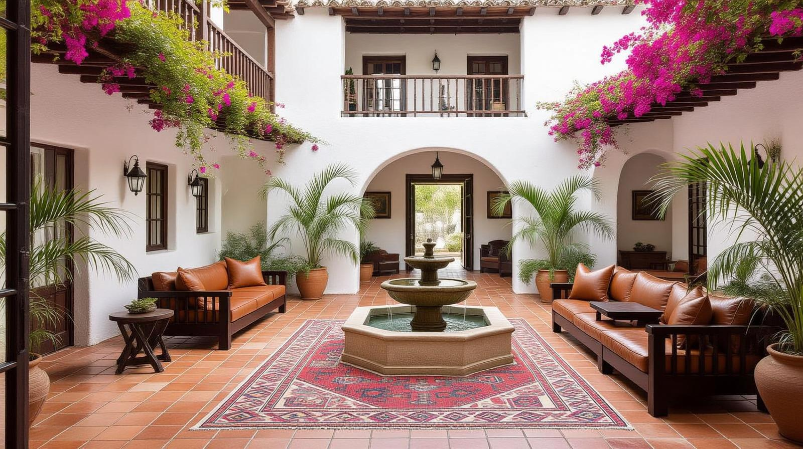

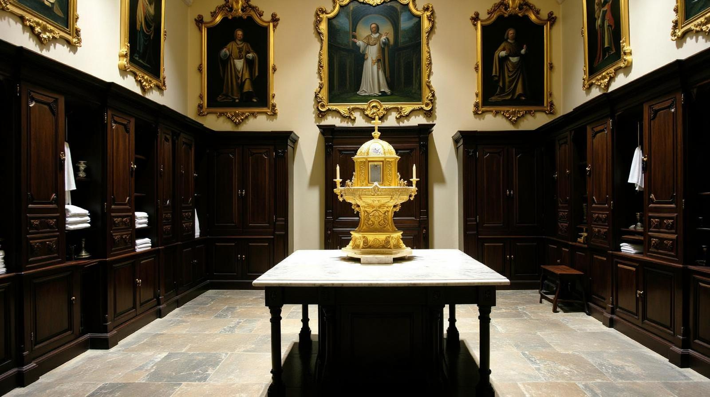

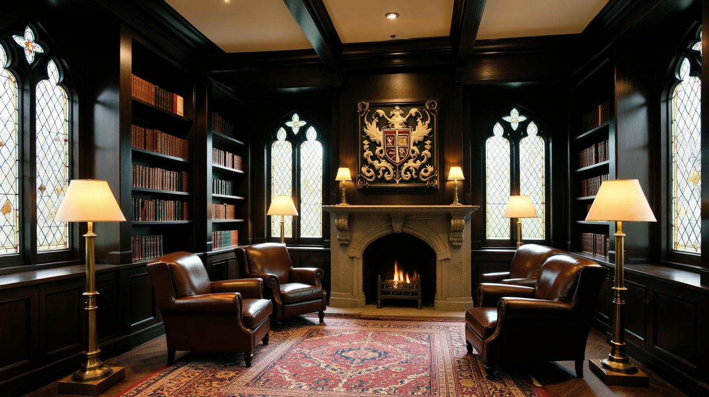

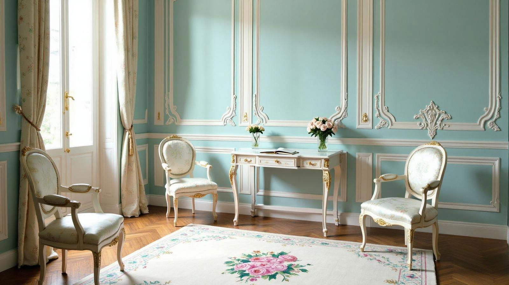

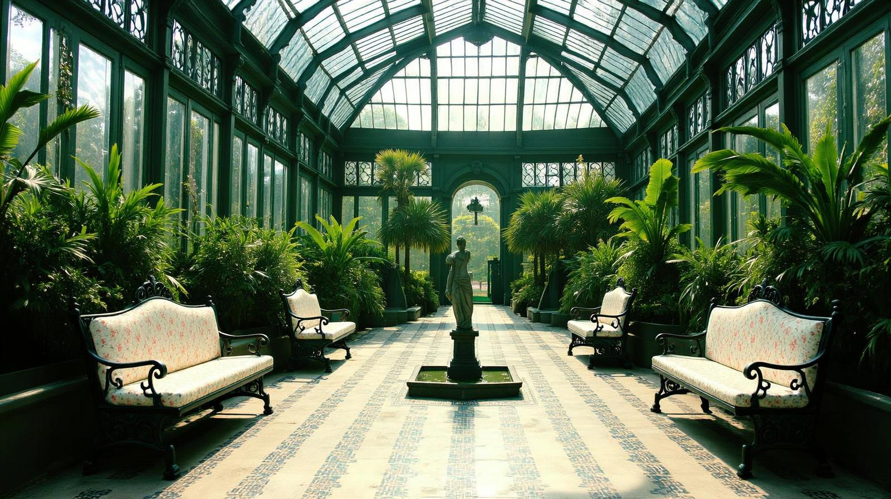
