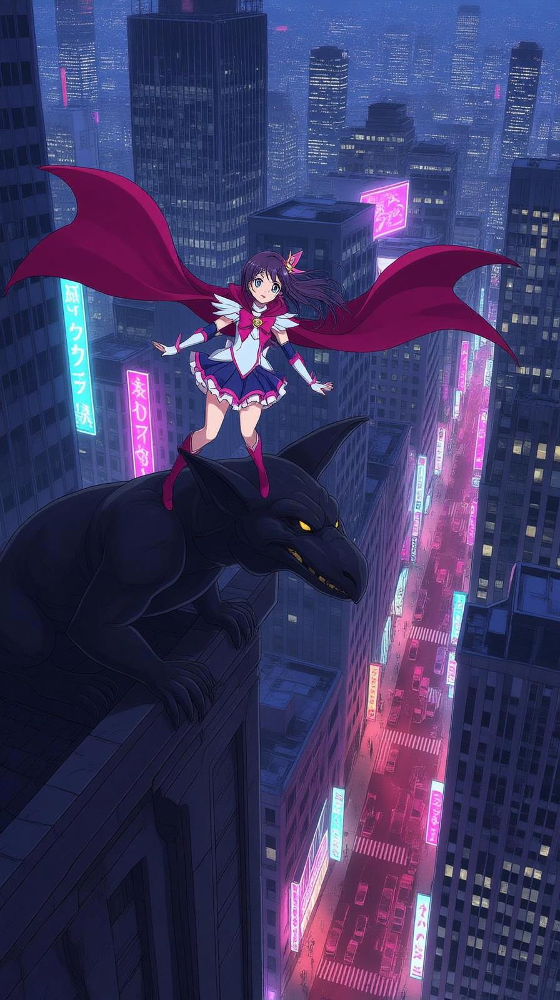
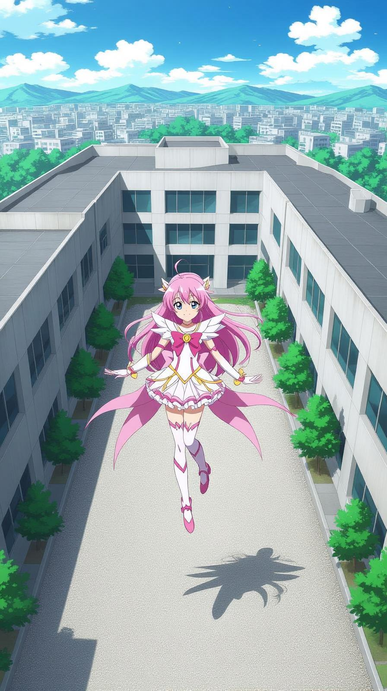
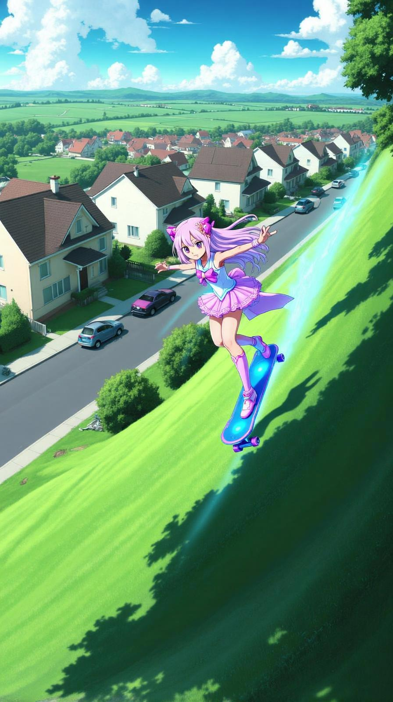
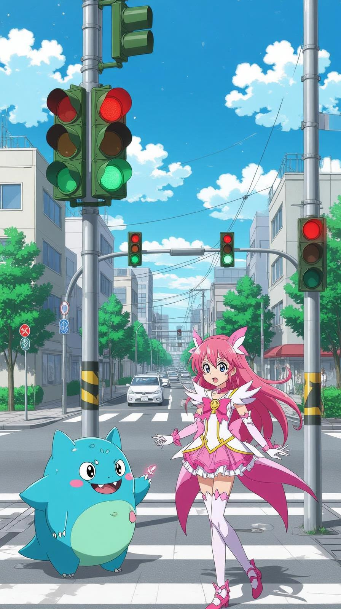
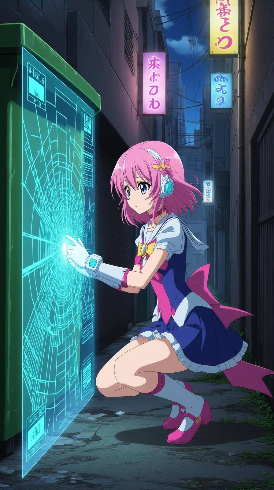
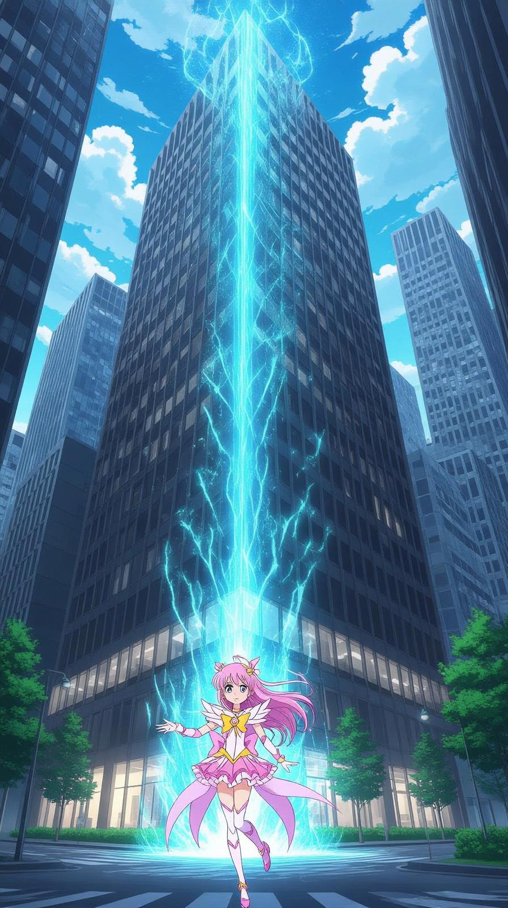

## Cosmos漫画系列：魔法少女

人像系列虽然不指定风格但漫画风格只占小部分，本系列指定了漫画风格并选择一些常见的角色类型。

生成图片的提示词如下：

#### user:

创建30个分镜，每个分镜以“An anime magical girl”开头，场景为城市或郊区，用英语回答。

#### assistant:

Here are 30 distinct anime magical girl scenes, each starting as requested and set in urban or suburban environments:

1.  **An anime magical girl** perches precariously on a gargoyle atop a skyscraper, scanning the neon-lit downtown streets below, her cape flapping wildly in the high wind.
2.  **An anime magical girl** sprints through a rain-slicked suburban alleyway, dodging overflowing trash cans, her glowing weapon leaving shimmering trails in the puddles.
3.  **An anime magical girl** stands defiantly in the middle of a deserted commuter train platform at midnight, her transformation glitter sparkling under the fluorescent lights as a shadowy figure approaches.
4.  **An anime magical girl** balances gracefully on a power line stretched between two weathered suburban houses, observing a quiet neighborhood below bathed in the golden light of sunset.
5.  **An anime magical girl** uses a shimmering energy shield to protect a group of frightened schoolchildren huddled in a recessed doorway on a bustling city sidewalk.
6.  **An anime magical girl** floats gently downwards like a feather, landing silently on the gravel rooftop of a sprawling, modern high school building.
7.  **An anime magical girl** rides a futuristic, glowing skateboard down a steep, winding suburban hill, weaving expertly around parked cars and mailboxes.
8.  **An anime magical girl** takes a moment's respite, leaning tiredly against a flickering vending machine in a dimly lit urban underpass, catching her breath.
9.  **An anime magical girl** conducts an intricate spell using shimmering musical notes that swirl around her in a quiet, moonlit suburban park gazebo.
10. **An anime magical girl** peers curiously through the dusty window of an abandoned, overgrown toy store in a decaying suburban strip mall.
11. **An anime magical girl** summons a torrent of water from a broken city fire hydrant, directing it like a whip against a sludge monster in the street.
12. **An anime magical girl** shares a quiet conversation with her talking animal companion while sitting on a bench overlooking a serene suburban duck pond at dawn.
13. **An anime magical girl** executes a perfect backflip off the side of a speeding monorail train car, soaring high above the city traffic below.
14. **An anime magical girl** uses vines sprouting from her staff to rapidly scale the ivy-covered brick wall of an old city library.
15. **An anime magical girl** hesitantly examines her own distorted reflection in the polished chrome surface of a sleek corporate building downtown.
16. **An anime magical girl** discovers a hidden, glowing magical symbol etched onto the concrete floor of an empty, echoing suburban parking garage.
17. **An anime magical girl** creates a dazzling barrier of light to contain an explosion of dark energy in a crowded city intersection, shielding civilians.
18. **An anime magical girl** sits alone on the swings in a small, empty neighborhood playground at twilight, looking pensive under the buzzing streetlights.
19. **An anime magical girl** uses wind magic to gather and swirl fallen autumn leaves into a protective vortex around herself in a suburban backyard.
20. **An anime magical girl** navigates a complex maze of laundry lines strung between apartment buildings in a dense, old residential district.
21. **An anime magical girl** confronts a minor nuisance creature mischievously tampering with traffic lights at a busy urban crossroads.
22. **An anime magical girl** finds a moment of peace, sipping a warm drink from a paper cup while sitting on the steps of a closed city museum at night.
23. **An anime magical girl** uses a beam of pure moonlight, channeled through her crystal wand, to cleanse a patch of corrupted earth in a community garden.
24. **An anime magical girl** leaps from rooftop to rooftop across tightly packed traditional houses in a quieter, older suburb.
25. **An anime magical girl** activates a holographic city map projection from her wrist device while crouched behind a dumpster in a grimy alley.
26. **An anime magical girl** comforts a lost child, using a gentle, glowing light to guide them safely back to a well-lit suburban street corner.
27. **An anime magical girl** performs her transformation sequence mid-air after tripping off a curb, landing gracefully (if slightly embarrassed) on a quiet suburban sidewalk.
28. **An anime magical girl** senses a magical disturbance emanating from a nondescript, modern office building amidst towering downtown skyscrapers.
29. **An anime magical girl** finds a rare, glowing magical bloom pushing its way through a crack in the concrete next to a busy freeway overpass.
30. **An anime magical girl** sits exhausted but satisfied on the ledge of a low-rise apartment building, watching the first rays of sunrise paint the city skyline pink and orange, her transformation fading.

<!-- AUTO-GENERATED MEDIA -->

