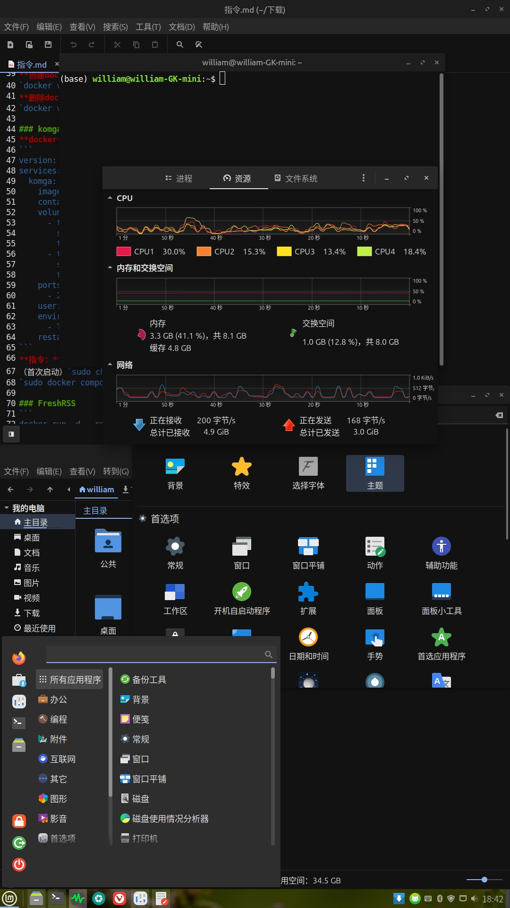

# Linux

本文介绍了我使用的Linux发行版以及配置局域网服务器的情况。

### 此前使用的Linux发行版

我尝试过不少Linux发行版，最终选择了Linux Mint，有几个方面的原因：
1. 在Ubuntu下游，N卡驱动、PPA以及Timeshift支持有优势。
2. Cinnamon桌面环境外观相对较好且接近Windows的操作习惯，对Xfce版本也进行了定制实现类似的外观且仍然适合低配设备。
3. 解决了Ubuntu过度依赖Snap的问题，仍然以系统包为主并引入Flatpak，并且能够自动换源。
4. 在apt换源和输入法安装的图形化支持较为完善。

Linux Mint也有一些缺点：
1. 软件不是最新，deb系这方面Debian Testing比较有优势，基本不需要使用Flatpak等方法安装比较新的软件。
2. 系统自带的smb服务器功能存在权限问题，如果需要开源smb服务器推荐iStoreOS或者NAS系统。
3. 默认外观不算优秀。由于外观较好的Solus Linux的主题实际上是使用了materia主题包和papirus图标包，可以用于其它不少发行版，在Linux Mint安装了这一主题，效果如下图。

    

基本配置和软件使用情况：
1. 浏览器用过Vivaldi，在低配设备流畅度高，同步功能比Firefox好用，但由于安卓版缺少扩展功能以及用不到j1800主机而换回了Edge。
3. 使用了Krita,LibreOffice和Inkscape等主流开源软件，游戏主要玩了画质相对较好的Openarena和SuperTuxKart。

### 近期使用的Linux发行版

考虑到有远程桌面需求，xrdp在手机基本不可用，kasmvnc画质差，pve的novnc等功能延时长，由于有用户反映Ubuntu24.04之后的远程桌面功能有较大优势，就改用最新的Ubuntu25.04。

根据一些文章判断，Ubuntu的远程桌面表现提升是因为用了性能更好的Wayland、远程桌面功能与系统集成以及在Gnome桌面对远程桌面需要的分辨率和画质调整做了优化。实际使用时在设置中有“远程桌面”和“远程登录”功能，前者与物理机共用会话但需要使用相同分辨率，在手机使用Windows APP连接无法修改宽高比，改用后一种方案，该方案与xrdp类似，都需要注销后切换远程连接和物理机。实际流畅度表现比xrdp好很多但比Windows的rdp差一些。

安卓客户端方面，Windows APP连接时不支持手机输入法也无法启动电脑上的输入法，导致无法输入中文。另外测试了aFreeRDP，无法调出键盘。Windows客户端方面，使用内置远程桌面功能无法连接。在wsl安装Remmina启动较慢且不支持语言和主题切换，最终选择在VMWare虚拟机安装Remmina以提高体验。在Linux使用Remmina连接即可。

除rdp功能外Ubuntu25.04相比Linux Mint的优点包括：
1. 自动换源且预装输入法。
2. 流畅度较高。
3. 内核和软件版本新。
缺点包括：
1. 没有轮播壁纸。
2. 稳定性差，文件管理器频繁闪退。
3. 不同应用外观不太一致。
4. 缺乏对盒盖操作等功能的图形化设置项。
5. Debian包维护差，例如Libreoffice需要手动安装语言包和主题支持，Remmina无法正常连接。
6. Snap程序启动速度慢，并且缺少国内源。

使用Ubuntu时，由于界面尺寸较大，相同缩放比例下应用尺寸偏小，开启大号文本能缓解这一问题，也能解决非整倍缩放可能带来的问题。不过VS Code的文件列表等内容没有被缩放。

Ubuntu25.04使用了新的Gnome版本，性能有一定提升，在j1800也达到可用水平，与Budgie桌面环境的流畅度接近。不过使用新版的一个问题是稳定性和兼容性差一些，Xtreme Download Manager等程序用不了。

### 目前能否代替Windows

目前Linux有不少特性优于Windows，比如外观一致性强、容器支持更好、Tun代理支持系统应用、流畅度更高和sftp的速度优势。

然而，Windows有一些特性还无法被替代，Ubuntu24.04以上版本算是补齐了远程桌面特性，但输入法支持有问题且实际使用时无法通过主机名连接。部分应用只有Windows版本，通过转译不能确保在Linux运行。

### 局域网服务器配置

##### 其它方案的缺陷：
1. iStoreOS较为轻量化且服务部署方便，但我有使用桌面系统的需求，iStoreOS内核有裁剪，通过Docker部署带KASM VNC的桌面系统不能正常使用部分功能。
2. PVE方便使用和测试多个系统，但ip地址改变时难以修复，显卡直通依赖额外配置。
3. 在iStoreOS可以部署PVE，能解决ip地址问题，但也存在虚拟机无法与iStoreOS使用同一个硬盘，连接smb有功能限制的问题。

##### ssh与文件服务器

远程终端控制安装ssh即可，有需要时需要允许root登录。由于在安卓设备连接基本不可用，后面改回物理机使用。

文件服务器由于smb不能正常使用，还是决定使用sftp。在安卓可以通过Solid Explorer等客户端连接。在Windows需要安装WinFSP和sshfs-win再映射网络驱动器，路径使用“\sshfs.r\用户名@IP地址!端口号\home”实现按绝对路径挂载。

##### Docker应用

使用Docker部署局域网服务，有以下优点：
1. 安装流程简单，没有依赖问题。
2. 无需额外配置就能解决第三方服务的局域网访问问题。
3. 方便进行容器启停和版本管理等操作。

不过Docker也有一些缺点：
1. 缺乏稳定的镜像站。
2. 集成依赖性和多版本管理对容量占用大。
3. 需要额外的工具链进行具体监测。

目前部署的应用包括：
1. Dpanel，用于图形化Docker管理。
2. Jellyfin,用于以图片/视频为主的媒体库。
3. Komga，用于文档媒体库。
4. Watchtowver，用于自动更新Docker镜像。
5. Openwebui，用于调用LLM，并执行生成的python程序。
6. code-server，用于编辑文件，解决在安卓连接无法输入中文的问题并提高编辑流畅度，但也存在在手机界面过大以及无法共用系统运行环境等问题。
##### 下载服务器

由于百度网盘Linux版没有p2p加速且wine版本不能正常运行，阿里云盘官方速度只略高于1mb/s且第三方客户端更慢，目前不在Linux使用网盘客户端。

由于Ubuntu25.04优化了xrdp，不再使用通过命令行下载的方式。由于Xtreme Download Manager已停止维护且不支持Wayland导致在新系统不可用，改用猫抓进行资源嗅探，暂不使用新的下载管理器。

### 未采用的软件

我了解过其它一些Linux优化措施和软件，但因为一些原因没有采用。

##### 透明终端与终端应用美化

透明终端是比较常见的美化方案，但我个人更注重开箱即用，就没有进行这类配置。目前Kali Linux在有Kali主题的桌面环境中也是透明终端。

终端应用讨论比较多的是Vim，常见的美化方法是添加路径显示和分屏实现类似于IDE的功能，也可以进行定制对其它用途进行优化。

##### 云原生软件

目前大部分工具类应用是桌面应用而非web应用，但不少类型的应用有web版本。比如用于文档编辑的OnlyOffice，用于代码编辑的CodeServer和用于协作的NextCloud。

我没有部署这类应用的原因如下：
1. 相比集中存储，考虑外出使用等情况，我更注重各设备的单独运行效果。
2. 通过挂载网络存储器，可以实现在本地编辑服务器上的内容。

##### 集群管理

docker swarm和k8s分别能满足小集群和大集群的容器管理需求。我部署应用由于是个人使用，对高可用要求不高，并且没有多版本和多设备需求，因此没有使用这类应用。
