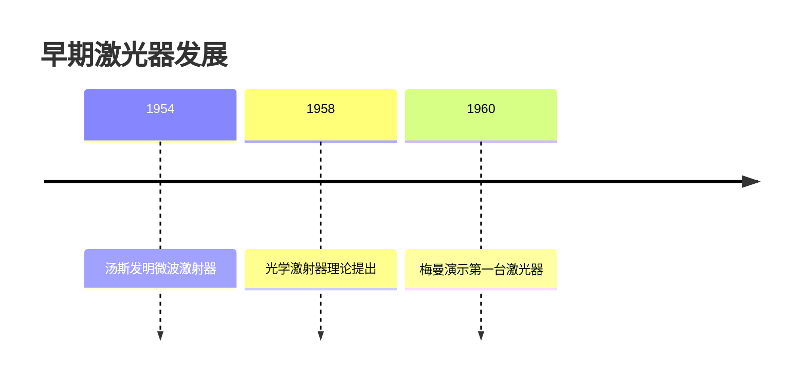

# 激光器发展史
## 从理论到应用的百年征程

> [!NOTE]
> 本报告将系统梳理激光技术从理论提出到现代应用的关键发展历程

---

## 理论基础 (1917-1950)
### 爱因斯坦与受激辐射理论

1917年，爱因斯坦在《关于辐射的量子理论》中首次提出**受激辐射**概念：

$$
\rho(\nu) = \frac{8\pi h\nu^3}{c^3} \frac{1}{e^{h\nu/kT}-1}
$$

关键里程碑：
- 1928年：拉登堡证实受激辐射存在
- 1940年：法布里坎特提出粒子数反转概念
- 1947年：兰姆发现氢原子能级位移

---

## 第一台激光器诞生 (1960)
### 梅曼与红宝石激光器

1960年5月16日，休斯实验室的**西奥多·梅曼**成功研制第一台激光器：

| 参数 | 数值 |
|------|------|
| 工作物质 | 红宝石晶体 |
| 波长 | 694.3 nm |
| 脉冲能量 | 3 J |
| 脉宽 | 1 ms |

---

---

## 技术突破期 (1960-1980)
### 多样化激光器发展

- 气体激光器
    - 1961年：氦氖激光器 (连续输出)
    - 1964年：CO₂激光器 (高功率)
    - 1966年：氩离子激光器 (可见光)

<->

- 半导体激光器
    - 1962年：GaAs激光器 (77K脉冲)
    - 1970年：室温连续工作激光二极管

> [!TIP]
> 这一时期激光器开始从实验室走向工业应用

---

## 现代应用 (1990-至今)
### 改变世界的激光技术

- 技术应用领域：
    - **医疗**：激光手术、眼科治疗
    - **通信**：光纤通信系统
    - **制造**：精密加工、3D打印
    - **科研**：冷原子、量子光学

<->
- 里程碑技术：
    - 1994年：蓝光激光二极管
    - 2000年：飞秒激光应用
    - 2010年：千瓦级光纤激光器

---

## 未来展望
### 量子激光与核聚变

前沿研究方向：
1. 拓扑激光器
2. 等离子体激光加速器
3. 激光核聚变点火 (NIF项目)

$$
P_{fusion} \propto n^2 \langle \sigma v \rangle T
$$

> [!WARNING]
> 高能激光的安全与伦理问题需要同步考虑

---

## 总结

- 激光发展关键阶段：
    - 理论奠基 (1917-1950)
    - 技术突破 (1960-1980)
    - 应用扩展 (1990-至今)
    - 前沿探索 (未来)

- 参考文献：
    - 《激光原理》 周炳琨
    - 《Laser Fundamentals》 William T. Silfvast
    - 美国光学学会期刊
