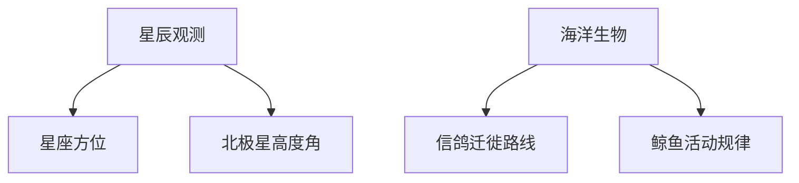

# 海上导航发展史

## 导论：航海技术的重要性
**航海技术**作为人类文明的重要推手，始终贯穿于文明交流与技术革新的历程。本演示将系统梳理从原始导航到卫星定位的关键演进阶段：

- 时空维度：公元前2000年至今
- 技术主线：天文观测→磁学应用→机械计时→电子信号→卫星定位
- 文明影响：贸易路线、殖民扩张、全球化进程

> [!NOTE]
> 导航精度的提升直接决定了海上探索的边界，误差每缩小1个数量级，航海半径扩大10倍

---

## 古代导航（公元前2000年-公元500年）
### 原始定位方法

### 文明典范
- **波利尼西亚人**：利用星象+海浪模式+候鸟轨迹，建立太平洋岛链导航体系
- **腓尼基人**：首创「等高航行法」，通过测量北极星高度保持纬度
- 《汉书·艺文志》记载汉代「司南之勺，投之于地，其柢指南」

---

## 中世纪航海革命（500-1500年）

- 东方突破
    - 宋朝《武经总要》记载「指南鱼」制作工艺
    - 郑和船队配置24方位罗盘（误差±5°）
    - 牵星板测量星辰高度定位法

<->

- 西方进展
    - 12世纪地中海出现**波特兰海图**
    - 1390年犹太制图师绘制首张等角航线图
    - 1484年葡萄牙建立航海数学学校

---

## 大航海时代的突破（1500-1800年）
### 关键发明年表

| 年份 | 发明者       | 装置         | 定位误差 |
|------|-------------|--------------|----------|
| 1530 | Gemma Frisius | 直角仪       | ±150 km  |
| 1731 | John Hadley  | 八分仪原型   | ±30 km   |
| 1757 | John Bird     | 精密六分仪   | ±8 km    |

> [!TIP]
> 哈里森H4航海钟（1761年）实现经度测量，使跨洋航行误差从数月缩短至分钟级

---

## 工业革命时期的革新（1800-1900年）
### 导航体系现代化
1. **标准化海图**（1800）
   - 墨卡托投影法普及
   - 等角航线可视化
2. **天文历法革命**（1850）
   - 皇家格林尼治天文台发布《航海年历》
   - 时区系统确立（1884）
3. **电报导航**（1899）
   - 马可尼跨大西洋无线电实验
   - 时号发射站建立

---

## 电子导航时代（1900-2000年）

- 技术迭代脉络
    - 1921 陀螺罗盘（误差±0.25°）
    - 1943 雷达导航（战时保密技术）
    - 1958 子午仪卫星系统（首个卫星导航）
    - 1973 GPS计划启动（24颗卫星架构）

**技术拐点**：1996年取消SA政策（Selective Availability），民用GPS精度从100m提升至10m

---

## 卫星导航系统（2000年至今）
### 全球四大系统对比

| 系统   | 所属国 | 卫星数 | 定位精度 | 特色技术           |
|--------|--------|--------|----------|--------------------|
| GPS    | 美国   | 31     | 3-5m     | 双向时间同步       |
| 北斗   | 中国   | 35     | 2.5m     | 短报文通信         |
| GLONASS| 俄罗斯 | 24     | 5-10m    | 极地覆盖优势       |
| Galileo| 欧盟   | 26     | 1m       | 搜救载荷           |

---

## 未来趋势与挑战
### 技术前沿
- **量子导航**：冷原子干涉仪（定位误差<1m/月）
- **地磁指纹**：海底地磁场特征数据库
- **AI导航**：神经网络实时修正路径偏差

### 永续课题
$$
\frac{\partial P}{\partial t} = \nabla \cdot (D\nabla P) + \lambda
$$
其中$P$为定位精度，$D$为技术扩散系数，$\lambda$为基础科研投入

---

## 结论：航海技术演进的意义
通过两千年的技术累积，人类实现了：

- 定位精度提升 **10^6倍**（从百公里级到厘米级）
- 航行安全保障提升 **99.7%**（相比18世纪海难率）
- 全球海运成本下降 **82%**（按吨公里计算）

> [!IMPORTANT]
> 导航技术的本质是**时空认知革命**，下一步突破或将来自量子物理与广义相对论的深度融合
