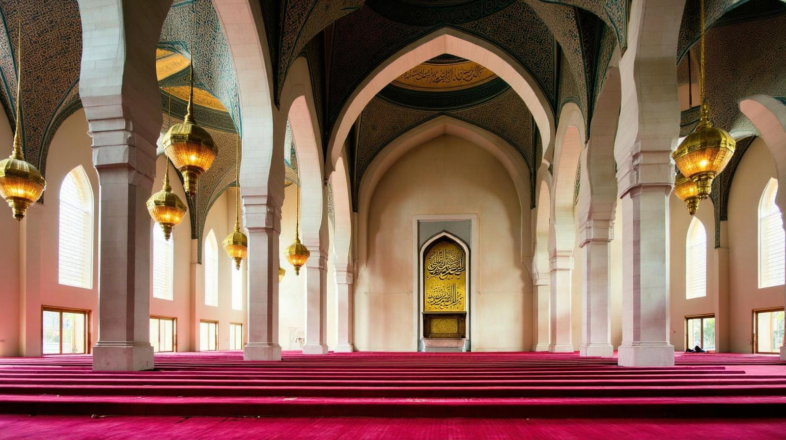

## Cosmos室内系列：伊斯兰风格

本系列参考相关文章进行创建，由于包含的风格较多，缩减到20分镜。

分镜提示词如下：

#### user:

创建20个独立的伊斯兰风格室内设计的图片描述，用英语回答。

#### assistant:

Here are 20 unique and independent prompts for Islamic-style interior design images, focusing on diverse settings and elements:

1.  **Grand Mosque Prayer Hall:** Vast prayer hall with towering pointed arches, intricate geometric stucco patterns covering walls and ceiling, ornate mihrab niche with gold leaf calligraphy, rows of plush red carpets under soft light from massive hanging brass lanterns.
2.  **Andalusian Courtyard Library:** Sun-drenched courtyard interior with horseshoe arches surrounding a central fountain. Walls lined with dark wood bookshelves carved with arabesques, colorful zellige tile dados, and scattered low divans with embroidered cushions.
3.  **Ottoman Hammam Relaxation Room:** Steam gently rising in a domed octagonal room. Central marble fountain, heated marble benches (göbek taşı) with plush towels, walls clad in gleaming white and turquoise Iznik tiles featuring floral patterns, small stained glass windows casting colored light.
4.  **Moroccan Riad Courtyard:** Lush central courtyard of a riad. White plaster walls adorned with intricate carved plaster (gebs), vibrant zellige tile fountain, orange trees in painted ceramic pots, colorful Berber rugs on polished tadelakt floors, carved cedar wood doors.
5.  **Safavid Palace Reception Room (Iwan):** Deep vaulted iwan opening onto gardens. Walls covered in complex polychrome tile mosaics depicting floral and geometric designs, ceiling with intricate muqarnas (stalactite vaulting), rich Persian carpets covering the floor, low seating along walls.
6.  **Mamluk Madrasa Study Niche:** A serene student's alcove in an ancient madrasa. Walls covered in deep blue and gold geometric tilework, a pointed arch window with intricate gypsum mashrabiya screen filtering light onto a low wooden desk with Quran stand and brass study lamp.
7.  **Modern Islamic Living Room:** Contemporary living space featuring clean lines. Accent wall with large-scale laser-cut metal screen showcasing an abstract geometric pattern, plush neutral sofas with vibrant silk cushions featuring arabesque designs, low brass coffee table, minimalist Islamic calligraphy art piece.
8.  **Luxury Desert Tent Interior:** Opulent Bedouin-inspired tent interior. Richly patterned textiles (kilims, brocades) covering walls and ceiling, low seating with mountains of embroidered cushions, ornate brass trays and lanterns, intricate carpet underfoot, open view to desert stars.
9.  **Ottoman Selamlık Lounge:** Formal men's reception room in an Ottoman mansion. Low cushioned divans lining the walls beneath large windows with stained glass upper panels, elaborate wood ceiling with painted floral motifs, central space with fine Isfahan rug, copper mangal (brazier).
10. **Calligrapher's Studio:** Peaceful workspace dedicated to Islamic calligraphy. Walls adorned with framed verses in various scripts (Thuluth, Naskh), a large slanted writing desk with inkwells and reed pens, shelves holding pigments and manuscripts, light streaming through a geometric stained glass window.
11. **Muqarnas Dome Detail:** Dramatic close-up perspective looking up inside a soaring dome. Complex honeycomb-like muqarnas structure descending, each cell decorated with vibrant blue, green, and gold floral tile mosaics, creating a mesmerizing celestial effect.
12. **Moroccan Zellige Bathroom:** Intricate bathroom featuring floor-to-ceiling zellige tilework in emerald green, cobalt blue, and white geometric patterns. Freestanding copper bathtub, hammered metal basin, arched niche with lantern, tadelakt plaster accents.
13. **Harem Garden Pavilion:** Delicate pavilion within a private garden. Lattice wood screens (jali) filtering sunlight, fountain trickling in the center, silk cushions piled on raised platforms, walls with painted floral frescoes and mirrored fragments.
14. **Moorish Palace Hall of Ambassadors:** Stately hall with high ceilings supported by slender columns with intricate capitals. Walls covered in elaborate carved plaster arabesques and Kufic inscriptions, large arched windows overlooking gardens, intricate mosaic floor.
15. **Traditional Tea Room:** Intimate space centered around tea service. Low round table inlaid with mother-of-pearl geometric designs, surrounded by floor cushions with rich velvet covers, brass samovar and engraved tea glasses, walls with niches displaying ceramic bowls.
16. **Sufi Khanqah Meditation Space:** Simple, serene circular room for contemplation. Minimal decoration except for a single large calligraphic panel (Dhikr) and a niche holding an oil lamp. Polished stone floor, soft light, atmosphere of quiet reflection.
17. **Islamic Art Gallery Hall:** Modern gallery space showcasing artifacts. Clean white walls punctuated by pointed arch doorways framed in dark wood, recessed lighting highlighting displayed ceramics and metalwork, polished concrete floor reflecting the forms.
18. **Starlit Courtyard in Winter:** Enclosed courtyard at night after snowfall. Archways outlined in soft lighting, geometric patterns traced in snow on the tiles, large brass lanterns casting warm glows, fountain stilled, cypress trees dusted white.
19. **Children's Room with Islamic Motifs:** Bright and playful bedroom. Walls painted with simplified, colorful geometric patterns and friendly animal shapes inspired by miniatures, a play tent resembling a small Bedouin tent, rug with maze-like design, wooden toy chest with star motifs.
20. **Smart Home with Islamic Design Elements:** High-tech living room blending tradition and modernity. Voice-controlled lighting illuminating a large geometric plaster screen, automated shades revealing a courtyard view, sleek furniture complemented by a vintage Persian rug and brass accent pieces, digital display showing abstract Islamic patterns.

Each description emphasizes key Islamic design elements (geometry, calligraphy, arches, water features, specific materials like tile, wood, plaster, brass) while creating distinct atmospheres and functions.
<!-- AUTO-GENERATED MEDIA -->

