## Cosmos室内系列：法式风格

本系列参考相关文章进行创建，由于包含的风格较多，缩减到20分镜。

分镜提示词如下：

#### user:

创建20个独立的法式风格室内设计的图片描述，用英语回答。

#### assistant:

Here are 20 unique French-style interior design image prompts, covering various substyles (Parisian, Provencal, Château, French Country) and room types:

1.  **Parisian Chic Salon:** Elegant Haussmann-style Parisian living room with high molded ceilings, ornate fireplace, tall windows with light silk curtains, Louis XVI armchairs in powder blue velvet, crystal chandelier, parquet flooring, antique gilded mirror, soft neutral palette with blush accents. Soft daylight. Ultra-detailed, 8k.
2.  **Provencal Kitchen Charm:** Sun-drenched Provencal country kitchen with thick limestone countertops, large farmhouse sink, rustic open wooden shelves displaying copper pots and white ceramics, faded terracotta floor tiles, simple wooden table with checkered cloth, lavender sprigs in a pitcher. Morning light streaming in.
3.  **Grand Château Library:** Opulent French château library featuring floor-to-ceiling dark wood bookshelves filled with leather-bound volumes, rolling library ladder, deep green velvet armchairs near a monumental marble fireplace, Persian rug, heavy brocade drapes, oil paintings in gilded frames. Atmospheric, moody lighting.
4.  **French Country Dining Room:** Warm and inviting French country dining room with a large rustic oak table, mismatched Louis-style chairs in faded floral upholstery, stone fireplace with antique mantel clock, wrought iron chandelier with candles, exposed wooden beams, basket of dried hydrangeas. Cozy evening ambiance.
5.  **Haussmann Bedroom Elegance:** Serene Parisian Haussmann bedroom: Tall windows with flowing linen drapes, carved white wood bedframe with luxurious ivory bedding, delicate crystal sconces, antique vanity with oval mirror, pale grey walls with intricate moldings, plush cream rug. Soft, diffused morning light.
6.  **Toile de Jouy Bathroom:** Romantic French bathroom featuring walls covered in classic blue and white Toile de Jouy wallpaper, freestanding clawfoot tub on black and white checkerboard floor, vintage brass fixtures, marble-topped console table with porcelain basin, fresh white towels. Bright and airy.
7. **Provencal Sunroom Retreat:** Light-filled Provencal sunroom (veranda) with wrought iron bistro table and chairs, large potted olive trees, terracotta tile floor, walls painted in faded ochre yellow, vintage French advertising posters, striped cushions. Sunny summer afternoon vibe.
8.  **French Art Nouveau Foyer:** Dramatic Art Nouveau-inspired foyer in a Parisian apartment. Curving wrought iron staircase banister with floral motifs, stained glass skylight above casting colored light, mosaic tile floor in peacock tones, sinuous wooden console table, Tiffany-style lamp. Whimsical and artistic atmosphere.
9.  **Rustic Provencal Bedroom:** Cozy Provencal farmhouse bedroom with whitewashed stone walls, simple wrought iron bed with crisp white linen and a colorful quilt, antique armoire, wooden side table with ceramic lamp, woven seagrass rug, small window overlooking lavender fields. Gentle sunrise glow.
10. **Gilded Age Salon:** Extravagant French salon reminiscent of the Gilded Age. Ornate boiserie (wood paneling) painted pale grey with gold leaf accents, massive crystal chandelier, gilded Louis XV furniture upholstered in rich damask silk (emerald green), grand piano, oversized mirrors. Opulent and formal.
11. **Parisian Patisserie Café:** Charming interior of a traditional Parisian café/patisserie. Marble-topped bistro tables, bentwood chairs, display case filled with colorful macarons and pastries, vintage espresso machine, brass details, large mirror with gold frame, zinc bar counter. Bustling yet cozy atmosphere.
12. **French Country Kitchen Garden View:** Charming French country kitchen view focused on a large window overlooking a lush herb garden. Stone sink beneath the window, open shelves with white dishes, hanging copper pans, simple wooden table with a bowl of lemons, terracotta tiles. Fresh and vibrant.
13. **Boudoir Glamour:** Intimate and feminine Parisian boudoir. Tufted chaise lounge in pale pink velvet, delicate dressing table with triptych mirror and perfume bottles, soft sheepskin rug, silk drapes, small crystal chandelier, framed fashion sketches. Soft, flattering lamplight.
14. **Provencal Wine Cellar:** Rustic stone-walled Provencal wine cellar. Ancient oak barrels, wooden wine racks filled with bottles, wrought iron lighting fixtures, heavy wooden table for tastings, terracotta floor, dried grapevines decorating the arches. Warm, ambient, slightly mysterious lighting.
15. **Modern French Apartment Living:** Contemporary interpretation of French style. Clean lines blended with classic elements: herringbone wood floor, modern sofa in dove grey, iconic Eames lounge chair, large abstract art piece, traditional marble fireplace surround, tall windows with simple linen shades. Sophisticated and airy.
16. **Château Formal Dining Hall:** Grand dining hall in a French château. Long refectory table seating 12 under a massive crystal chandelier, high-backed upholstered chairs, enormous stone fireplace, tapestries on stone walls, leaded glass windows, Persian rug. Lit by candlelight and chandeliers.
17. **Parisian Artist's Atelier:** Top-floor Parisian artist's studio (atelier) under a sloped, beamed roof. Large north-facing window, easel with canvas, paint-splattered wooden floor, vintage velvet sofa, shelves overflowing with art books and supplies, plaster busts. Authentic creative chaos, natural light.
18. **French Country Dressing Room:** Elegant yet simple French country dressing room. Freestanding full-length mirror with ornate frame, upholstered stool, open wardrobe with linen dresses, woven storage baskets, delicate chandelier, pale blue walls, wide plank wood floor. Soft, serene light.
19. **Dark Academia Study:** Moody, book-filled study in a French townhouse. Dark emerald green walls, floor-to-ceiling bookshelves, antique mahogany desk with brass desk lamp, leather Chesterfield armchair, globe bar cart, Persian rug, velvet drapes. Intellectual and atmospheric, lamplit.
20. **Provence Terrace Living:** Seamless indoor-outdoor Provencal living space. Stone archway opening to a sun-drenched terrace with lavender pots. Inside: comfortable linen sofas, coffee table made from an old wine crate, stone floor, rustic beams, large fireplace. Sunlight flooding both areas, view of rolling hills.

Each prompt emphasizes distinct elements (furniture styles, materials, colors, lighting, textures, specific decorative items) to ensure unique and evocative visuals for generating French-inspired interior images.
<!-- AUTO-GENERATED MEDIA -->

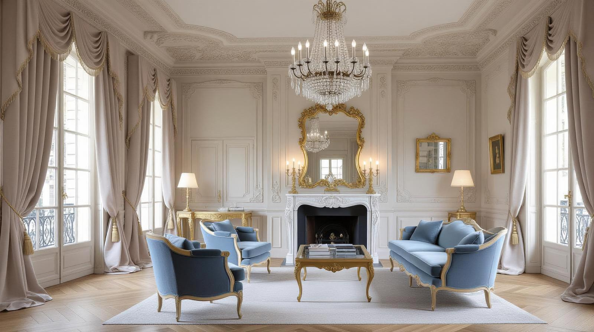

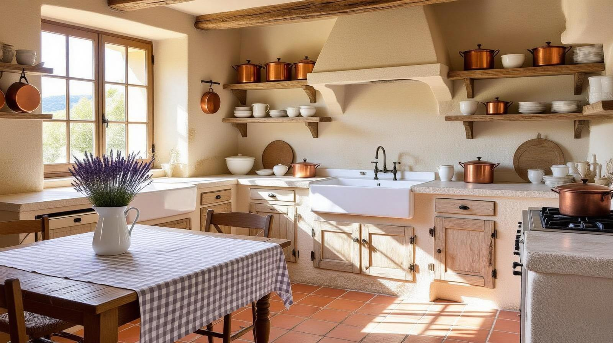

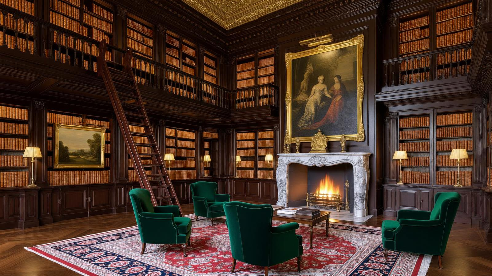

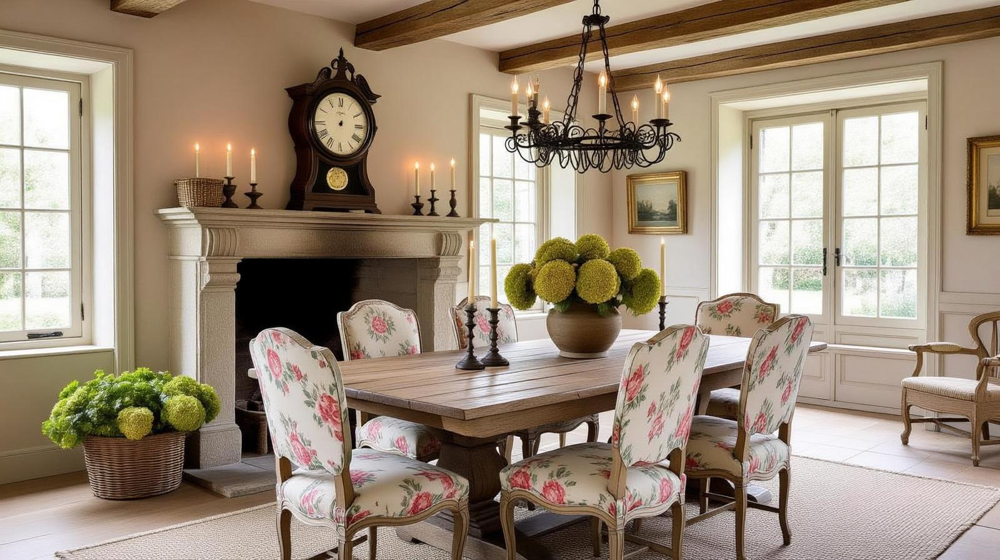

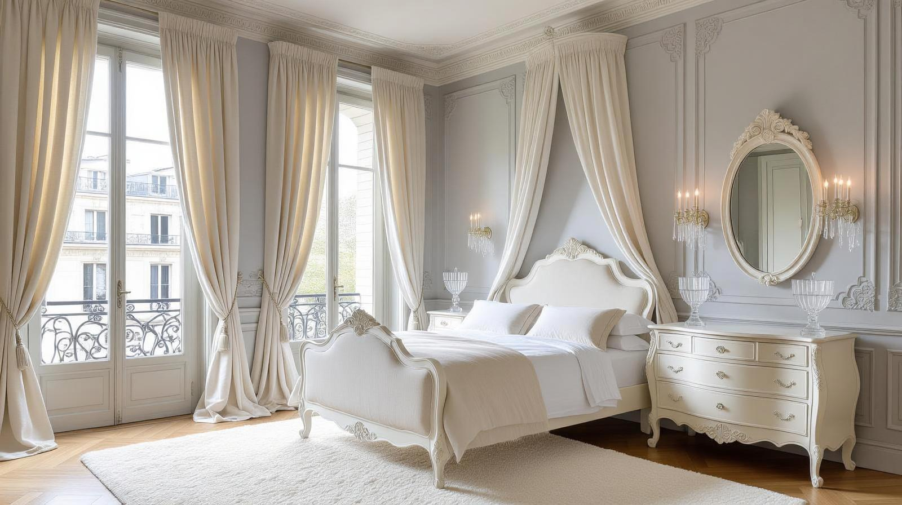

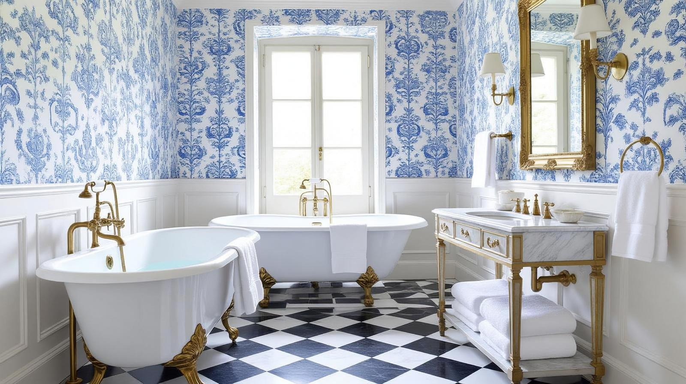

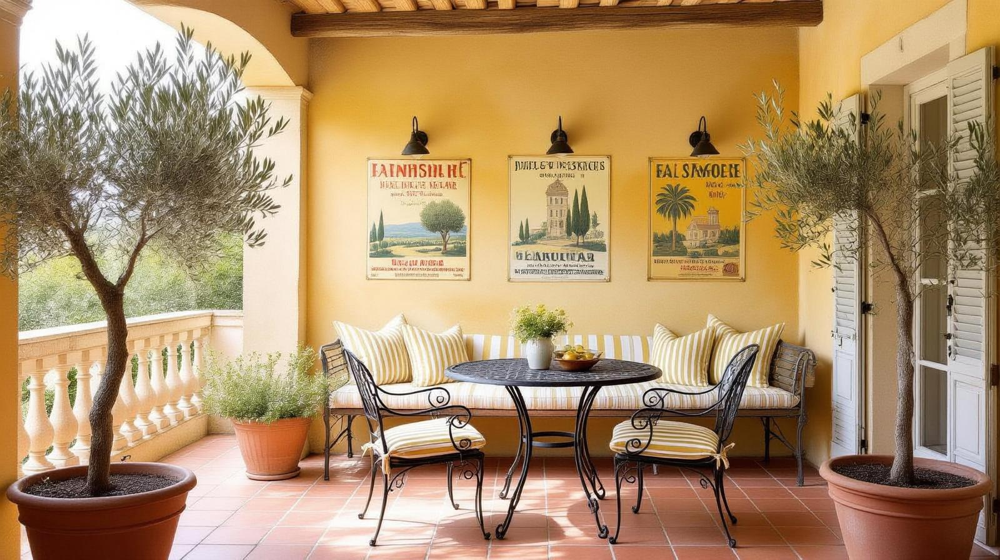

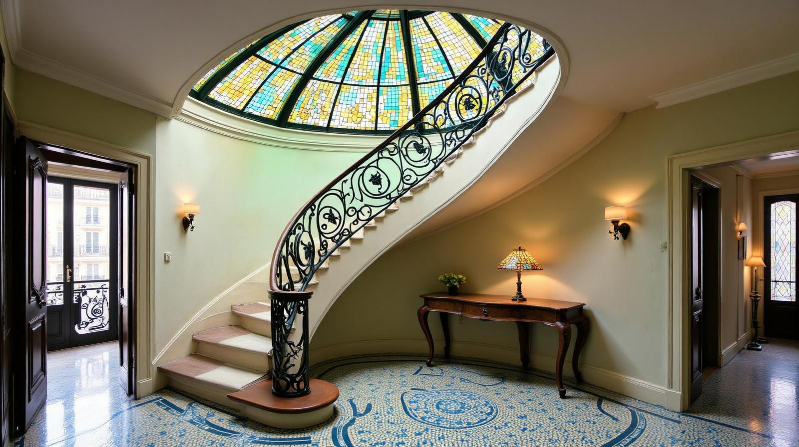

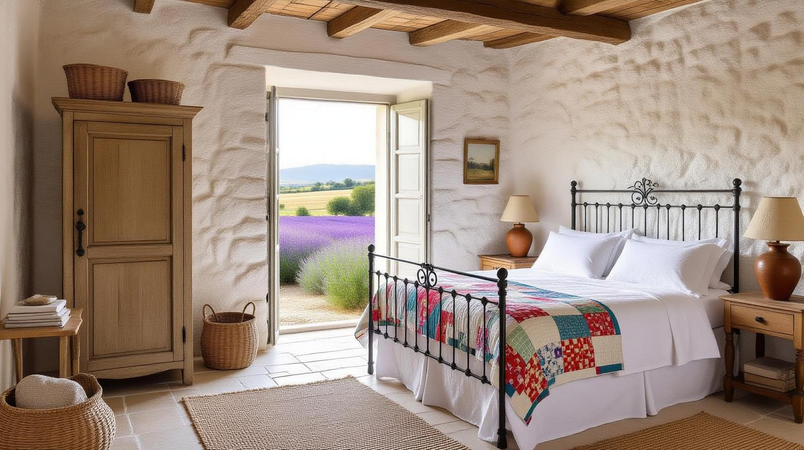

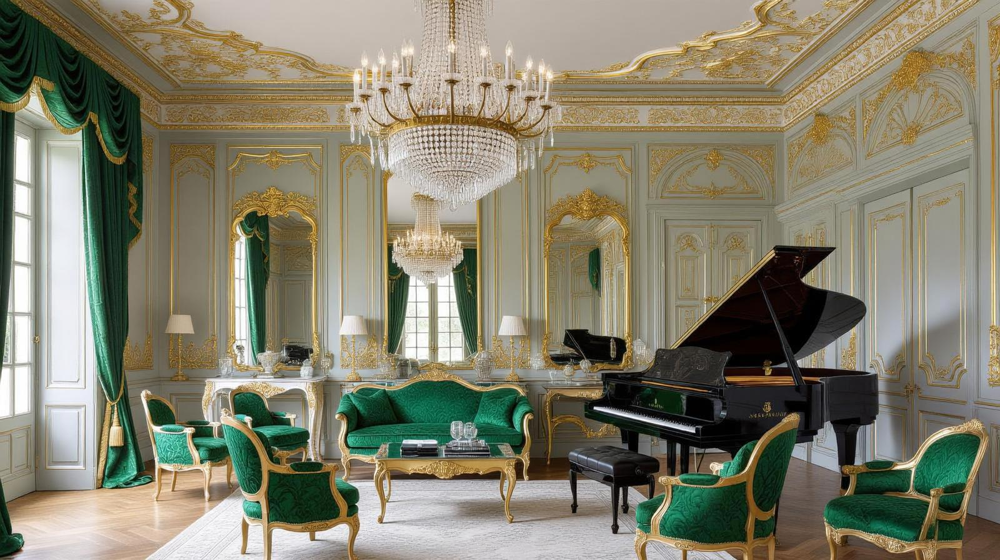

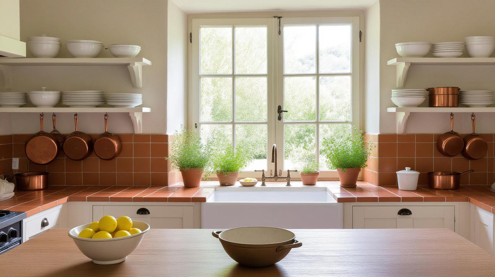

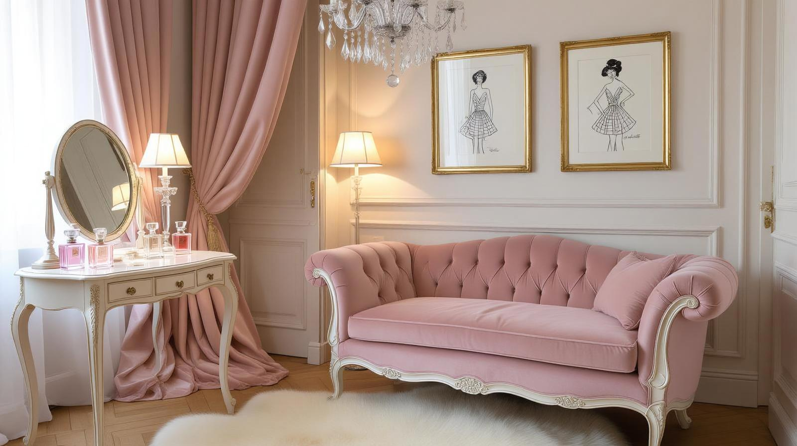

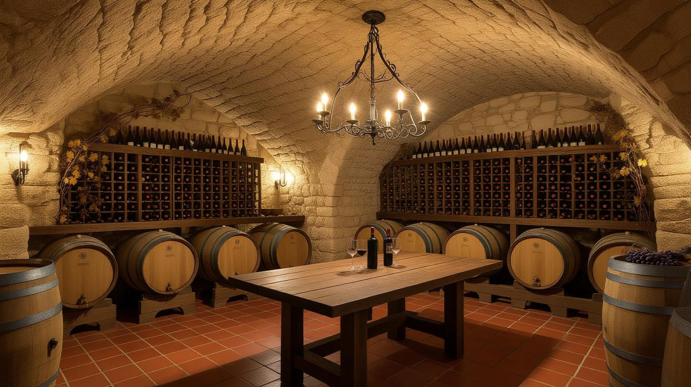

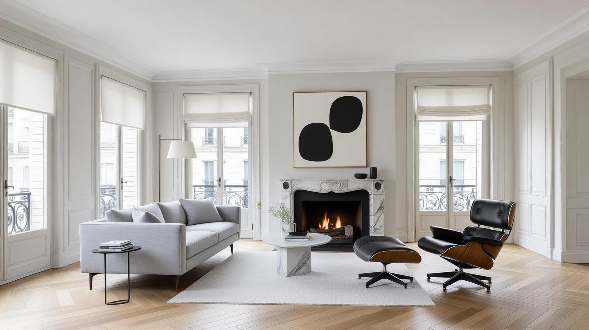

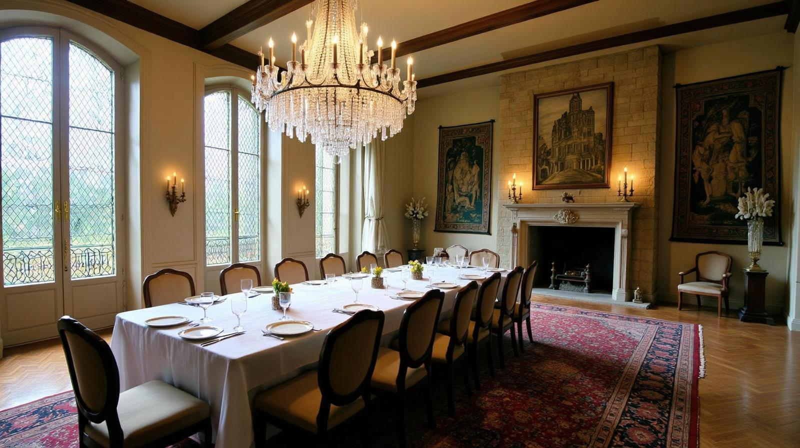

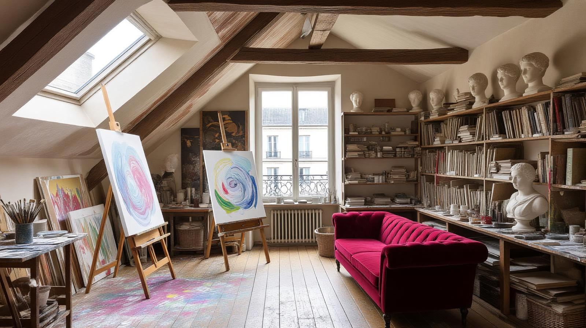

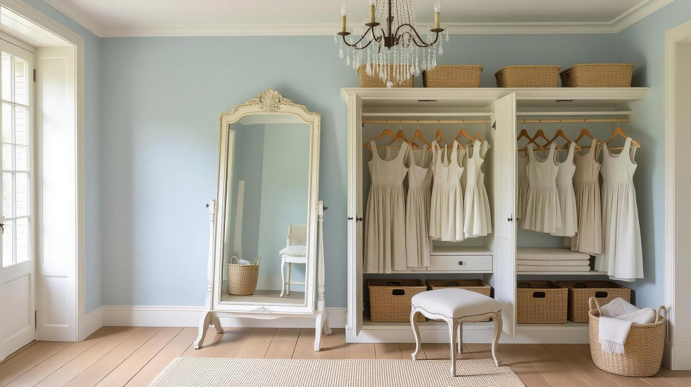

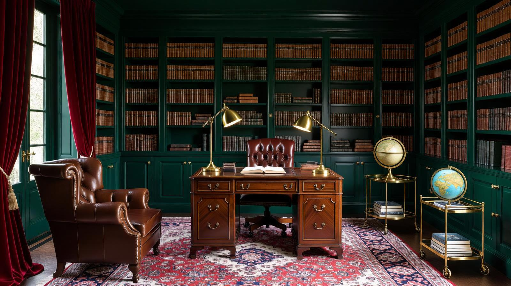

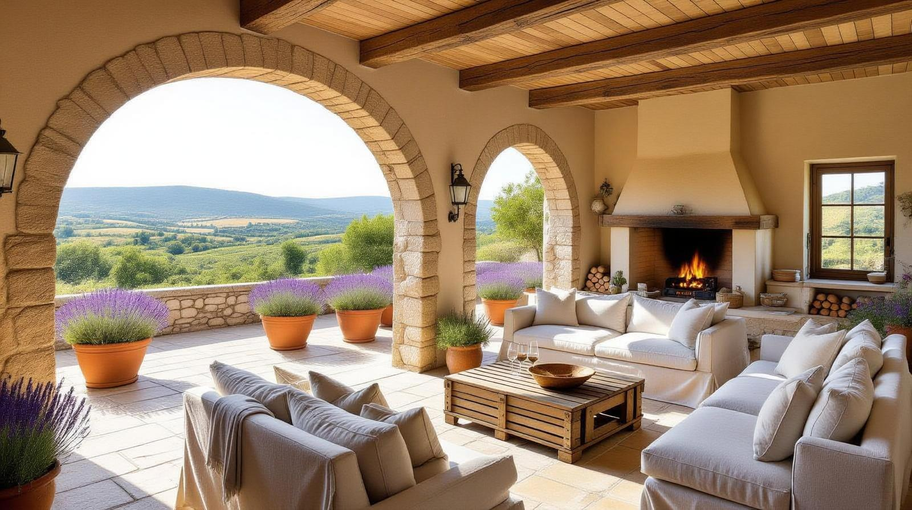
