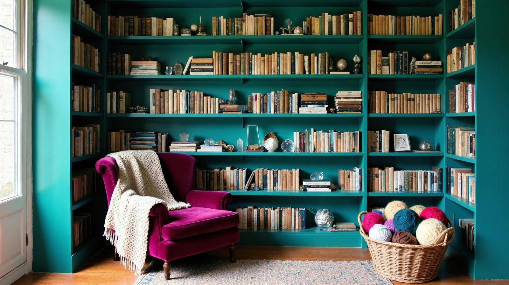

## Cosmos室内系列：波西米亚风格

本系列参考相关文章进行创建，由于包含的风格较多，缩减到20分镜。

分镜提示词如下：

#### user:

创建20个独立的波西米亚风格室内设计的图片描述，用英语回答。

#### assistant:

Here are 20 distinct Bohemian-style interior design image descriptions:

1.  **Sunlit Eclectic Lounge:** A bright room overflowing with plants. Low Moroccan leather poufs surround a vintage brass coffee table layered with colorful Turkish rugs. Macrame wall hangings mingle with woven tapestries.
2.  **Moody Velvet Bedroom:** Deep emerald velvet curtains frame windows draped in fairy lights. A wrought-iron canopy bed piled high with embroidered pillows and a faux fur throw sits on a faded Persian rug. Vintage lamps cast a warm glow.
3.  **Global Fusion Dining:** A reclaimed wood table surrounded by mismatched chairs (rattan, painted wood, upholstered). Walls display a gallery of ethnic masks and baskets. A large, colorful ikat table runner anchors the setting.
4.  **Desert Boho Patio:** A shaded corner with hanging macrame chairs, vibrant floor cushions, and terracotta pots overflowing with cacti and succulents. A low wooden table holds Moroccan tea glasses under strings of bulb lights.
5.  **Maximalist Book Nook:** Floor-to-ceiling bookshelves painted teal, crammed with books, crystals, and small trinkets. A vintage velvet armchair draped in a crochet blanket sits beside an overflowing basket of yarn.
6.  **Textile-Rich Bathroom:** An antique clawfoot tub draped with a colorful kantha quilt. Walls adorned with small framed embroidery and shelves holding baskets of towels. Lush ferns hang in macrame planters near the window.
7.  **Rattan & White Living Space:** Airy feel with white walls and sheer curtains. Dominated by large rattan furniture (sofa, chairs, coffee table) layered with cream and beige textured throws and cushions. Pops of terracotta and green from plants.
8.  **Gypsy Caravan Kitchen:** Open shelves displaying colorful mismatched ceramics and copper pots. Walls covered in intricate Moroccan tiles behind the stove. A large wooden farmhouse table doubles as prep space and gathering spot.
9.  **Hippie Chic Bedroom Loft:** Accessed by a ladder, featuring a low mattress piled with ethnic print pillows and quilts on a tatami mat. Dreamcatchers, beaded curtains, and tapestries cover the slanted ceiling and walls.
10. **Artisan Corner Studio:** A dedicated crafting space with pegboards holding tools, baskets of fabric scraps, and threads. A vintage industrial table serves as a workbench under a large, intricate mandala tapestry.
11. **Boho Glam Entryway:** A dramatic entry with a deep purple accent wall. A vintage gilded mirror hangs above a rustic wooden console table cluttered with crystals, incense burners, and a large, ornate brass tray.
12. **Cozy Earthy Den:** Deep brown leather Chesterfield sofa layered with woven throws and sheepskins. Walls clad in dark wood paneling adorned with vintage botanical prints and antler mounts. Warm, low lighting.
13. **Moroccan Riad Courtyard (Indoor):** An interior courtyard with a central mosaic-tile fountain. Low seating platforms covered in kilims and floor cushions surround it. Lush palms and banana plants thrive under a skylight.
14. **Vintage Music Lounge:** A room centered around a vintage record player on a mid-century cabinet. Eclectic mix of seating: a velvet loveseat, a papasan chair, floor cushions. Band posters and album covers adorn the walls.
15. **Tropical Boho Balcony:** A small balcony transformed with hanging rattan chairs, a mosaic-top bistro table, and dense greenery including monstera and bird of paradise plants. Colorful wind chimes catch the breeze.
16. **Painted Floor Bedroom:** A bedroom with wide-plank wooden floors painted in a faded geometric pattern (diamonds or stripes). A simple low platform bed with batik bedding. Walls decorated with woven fans and simple shelves holding plants.
17. **Coastal Boho Living Room:** Light, airy palette of whites, blues, and sandy beiges. Natural textures: jute rug, seagrass baskets, driftwood mirror. Accents of turquoise glass and shells. Large windows overlooking the sea.
18. **Upcycled Eclectic Office:** A desk made from salvaged doors and pipes. Walls covered in a patchwork of vintage maps, concert posters, and children's drawings in mismatched frames. A vibrant vintage rug underfoot.
19. **Festival-Inspired Kids' Room:** A teepee draped in fairy lights and fabric scraps. Floor covered in colorful foam tiles and bean bags. Walls painted with murals of rainbows, mountains, and animals. Toy storage in woven baskets.
20. **Rustic Alchemy Apothecary:** Dark wood apothecary cabinet filled with amber bottles, dried herbs, and crystals. A worn wooden table holds mortar and pestles, scales, and open books with botanical illustrations. Low, moody candlelight.

Each description offers a unique take on Bohemian style, emphasizing different elements like color palettes, key furniture pieces, textiles, global influences, and overall ambiance.
<!-- AUTO-GENERATED MEDIA -->

