## Cosmos室内系列：现代轻奢风格

本系列参考相关文章进行创建，由于包含的风格较多，缩减到20分镜。

分镜提示词如下：

#### user:

创建20个独立的现代轻奢风格室内设计的图片描述，用英语回答。

#### assistant:

Here are 20 unique modern luxury interior design descriptions, each capturing a distinct space and element of the style:

1.  **Open-Plan Serenity:** A vast living area with bleached oak flooring, a low-slung cream boucle sectional, and a striking black marble coffee table. Floor-to-ceiling windows flood the space with light, while minimalist brass floor lamps and an oversized abstract monochrome painting add refined elegance.
2.  **Master Bedroom Oasis:** A plush, king-sized bed dressed in charcoal gray velvet linen dominates the room. Behind it, a textured taupe leather headboard wall extends to the ceiling. Polished nickel sconces flank the bed, reflecting light onto sleek nightstands and a soft, oversized sheepskin rug.
3.  **Gourmet Kitchen Contrast:** Sleet gray matte lacquer cabinets contrast dramatically with a waterfall island in Calacatta Viola marble. Integrated brass handles gleam softly, complemented by matte black fixtures. Minimalist bar stools with deep green velvet seats provide a pop of color.
4.  **Spa-Like Bath Retreat:** Walls clad in large-format, soft grey marble tiles create a serene backdrop. A freestanding oval bathtub in matte black sits beside a walk-in rain shower with a frameless glass enclosure. Brushed gold fixtures and integrated LED lighting enhance the luxurious feel.
5.  **Dramatic Dining:** A long, matte black oak dining table anchors the space beneath a sculptural cluster of smoked glass globe pendants. Upholstered dining chairs in a rich emerald green velvet surround the table, resting on a deep-pile grey wool rug.
6.  **Textured Lounge Nook:** A curved sofa in warm camel leather defines a cozy corner. A fluted black wood side table holds a unique ceramic lamp. A large, textured wool rug in earthy tones grounds the space, while a floor-to-ceiling sheer curtain diffuses light.
7.  **Refined Home Office:** A streamlined desk in dark walnut features integrated brass detailing. A cognac leather executive chair sits before floor-to-ceiling bookshelves with a mix of open and closed storage in matte taupe. A geometric brass desk lamp provides focused task lighting.
8.  **Luxurious Walk-In Closet:** Custom rift-cut white oak cabinetry with integrated LED lighting lines the walls. A central island with a quartzite countertop offers additional storage. Full-height mirrors and plush dove gray carpeting underfoot elevate the experience.
9.  **Sun-Drenched Breakfast Corner:** A small round table in brushed brass and smoked glass sits by a large window. Sculptural chairs in cream boucle face the view. A minimalist linear chandelier hangs above, and a single stem in a slender vase adds life.
10. **Moody Media Room:** Deep sapphire blue walls envelop the space. A large, low-profile sofa in charcoal velvet faces a recessed screen. Brass accents on side tables and a tiered coffee table catch the low light from recessed LEDs and a single brass floor lamp.
11. **Elegant Entryway:** A fluted console table in a warm taupe finish stands against a wall clad in textured plaster. A large round mirror with a thin brass frame hangs above. A single, dramatic black vase holds dried pampas grass, illuminated by a sculptural brass wall sconce.
12. **Chic Wet Bar Area:** A backlit onyx countertop glows softly atop minimalist white lacquer cabinetry. Floating shelves display crystal decanters and glassware. Brass bar faucets and under-counter wine storage complete this sophisticated entertaining spot.
13. **Urban Balcony Escape:** A compact terrace features smooth concrete flooring and sleek black metal railings. A small bistro set with a marble-top table and woven black chairs creates an intimate spot. Potted olive trees and integrated planter boxes add greenery against the city skyline.
14. **Modern Grand Living Room:** High ceilings emphasize the scale. A large, curved sofa in soft grey wool faces a linear fireplace with a honed black granite surround. A dramatic oversized pendant light in ribbed glass and brass hangs centrally, casting soft patterns.
15. **Serene Guest Bedroom:** Walls painted in a soothing pale clay hue. A platform bed with a linen-upholstered headboard is layered with textured throws in cream and beige. Simple black wood nightstands and woven pendant lights create a calm, inviting atmosphere.
16. **Statement Powder Room:** Walls covered in a large-scale, graphic black and white marble. A floating vanity in matte black with an integrated oval sink contrasts sharply. An oversized round mirror with backlighting and a single bold brass faucet make a powerful impression.
17. **Light-Filled Library:** Floor-to-ceiling white oak bookshelves line one wall. A deep, emerald green velvet armchair and a matching ottoman sit beside a fluted brass floor lamp, creating a perfect reading nook near a large window.
18. **Sleek Kitchen Scullery:** Hidden behind pocket doors, this functional space features glossy white cabinets, durable quartz countertops, and integrated appliances (dishwasher, fridge drawers). Brass hardware and task lighting under cabinets add a touch of luxury.
19. **Minimalist Hallway:** Wide-plank white oak flooring runs the length. A long, low bench upholstered in cream boucle sits beneath a series of three abstract line drawings in black frames. Recessed linear lighting in the ceiling creates a gallery-like feel.
20. **Evening Terrace Lounge:** An outdoor sectional with deep cushions in weather-resistant charcoal grey surrounds a low gas fire pit table. Oversized black planters hold sculptural evergreens. String lights overhead and recessed step lighting create a warm, inviting ambiance.

Each description focuses on key modern luxury elements: clean lines, high-quality materials (marble, metal, velvet, wood), sophisticated neutral palettes with strategic pops of color or texture, statement lighting, and an overall sense of curated elegance and spaciousness.
<!-- AUTO-GENERATED MEDIA -->

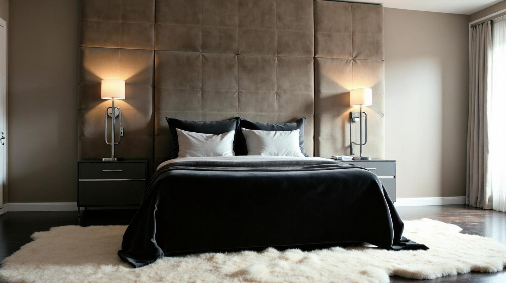

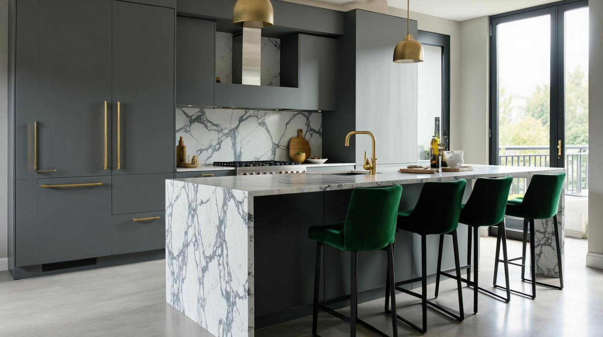

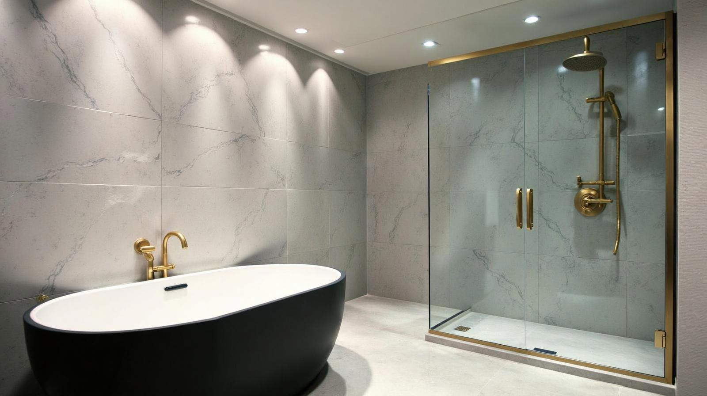

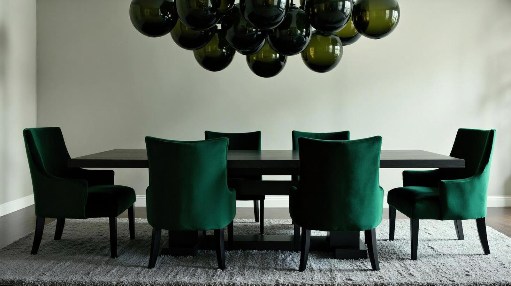

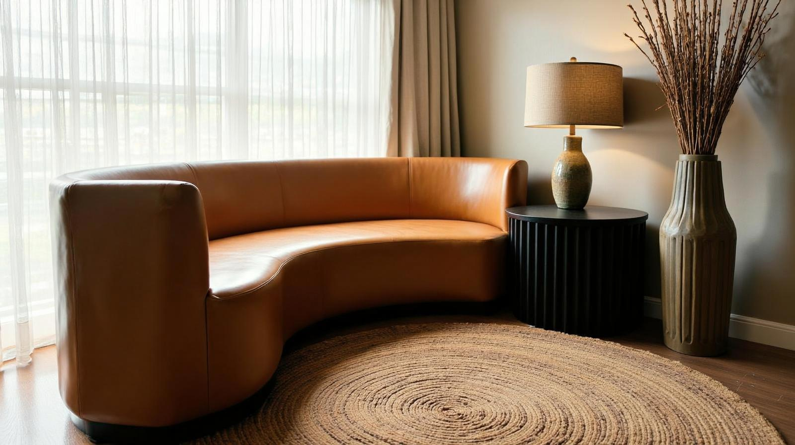

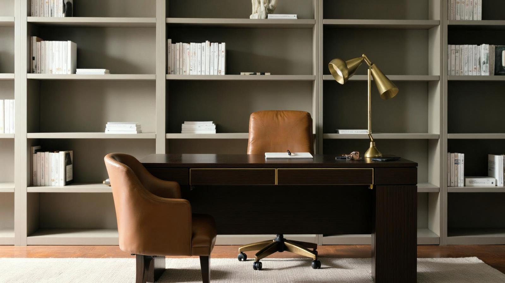

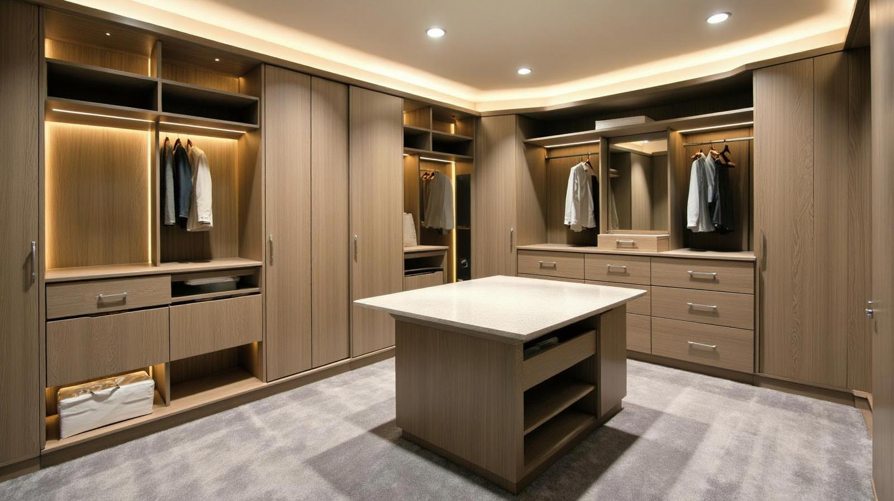

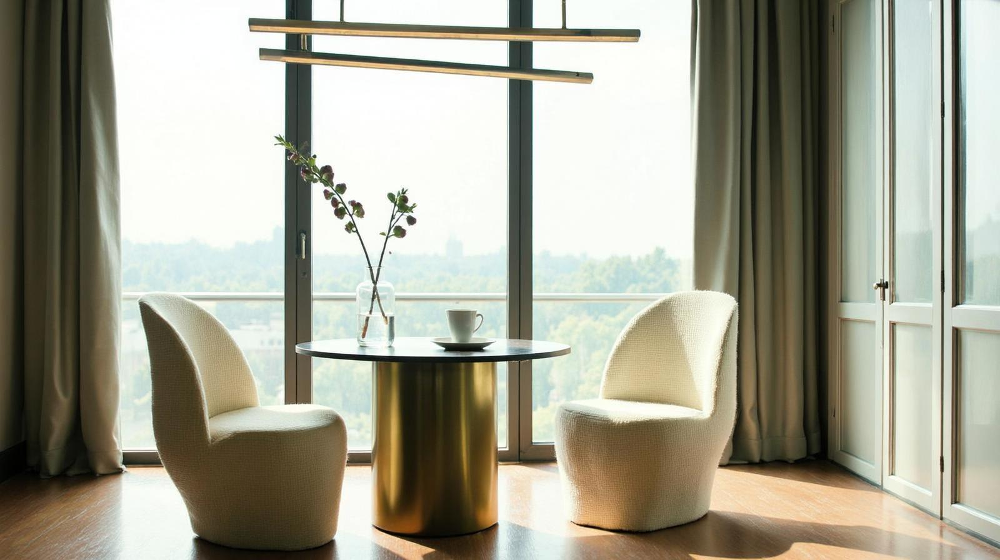

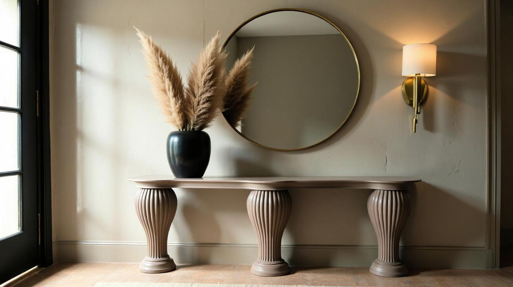

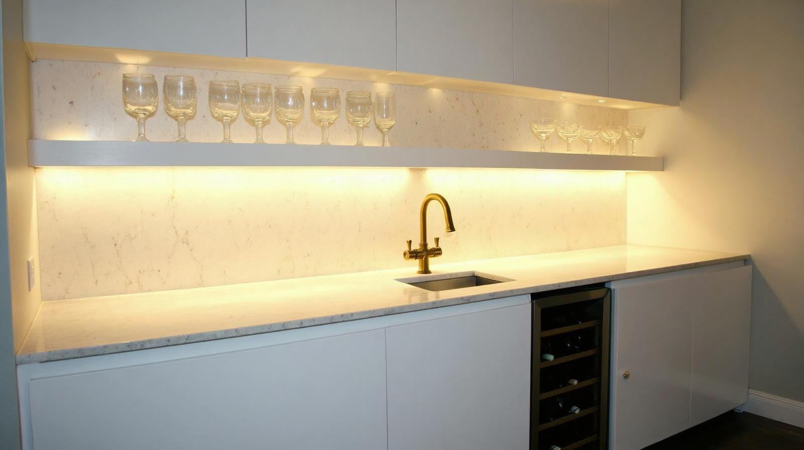

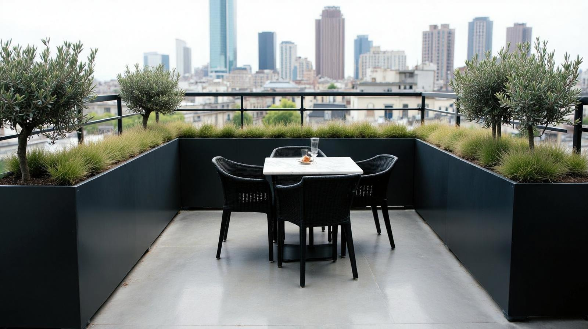

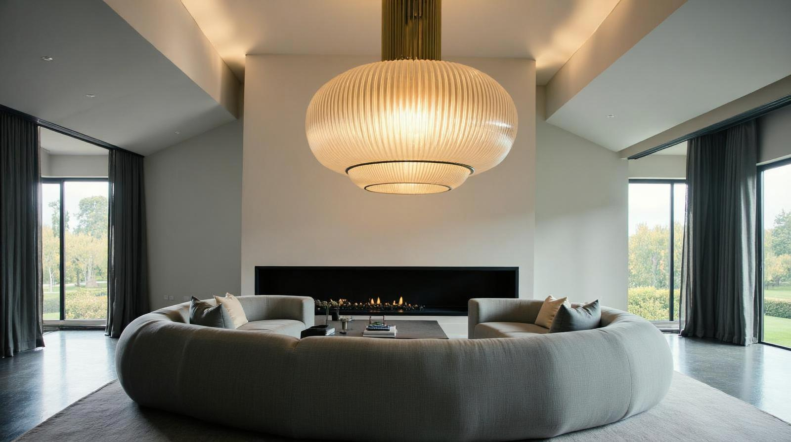

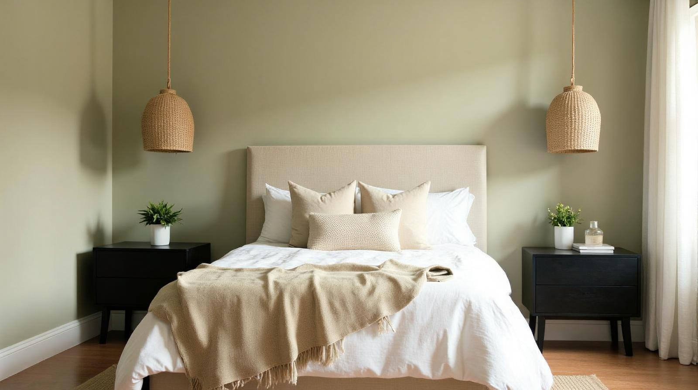

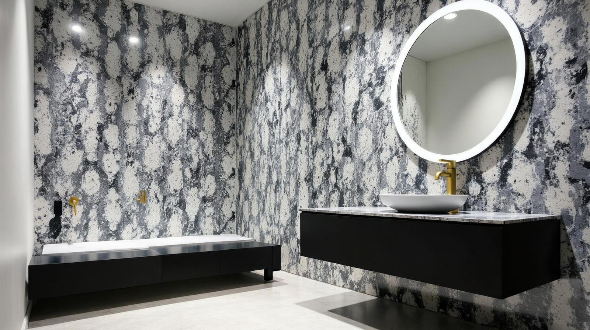

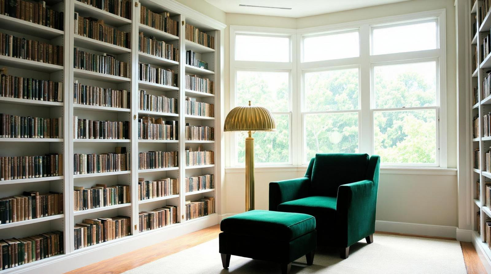

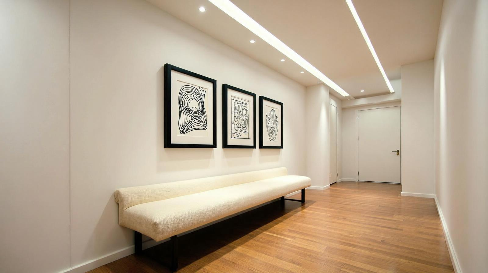

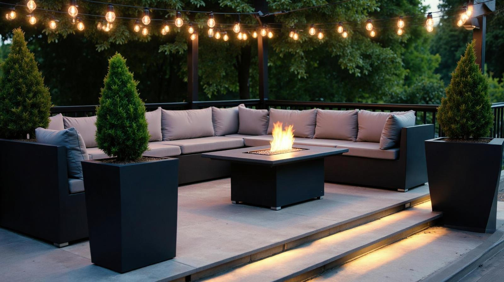
