## Cosmos室内系列：现代简欧风格

本系列参考相关文章进行创建，由于包含的风格较多，缩减到20分镜。

分镜提示词如下：

#### user:

创建20个独立的现代简欧风格室内设计的图片描述，用英语回答。

#### assistant:

Here are 20 independent modern simple European (Modern Simplicity European) interior design descriptions, each featuring a distinct space and focal point:

1.  **Sunlit Minimalist Living:** Expansive floor-to-ceiling windows flood a spacious living room with light. Crisp white walls, a low-profile dove-grey sofa, and a natural oak coffee table create serenity. A single, large abstract canvas in muted blues adds a focal point. Sleek, integrated shelving holds curated objects.
2.  **Elegant Neutral Bedroom:** A calming sanctuary featuring a upholstered platform bed in warm taupe linen. Fluted wood paneling accents the headboard wall. Matching nightstands with integrated reading lamps and a plush ivory rug complete the sophisticated, minimalist look.
3.  **Modern Simplicity Kitchen:** Clean-lined, handleless cabinets in soft grey matte finish. A large, white quartz waterfall island doubles as a breakfast bar with minimalist stools. Integrated appliances and a statement black metal pendant light above the island define the space.
4.  **Serene Bathroom Oasis:** Walls clad in large-format, light grey stone-look tiles. A freestanding oval bathtub takes center stage near a window. A floating vanity in pale oak with an integrated white basin and a large, backlit mirror exudes tranquility.
5.  **Cozy Reading Nook:** Built into a bay window alcove, a deep custom sofa in charcoal velvet is piled with textured cushions. A sleek black floor lamp arches over it. Light oak floating shelves hold books and a single sculptural vase. A sheepskin rug adds warmth.
6.  **Refined Dining Space:** A substantial oval dining table in rich walnut anchors the room. Surrounded by upholstered chairs in cream bouclé fabric. A linear, minimalist black metal chandelier hangs low above. A large, framed black and white photograph adorns one wall.
7.  **Open Plan Living/Dining:** Seamless flow between living and dining areas. A deep sectional in warm greige faces a linear fireplace with a white marble surround. Behind it, a dining table with black metal legs and a light wood top is illuminated by sculptural glass pendants.
8.  **Functional Home Office:** A streamlined, wall-mounted desk in white lacquer floats above light oak flooring. A comfortable ergonomic chair in black leather. Integrated wall shelves above the desk hold books and storage boxes. Large windows provide ample natural light.
9.  **Inviting Entryway:** A welcoming space with patterned cement floor tiles in grey and white. A slim, dark wood console table holds a modern ceramic vase. A large round mirror with a black frame hangs above. A textured jute rug adds warmth underfoot.
10. **Textural Guest Bedroom:** Walls painted in a soft, warm grey. A platform bed dressed in crisp white linen and layered with knitted throws. A woven pendant light hangs low over the bedside table. A textured rug in oatmeal and charcoal adds depth.
11. **Modern Simplicity with Fireplace:** A deep, comfortable sofa in dusty blue faces a statement fireplace. The surround features vertically stacked, smooth pale limestone tiles reaching to the ceiling. A simple black metal log holder and abstract art complete the focal wall.
12. **Light-Filled Kitchen Dining:** A bright eat-in kitchen area. A round, white marble table sits beside large windows. Paired with sculptural chairs in black wood and cane. Open shelving displays simple white ceramics against pale grey walls.
13. **Spa-Like Ensuite:** Walk-in shower with large, frameless glass panels and textured charcoal tiles on one wall. A floating double vanity in white with integrated basins and brushed brass faucets. Warm wood accents on stools and a niche shelf add contrast.
14. **Urban Loft Vibe Living:** High ceilings with exposed concrete beams. A modular dark green velvet sofa defines the seating area. An industrial-inspired black metal floor lamp and a large abstract painting on a white brick wall create an edgy yet refined feel.
15. **Calming Master Retreat:** Feature wall behind the bed clad in wide, whitewashed oak planks. The bed is dressed in layers of white and ivory linens. Symmetrical wall sconces with black metal shades flank the bed. Plush carpet underfoot.
16. **Functional Utility/Mudroom:** Practical and stylish. Built-in cabinetry in light grey with integrated bench seating and hidden shoe storage. Hooks in matte black. Walls covered in easy-clean, large white tiles with dark grey grouting. Patterned floor tiles.
17. **Breakfast Corner Bliss:** A built-in banquette upholstered in light grey linen nestled in a corner with large windows. A round tulip table in white sits atop a natural fiber rug. Hanging glass globe pendant lights add a touch of softness.
18. **Gallery Hallway:** A long hallway with smooth, white walls acting as a gallery. Carefully spaced, large-scale black and white photographs in simple black frames. Recessed ceiling lighting provides even illumination. Light oak flooring runs throughout.
19. **Walk-In Closet Elegance:** Organized luxury. Floor-to-ceiling cabinetry in a soft, warm white finish with integrated lighting. Glass-fronted sections display accessories. A central island with a white quartz top provides additional storage and folding space. Plush rug.
20. **Balcony/Patio Integration:** Seamless indoor-outdoor flow. Large sliding doors open from a minimalist living room to a balcony. Outdoor furniture echoes the interior: a light grey modular sofa, black metal side table, and large potted olive trees in simple concrete planters.

Each description emphasizes the clean lines, neutral palettes, natural materials, functional elegance, and subtle sophistication characteristic of Modern Simplicity European design.
<!-- AUTO-GENERATED MEDIA -->

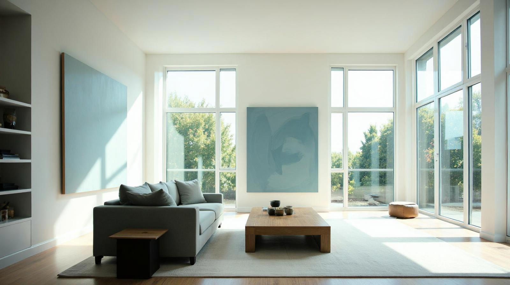

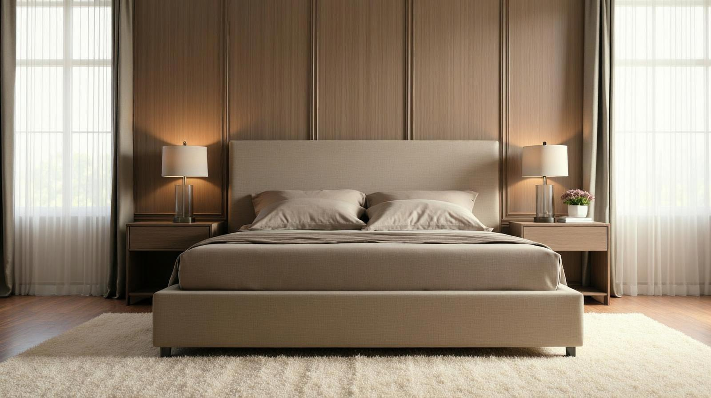

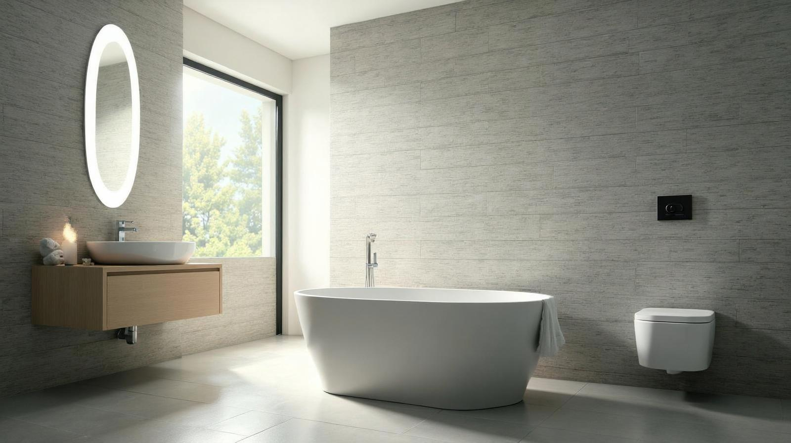

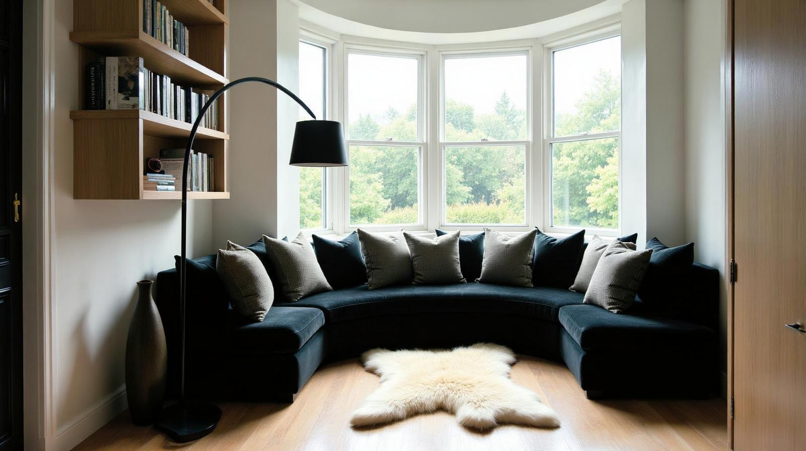

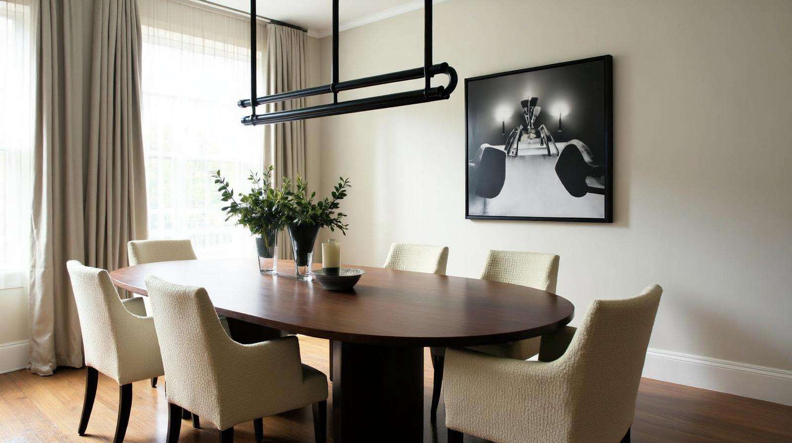

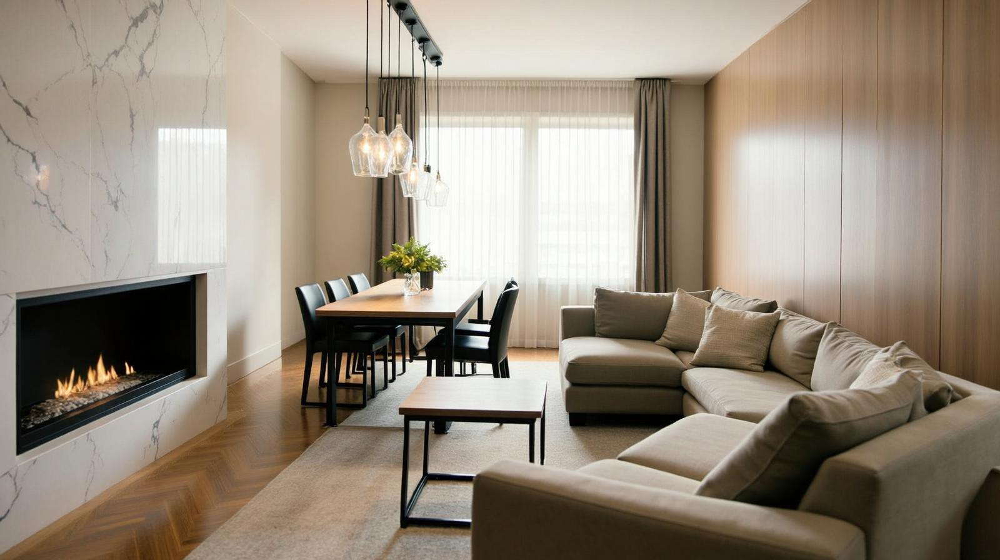

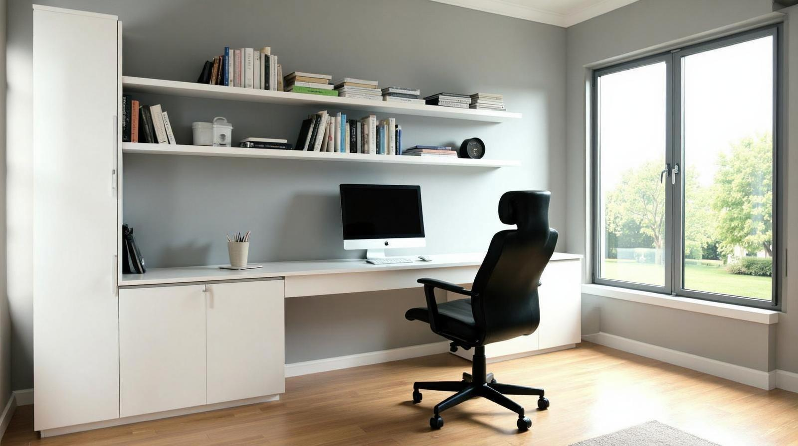

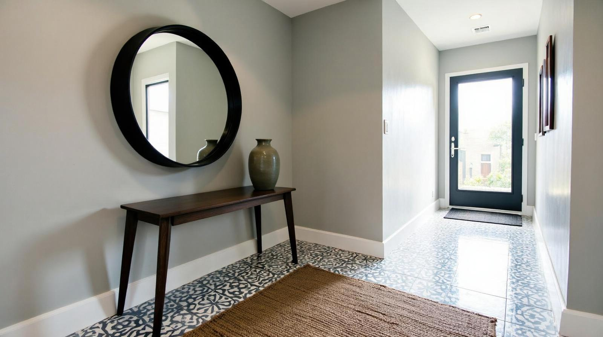

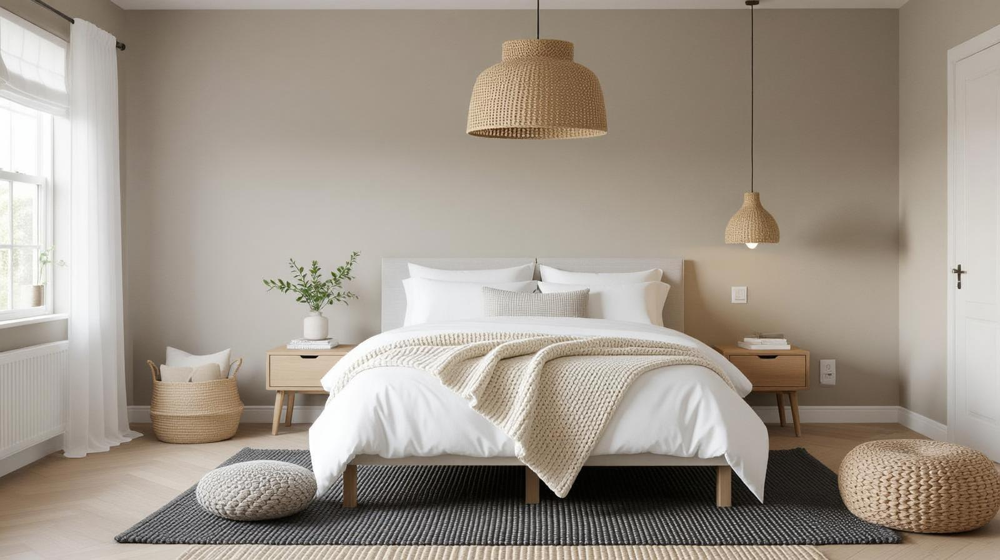

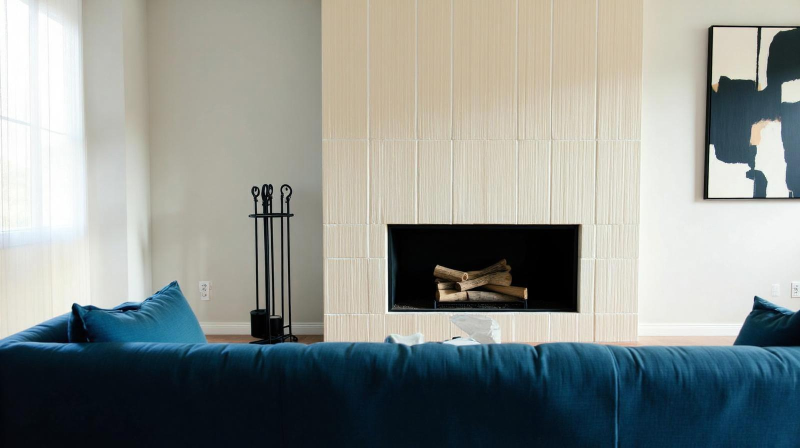

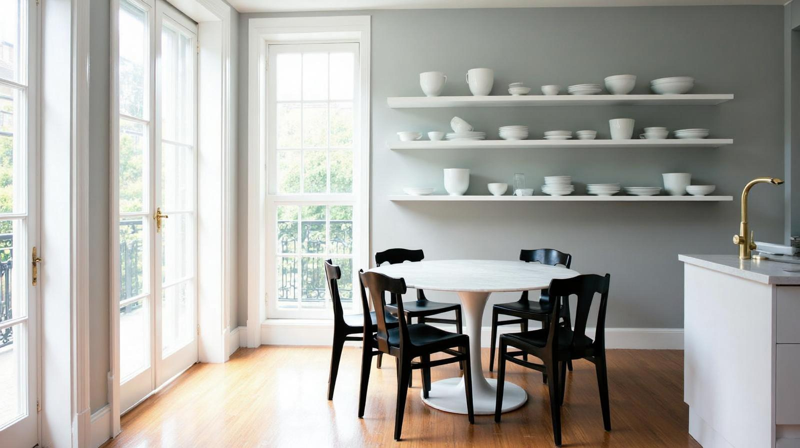

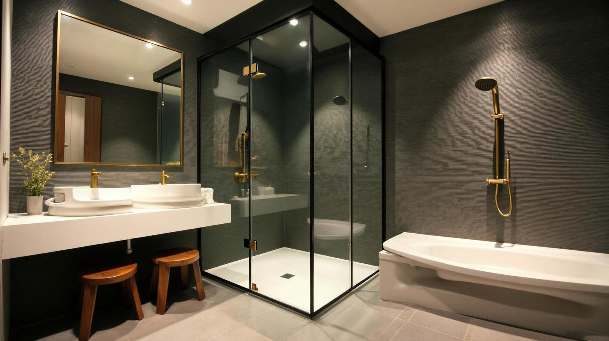

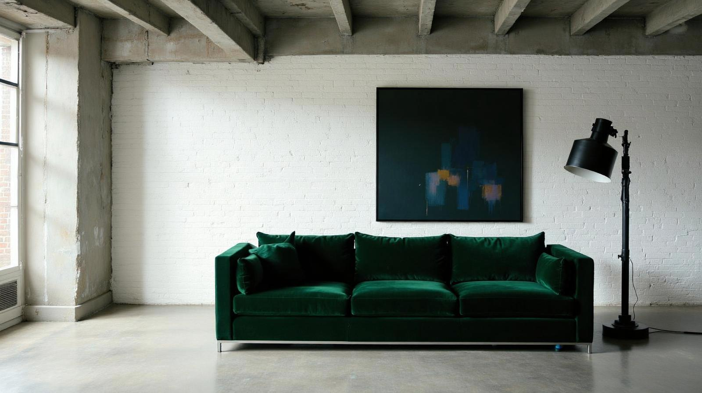

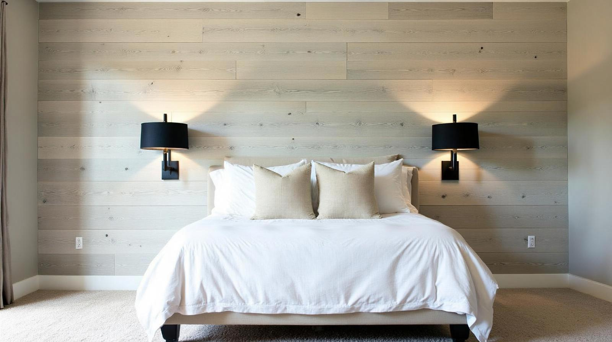

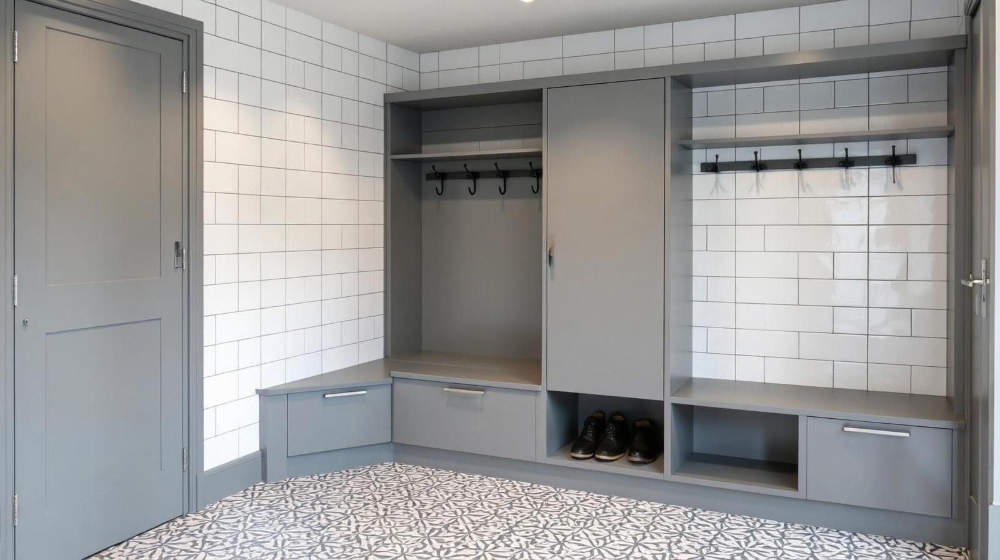

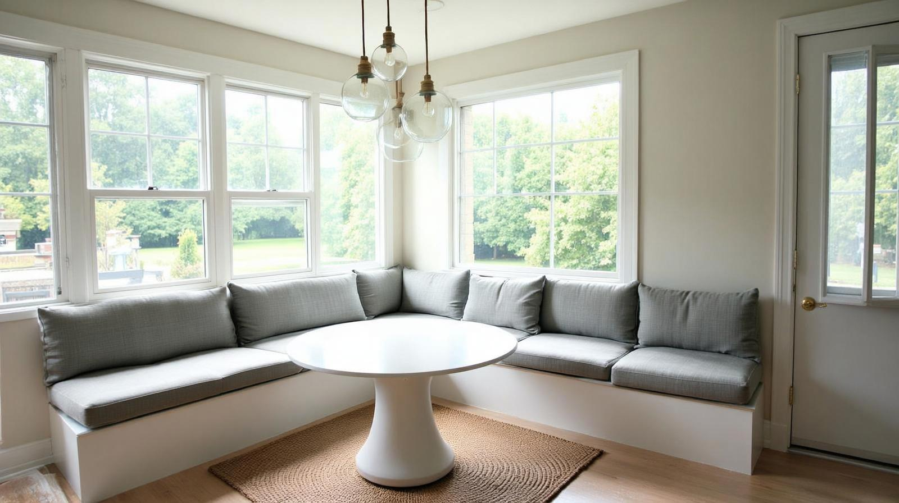

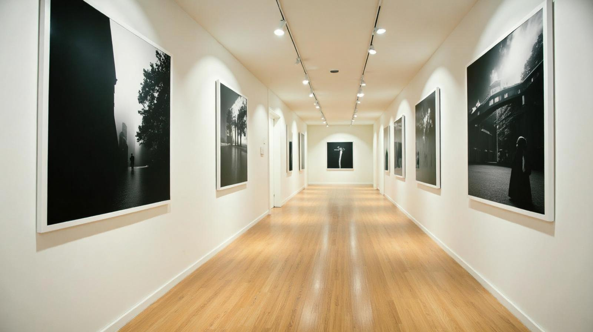

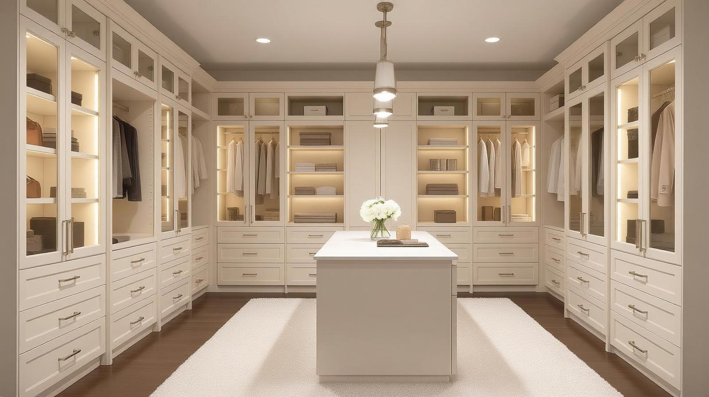

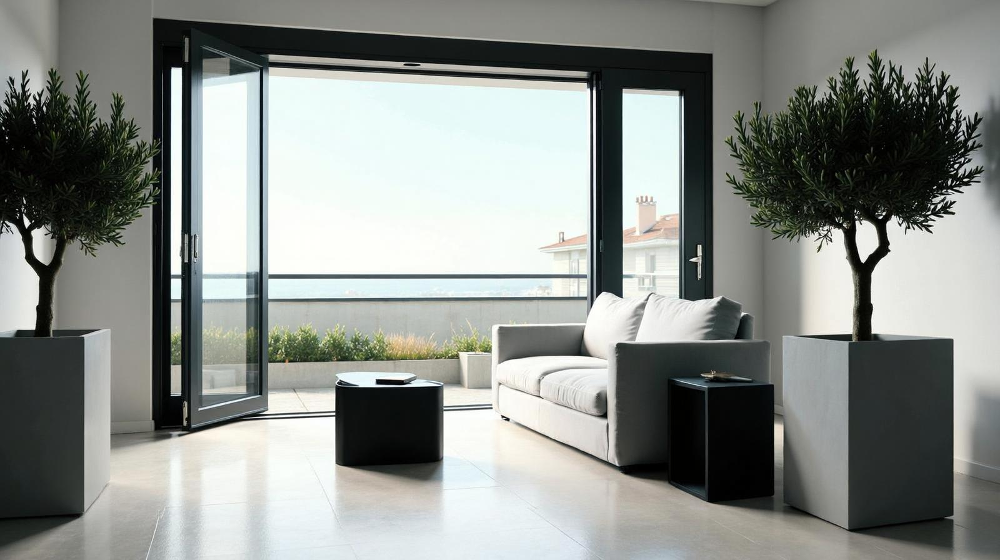
